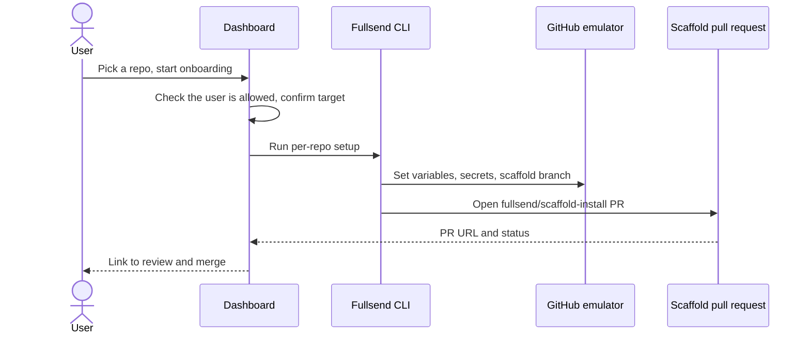

# Fullsend Integration Conformance

**Status:** All seven breakpoints are **go** as of 2026-09-23.

A real GitHub event flows through Fullsend's own unmodified workflow into a
real sandboxed agent running a real model, and the run leaves behind evidence
that outlives it. The chain is: shim, `reusable-dispatch.yml`, actor
permission check, OIDC exchange at the mint over internal TLS, a role-scoped
credential, an OpenShell sandbox on the cluster gateway, the harness loaded
from the local forge, Claude Code against Vertex, schema validation, and a
post-script that labels and comments as `fullsend-triage[bot]`.

`make host-conformance-reset && make host-conformance` runs that end to end
from a cleared baseline and asserts on artefacts and identities rather than on
the run's own conclusion — which was green on several runs that did nothing
useful. The dashboard's onboarding button runs `fullsend github setup` in the
runner pod and returns a reviewable scaffold pull request.

Local deviations are eleven upstream-bound patches, two local-only profile
patches, and three emulated marketplace actions; every one is named and its
status recorded. Twenty-six checklist items remain open, mostly small
emulator-fidelity defects and work packages 3 to 5, and none of them blocks
the conformance path. Two are open by decision rather than oversight: the
short-lived App installation token needs a private key this deployment does
not hold, and "who may start onboarding" is answered by the deployment rather
than by a user model.

## Goal

Make Breadboard run Fullsend the way Fullsend is meant to run today, in a
local stack that can be reset and re-run. Keep the older development
shortcuts around as clearly named tests, but never let them count as proof
that the real path works.

Fullsend is now a first-class part of the Breadboard stack, not a demo. Its
deployment files belong under `deploy/` next to every other service. The
`var/demos/fullsend-dev-stack/` folder goes away, and the milestone prefixes
(`m4`, `m8`, `M11`, and so on) disappear from every file that survives.

## Words used in this plan

| Term | Meaning here |
| --- | --- |
| Fullsend | The upstream project (`fullsend-ai/fullsend`) that runs AI agents against a code forge. |
| agents repo | `fullsend-ai/agents`. Holds the agent definitions Fullsend runs: prompts, sandbox settings, output schemas, and scripts. |
| forge | A code host: GitHub, GitLab, or Jira. In this stack it is always an emulator. |
| GitHub emulator | Breadboard's local GitHub stand-in at `https://github.local`. It serves the API, Git, Actions, and a web UI. |
| target repo | The repository an agent works on. The demo uses `fullsend-dev/triage-target` in the GitHub emulator. |
| shim | The one small workflow file Fullsend installs in a target repo (`.github/workflows/fullsend.yaml`). It listens for issue, pull request, review, label, and comment events and hands them to Fullsend. |
| reusable-dispatch | Fullsend's `reusable-dispatch.yml` workflow. The shim calls it. It checks who triggered the event, picks a stage, and runs it. |
| stage | One kind of agent job: triage, review, code, or fix. |
| runner | The GitHub Actions runner pod that executes workflow jobs. |
| mint | A small service that trades a workflow's identity token for a short-lived forge credential limited to one role and one repository. |
| OIDC token | A signed identity token GitHub Actions gives a workflow job. It says which repo, workflow, and branch the job came from. The mint checks it. |
| role | The Fullsend permission level a stage needs. Triage and review are read-level. Code and fix are write-level. |
| harness | A file in the agents repo that describes how to run one stage: which image, policy, credentials, scripts, and output schema to use. |
| OpenShell | The sandbox runtime. It runs the agent in an isolated process with an allow-list of binaries, files, and network destinations. |
| policy / provider / profile | OpenShell settings selected by the harness. Policy limits what the agent can touch. Provider injects a credential. Profile routes network traffic. |
| pre-script / post-script | Scripts named in a harness. Both run on the host, outside the sandbox, with credentials. The pre-script fetches inputs. The post-script checks the agent's output and writes it to the forge. The agent itself never writes to the forge. |
| scaffold | The set of files Fullsend's installer writes into a target repo: the shim, a config file, and a few caller workflows. |
| seed | A script that creates emulator orgs, repos, users, secrets, and fixtures from a clean state. |
| checkout | A clone of an upstream repository under `checkouts/`. |
| conformance path | The one end-to-end route this plan is trying to prove. Everything else is a legacy test. |
| compatibility profile | The short list of local substitutions the conformance path is allowed to make. See decision 3. |

### The three legacy fixtures

Breadboard's earlier Fullsend work was numbered by milestone. The numbers are
still in the file names today. This plan calls the fixtures by what they do,
and work package 8 renames the files to match.

| Plain name | Files | What it does |
| --- | --- | --- |
| direct-token smoke job | `deploy/k8s/25-fullsend-m4-smoke.yaml`, `19-run-fullsend-m4-smoke.sh` | A Kubernetes Job that clones the target repo, reads a forge token straight from a Secret, and runs `fullsend run triage` with the post-script turned off. No Actions, no mint. |
| default seeded fixture | `22-seed-fullsend-m8.sh`, which runs `m8_seed.py` and `m8_mirror.py` | What `deploy-all.sh` installs today. Registers a fake GitHub App and copies a small set of Fullsend workflow and action files into the emulator. |
| config-repo fixture | `m11_seed.py`, `onboard_repo.py` | Puts only the shim in the target repo and puts the dispatcher and per-stage workflows in a separate `.fullsend` repo. This is the older per-organization layout that Fullsend has since deprecated (Fullsend ADR 0044). |

The numeric prefixes on `deploy/scripts/` and `deploy/k8s/` files (`05i`,
`22`, `25`) are deployment ordering, not milestones. They stay.

## Today versus target

| Boundary | Today | Target |
| --- | --- | --- |
| Where routing lives | A Breadboard-seeded `.fullsend` repo | Fullsend's own `reusable-dispatch.yml`, called from the shim |
| Who may trigger an agent | Nobody is checked | Collaborator permission check that fails closed |
| How the agent gets a credential | An opaque dev token, or a token read straight from a Secret | An OIDC token exchanged by the mint for a short-lived, scoped credential |
| Which images and patches run | Local images plus three patches, two of which no longer apply | Local images built from the current checkouts with a documented, minimal patch set |
| How results are reported | Post-script disabled; a clean exit counts as success | Post-script, output schema, forge status, and telemetry all retained |

## Sources audited

Fullsend and the agents repo are permanent Breadboard dependencies. They belong
at `checkouts/fullsend-ai/fullsend` and `checkouts/fullsend-ai/agents`, which is
the layout `gh-org-clone` produces when run inside `checkouts/`. Keep those
clones pristine. Breadboard-specific changes go in patch files or Breadboard's
own tree.

The audit used the temporary clones, which stay the provenance until the move
is done:

- Fullsend: `checkouts.tmp/fullsend-ai/fullsend` at `a734637c`
- agents: `checkouts.tmp/fullsend-ai/agents` at `6ffe9c77`
- Breadboard: `deploy/` and `var/demos/fullsend-dev-stack/`

The audit changed nothing and could not reach a live cluster. Every runtime
claim below still needs a real run to confirm it.

## Findings

### Source checkouts and patches

- `deploy/scripts/05i-build-fullsend.sh` points at `checkouts.tmp/fullsend`,
  which does not exist. The clone is at `checkouts.tmp/fullsend-ai/fullsend`.
  Seven files under `var/demos/fullsend-dev-stack/` (`README.md`,
  `m0-contract.json`, `m3_seed.py`, `m8_mirror.py`,
  `m8_standalone_mint_smoke.sh`, `m9_seed.py`, `m10_seed.py`) reference the
  same missing path. A fresh `make host-deploy-all` fails at the Fullsend
  image build until this is fixed.
- The build script applies three patches from
  `var/demos/fullsend-dev-stack/patches/fullsend/`. Against the current
  Fullsend revision, `0001` and `0003` no longer apply. `0002` still does.
- A stale clone of the agents repo sits at `checkouts/fullsend-agents`
  (revision `9b85a9ad`, from 2026-08-21). It is not the audited revision and is
  in the wrong place.
- Reproducibility comes from the reset-and-seed procedure, not from pinning
  source revisions. Record revisions in logs when it helps debugging. Do not
  make them deployment pins.

### The demo folder

- `var/demos/fullsend-dev-stack/` was built as a throwaway demo. It now holds
  the only copies of things the deployment depends on: the three Fullsend
  patches, the `github-emulator-readonly.yaml` OpenShell policy, and the seed
  and mirror scripts that `22-seed-fullsend-m8.sh` runs.
- Twenty-four files there are tracked. Sixteen are milestone-prefixed seed
  and smoke scripts (`m0_contract.py` through `m11_seed.py`, plus
  `onboard_repo.py` and `test_m11_seed_contract.py`). The `artifacts/` tree
  and `m8-real-runner.log` are untracked run output.
- Five deploy scripts reach into the folder: `05i-build-fullsend.sh`,
  `19-run-fullsend-m4-smoke.sh`, `20-run-fullsend-m5-vertex.sh`,
  `21-run-fullsend-m6-result.sh`, and `22-seed-fullsend-m8.sh`. So do one
  `.gitleaksignore` line and the older
  `.ledger/plans/fullsend-dev-stack-plan.md`.
- `docs/fullsend-integration.md` does not reference the folder, so the docs
  will not break when it is removed.

### Workflow layout

- `deploy-all.sh` installs the default seeded fixture. The config-repo fixture
  is close to Fullsend's deprecated per-organization layout. Neither is the
  current per-repo layout.
- Fullsend's current per-repo install writes a small scaffold into the target
  repo: the shim, `.fullsend/config.yaml`, any customized override
  directories, and a few directly installed caller workflows. Everything else
  (agents, skills, schemas, harnesses, policies, profiles, providers, scripts)
  is fetched at run time from the selected Fullsend and agents revisions.
- `reusable-dispatch.yml` does the routing and keeps the stage logic inline
  on purpose, so there is no second set of stage files to drift (Fullsend ADR
  0062).
- Breadboard should generate the scaffold from the Fullsend checkout rather
  than hand-maintain a parallel copy.

### Identity and authorization

- Four identities must stay separate: the person or bot that caused the
  event, the Actions workflow, the Fullsend role, and the individual emulator
  service accounts the sandbox uses. One shared admin token spanning all four
  is a failure. The seed must therefore create and use non-admin accounts for
  each of them, so that permission failures are visible instead of hidden by
  admin rights.
- Fullsend's real workflow gets an OIDC token (`id-token: write`) and calls
  the mint action with an explicit role and repo scope.
- Breadboard's `fullsend-mint-dev` accepts an opaque dev token and hands back
  pre-created emulator tokens from a Kubernetes Secret. It does not validate
  any claims. The direct-token smoke job skips the mint entirely.
- Fullsend requires a collaborator permission check before any automatic or
  slash-command dispatch (Fullsend ADR 0054). The default seeded fixture has
  no such check.

### Sandbox, images, and policies

- Breadboard builds `fullsend-runner-dev:k3s` and `fullsend-sandbox-dev:k3s`
  locally and applies the patches above.
- The harness files in the agents repo form one contract. A triage harness
  picks a sandbox image and `policies/base.yaml`, layers a Vertex provider and
  OpenShell profile, then a forge overlay (GitHub, GitLab, or Jira) swaps in
  the forge provider, profile, skill, environment file, output schema, and
  post-script inputs. Host-file rules then place credentials, OIDC material,
  and workspace inputs at fixed sandbox paths. Changing one layer changes the
  meaning of the others, so review them per stage, not per file.
- The local mint URL is plain HTTP inside the cluster, accepted only through
  patch `0002` gated by `NO_SSL_VERIFY=1`. Fullsend production requires HTTPS
  except for localhost development.

### Results and telemetry

- The direct-token smoke job disables the post-script. Real Fullsend harnesses
  rely on the post-script to validate output against a schema and write
  status, comments, and labels back to the forge.
- The conformance path must keep the output schema, status reporting,
  post-script behavior, and telemetry. A clean sandbox exit proves nothing on
  its own.

## The target flow

```mermaid
flowchart LR
    E[Issue, PR, review, label, or comment event]
    S[Shim in target repo]
    D[Fullsend reusable-dispatch workflow]
    A[Permission check and stage choice]
    M[Mint: OIDC token to scoped credential]
    R[Actions runner]
    O[OpenShell sandbox]
    H[Agent harness]
    P[Post-script writes results]
    F[Forge status, comments, artifacts]

    E --> S --> D --> A
    A --> M --> R --> O --> H --> P --> F
```



A conformance seed must install the scaffold, set the repo variables and
secrets, point the shim at the emulator's reusable workflow, and prove that
every box above leaves an identifier behind: a run, a job, a token exchange, a
sandbox, a result, and a forge change.

### Identity rules along that flow

1. The forge records who caused the event.
2. The shim and dispatcher check that person's repo permission before starting
   anything. Triage and review need read-level. Code and fix need write-level.
   Label handoffs need whatever permission applying the label needs. Missing
   permission stops the run.
3. The workflow asks Actions for an OIDC token that names the repo, workflow,
   branch or event, and environment.
4. The mint checks those claims and returns a credential for one role and one
   repo only. It rejects unknown repos, role escalation, wrong audience,
   expired tokens, and replays.
5. The runner hands that short-lived credential to the sandbox through
   Fullsend's normal provider path. The sandbox never sees the token registry
   or an admin credential.
6. The harness and post-script act as that scoped identity. The dashboard
   records actor, repo, role, run, and exchange outcome, never secret values.

## Sandbox review questions

Answer these for triage, review, and code/fix and record the answers in a
stage matrix (one row per stage: agents revision, harness file, image input,
policy, providers, profiles, host files, schema, scripts, forge overlay, local
substitutions, observed checks).

- Does the freshly built image contain the binaries and entrypoints the
  harness expects? Reviewer note: it should contain whatever the harness
  needs. Concrete examples from the real harnesses are required before this
  can be answered; work package 4 collects them.
- Does the policy allow only what the stage needs? A read-only triage profile
  must not inherit the write-capable code profile. Reviewer note: this is in
  the spirit of Fullsend, OpenShell, and sandboxing, and is the intended
  direction.
- Do providers inject credentials through OpenShell's credential path rather
  than broad environment variables or shared files? Reviewer note: follow the
  Fullsend and agents repo examples and OpenShell's standard practice.
- Do profiles route only the emulator hosts and approved model endpoints, with
  TLS kept where the credential type needs it?
- Do host-file rules expose only what the stage needs, with no path escaping
  the sandbox?
- Does the schema match what the validation loop and post-script consume,
  including retry limits?
- Do pre- and post-scripts run on the host side, with write credentials
  available only to the post-script?

## Decisions

All decided on 2026-09-16.

1. The default deployment targets Fullsend's current per-repo layout. The
   three legacy fixtures stay as named tests only.
   **Amended 2026-09-22:** the M8 role-and-event fixture is retired rather
   than kept as a named test, and `mirror-fullsend-workflows.py` now removes
   it from the target repository. The decision was made when the conformance
   path did not work and the fixtures were the only evidence anything
   functioned; that premise is gone. The fixture echoed a string into a log
   nothing read while firing on `issues: [opened, labeled]` and
   `issue_comment: [created]`, so every agent comment and every label the
   agent applied re-triggered it - six runs per conformance run - and it
   appeared ahead of the real run on the same event, which is the reason
   selecting a run by event alone picks the wrong one. Everything it could
   have covered is covered better: `reusable-dispatch.yml` uses a matrix
   itself, and array `runs-on`, matrix expansion and event triggers have
   emulator unit tests in `tests/actions/`. The other two legacy fixtures are
   untouched; if a primitive turns out to be genuinely uncovered it belongs in
   a unit test, not a live workflow.
2. Breadboard uses the `fullsend-ai/fullsend` and `fullsend-ai/agents`
   checkouts directly, at `checkouts/fullsend-ai/*`, kept pristine, with only
   the small patch set the dev stack truly needs.
3. The only allowed local substitutions are local image builds of the runner
   and sandbox, and emulator `.local` routing with development CA handling.
   Opaque mint tokens and a plain-HTTP mint are not allowed on the conformance
   path. They may survive only inside the legacy fixtures, and patch `0002`
   is retired once the mint is served over the stack's internal TLS.
4. The conformance mint validates real OIDC claims and scopes to one repo,
   using the emulator's OIDC issuer and key set or Fullsend's standalone mint.
5. Any workflow, OIDC, App, reusable-workflow, or permission feature the
   scaffold needs and an emulator lacks is added to that emulator as part of
   this plan. No Breadboard compatibility layer. Work package 2 finds the
   gaps at B2 and then fixes them.
6. The first scenario to prove is triage on an issue. It is read-only and has
   the smallest credential surface. Review on a pull request and the full
   triage-to-code-to-review sequence follow.
7. Breadboard adds a dashboard onboarding action, built in parallel with the
   rest because it does not depend on the conformance path.

8. Fullsend is a first-class service. Everything the deployment needs moves
   from `var/demos/fullsend-dev-stack/` to `deploy/`, the demo folder is
   deleted, and no surviving file keeps a milestone prefix. Scripts that only
   existed to prove an earlier milestone are deleted rather than moved.
9. **Runtime and model.** Use the `dummy` runtime wherever it suffices, and
   reach for a real agent only where genuinely agentic behaviour is the thing
   under test. **If `dummy` starts blocking progress, switch to Claude on
   Vertex rather than working around it** - the preference is for cheap
   determinism, not for defending the dummy runtime. When a real agent is needed, use Claude on Vertex pinned to
   `claude-haiku-4-5` rather than Fullsend's default. The default is `opus`,
   set in both `harness/triage.yaml` and `agents/triage.md` in the agents
   repository. Override it with the repository variable `FULLSEND_MODEL`, or
   `TRIAGE_FULLSEND_MODEL` for the triage stage alone, rather than editing the
   checkout, which decision 2 requires to stay pristine. The cluster already
   carries what this needs: a `gcp-credentials` secret, and the runners
   already set `CLAUDE_CODE_USE_VERTEX`, `ANTHROPIC_VERTEX_PROJECT_ID`, and
   `GOOGLE_APPLICATION_CREDENTIALS`.

## Breakpoints

A breakpoint is a hard stop. When the work reaches one, the agent stops,
hands over something the reviewer can open, click, or run, and waits. The
reviewer answers **go**, **pivot**, or **stop**, and the answer is written in
the status notes before any further work starts. Breakpoints exist so that
direction gets checked every day or two, not after weeks.

Rules for agents working this plan:

- Never work past a breakpoint without a recorded **go**.
- Each breakpoint must be reachable in about one working session. If it is
  not, split it and add the new breakpoint here before continuing.
- What is handed over must be real: a URL in the running stack, a command
  that runs, or a page that shows actual output. Not a description of what
  would happen.
- If a breakpoint cannot be reached, stop anyway and show what blocked it.
  A blocked breakpoint is still a breakpoint.
- Prefer the smallest thing that proves the direction. A stub job that shows
  the right event reaching the right place beats a half-built agent run.

| # | You get to see or try | How to check it | The question you answer |
| --- | --- | --- | --- |
| B1 | Fullsend lives under `deploy/`, the demo folder is gone, and the stack still comes up | `tree deploy/fullsend`, `make host-deploy-all`, then open `https://fullsend.local` and `https://github.local/ui/fullsend-dev/triage-target` | Is this the file layout and naming you want? |
| B2 | The real Fullsend scaffold installed in the target repo, plus a page listing every gap the emulators have when the shim calls `reusable-dispatch.yml`. Every gap on that page becomes a work item in this plan. | Browse the target repo in the emulator UI and see `.github/workflows/fullsend.yaml` and `.fullsend/config.yaml`. Read the gap list. | Which gaps get fixed first, and in what order? Fixing them is part of the plan, not a question. |
| B3 | Opening an issue as a non-admin user starts an Actions run that reaches a stub triage job; a second user without permission is refused | Log in to the emulator as each user, open an issue, watch the Actions tab | Does the event, routing, and permission path behave the way you expect? |
| B4 | A workflow job that shows its OIDC claims, exchanges them at the mint, and gets a credential that works on its own repo and is refused on another | Read the job log in the Actions UI; see the exchange on the Fullsend dashboard | Is this the trust model you want before an agent ever runs? |
| B5 | The real triage agent runs on one issue and the post-script writes a label and comment back | Open the issue in the emulator UI and read what the agent wrote. Open the sandbox evidence bundle and the stage matrix. | Is the agent output useful, and is the sandbox boundary right? |
| B6 | One make target that resets, seeds, deploys, runs triage, and leaves an evidence folder | Run it from a clean cluster and read the evidence folder | Is this repeatable enough to hand to someone else? |
| B7 | A button in the Breadboard dashboard whose backend runs the real `fullsend` CLI (`fullsend github setup OWNER/REPO`) against the emulator and opens the scaffold pull request. Not a re-implementation of what the CLI does. | Click it, open the PR in the emulator UI, and read the CLI command and output the dashboard captured | Is this how you want onboarding to feel? Can land any time after B1. |

Each work package below names the breakpoint it feeds.

### Which model runs each stretch

The breakpoints do more for the outcome than the model choice. Pick by the
shape of the work between stops, and give the agent this file plus the
breakpoint it is working toward at the start of every session.

| Toward | Work | Model | Why |
| --- | --- | --- | --- |
| B1 | Packages 8 and 1: file moves, renames, path fixes, patch rebasing, one deploy run | Sonnet 5 or Opus 5 | Mechanical and well specified. Fable is overkill and its longer turns only cost more. |
| B2 | Package 2, first half: read the real `reusable-dispatch.yml`, run the scaffold against the emulator, produce an honest gap list | Opus 5 at high or xhigh effort; Fable if budget allows | The most judgment-heavy stop. A weaker model quietly papers over gaps instead of listing them. |
| B3, B4 | Package 2 second half and package 3: fix emulator gaps, permission check, OIDC issuance, mint validation | Opus 5 | Real code in an unfamiliar codebase plus a trust model that must fail closed. Escalate to Fable only for a single deep gap, such as OIDC issuance in the emulator. |
| B5 | Packages 4 and 5: harness diff, sandbox policy, stage matrix, result reporting | Opus 5 | Layered policy and credential reasoning, but bounded by concrete files. |
| B6, B7 | Package 6 make target; package 7 dashboard button | Sonnet 5 | Plumbing with clear success criteria. |

If one model must run the whole plan: Opus 5 at xhigh effort. Fable earns its
cost only on a long, ambiguous investigation where the agent must hold a lot
of unfamiliar context without fooling itself, and B2 is the only stop here
that looks like that.

## Work packages

Packages 1 and 8 come first and can be done together. Package 7 runs in
parallel with everything. The rest go roughly in order.

### 1. Fix the source inputs

Feeds breakpoint B1.

- [x] Choose `checkouts/fullsend-ai/fullsend` and `checkouts/fullsend-ai/agents`
  as the canonical paths.
- [x] Remove or move the stale `checkouts/fullsend-agents` clone. Removed:
  it was two commits behind the audited revision and carried only two
  uncommitted lines swapping `model: opus` for a local override - exactly
  the kind of working-tree drift decision 2 rules out.
- [x] Move the temporary clones into the canonical paths. Record the audited
  revisions first. `checkouts.tmp/fullsend-ai/fullsend` and `.../agents` held
  only the audited clones plus unrelated sibling repos (`adoption-analytics`,
  `autonomy-analysis`, `autonomy-readiness`, `experiments`, `metrics`,
  `pi-anthropic-vertex`, `pi-xai-vertex`, `.fullsend`) that are out of this
  plan's scope and were left untouched.
- [x] Fix the eight files that reference `checkouts.tmp/fullsend` (fewer
  once package 8 deletes some of them). Five of the eight were deleted by
  work package 8; the remaining three (`05i-build-fullsend.sh`, and the
  renamed `mirror-fullsend-workflows.py`) now point at
  `checkouts/fullsend-ai/fullsend`.
- [x] Record active revisions and image inputs in diagnostics, not as pins.
  `05i-build-fullsend.sh` now echoes the Fullsend and OpenShell checkout
  revisions at build time.
- [x] Rebase, replace, or drop each of the three patches. `0001` (sandbox
  name length) is superseded by upstream's own `generateSandboxName` fix;
  dropped. `0003` (sticky-comment forge URL) is superseded by upstream's
  `newAuthenticatedGitHubClient`/`GITHUB_API_URL` handling; dropped. `0002`
  (insecure dev mint URL) still applies and moved to `deploy/fullsend/patches/`;
  it is flagged for retirement in work package 3, not this one. One behavior
  change: `0001` also skipped the Fullsend binary upload for the dummy
  runtime as a speed optimization with no upstream equivalent; dropping the
  whole patch means the legacy direct-token smoke now uploads the full
  binary. Revisit only if that smoke actually breaks or slows down.
- [x] Add a check that fails the build when a patch does not apply.
  `05i-build-fullsend.sh` now runs `git apply --check` per patch first and
  exits with a message pointing at this plan before attempting the real apply.

**Done when:** a clean build consumes the canonical checkouts, and every patch
either applies cleanly or has been removed with its upstream equivalent
confirmed. Met: `0002` applies cleanly against the canonical checkout
(verified with `git apply --check`); `0001` and `0003` are removed with
their upstream equivalents confirmed by reading the current Fullsend source.

### 2. Install the real workflow layout

Feeds breakpoints B2 and B3. Stop at B2 once the gap list exists so the
order of fixes can be agreed. Every emulator gap found is added to this
package as a checklist item and fixed during execution.

- [x] Compare the per-repo scaffold with the two seeded fixtures.
- [x] Choose the shim plus `reusable-dispatch.yml` chain as the target.
- [x] Run the triage-on-issue scaffold against the GitHub emulator and list
  every gap: workflow-call inputs, permissions, event payloads, reusable
  workflow references, job outputs.
- [x] Add each listed gap as a checklist item here, then fix it in the
  emulator that owns it (decision 5). The GitHub emulator first; the GitLab
  and Jira emulators if a forge overlay exercises them.
- [x] Generate the scaffold from the Fullsend checkout instead of keeping a
  hand-written copy.
- [x] Trace one event through every box in the target flow and record the
  API call and resulting ID at each step. The trace stops at the first
  boundary; see the gap list below.
- [x] Keep the legacy fixtures out of the conformance deployment path.

#### Gap list (B2 deliverable, 2026-09-16)

Twenty-five gaps found: 23 in the emulator, 2 on the Fullsend side. Each is a
work item. Ordering is the reviewer's call at B2; nothing below has been fixed.
Nine were observed live against the running stack; the other sixteen were
confirmed by reading the emulator source, because the trace stalls before they
would fire.

**Where the trace actually stopped.** Issue #38 created in
`fullsend-dev/triage-target` → the real shim matched `issues.opened` → run
`1103` created (`workflow_id` 30, head `8e45555`) → job `1752`
"dispatch (reusable workflow)" **stuck `queued` with zero steps**, because the
called workflow could not be resolved. Nothing past that boundary ran.

*Group A - seeding, not engine defects (cheapest).*

- [x] **[W1] A1. `fullsend-ai/fullsend` does not exist in the emulator** (404). The
  shim calls `uses: fullsend-ai/fullsend/.github/workflows/reusable-dispatch.yml@main`.
  The engine *does* support cross-repo reusable refs
  (`workflow_service.py:231-246`, resolved from the DB by `full_name` and read
  with `git show <ref>:<path>`), so this is a missing seed, not a missing
  feature. This alone is what stalled job `1752`. Seeded by `deploy/fullsend/seed/seed-upstream-fullsend.py`, which mirrors the dispatch chain (81 files) from the checkout and is wired into `22-seed-fullsend.sh`.
- [x] **[W2, decided 2026-09-22: real PyNaCl] A2. Repository secrets cannot be
  created the normal way.**
  `actions/secrets/public-key` returns 404, so the encrypted-value flow the
  real API and `gh secret set` use is unavailable. A plaintext `PUT` exists as
  a substitute. **Not done in wave 2.** Faithful support means decrypting
  libsodium sealed boxes, which needs PyNaCl; the emulator declares no such
  dependency and `cryptography` alone cannot do it (no XSalsa20-Poly1305).
  Accepting `encrypted_value` without decrypting it would store silently wrong
  secrets, which is the quiet-failure pattern this plan exists to remove. This
  needs an explicit decision to add PyNaCl to the emulator, so it is left for
  the owner rather than taken unilaterally. Nothing on the current trace needs
  it: the mint and GCP values are set through the plaintext path.

*Group B - Actions engine. B1 and B2 block the dispatch design outright.*

- [x] **[W1] B1. Job `outputs:` are never parsed and there is no `needs` context.**
  `build_job_graph` reads `runs-on`, `needs`, `steps`, `uses`, `env`,
  `strategy`, `permissions`, `if`, `timeout-minutes` - not `outputs`. `needs`
  is used only for ordering. So `needs.route.outputs.stage` evaluates to the
  empty string, every stage job's `if:` is false, and **no stage can ever
  run** even once A1 is fixed. This is the single largest gap. Job `outputs:` are parsed, dependencies resolve by YAML job key rather than display name, and jobs with dependencies defer their condition and steps until promotion so a `needs` context exists. The runner reports step outputs; the server resolves the job's outputs from them. Migration `0004_workflow_job_outputs`.
- [x] **[W1] B2. `fromJSON()` is not implemented** (absent from `src/app/`; the only
  hits are vendored front-end packages). The triage job reads
  `fromJSON(needs.route.outputs.event_payload).issue.html_url` and
  `harness-run` gates on `fromJSON(...).include[0]`. Implemented in both evaluators, with the trailing property and index access it needs.
- [x] **[W2] B3. `toJSON()` is not implemented.** The triage job passes
  `FULLSEND_REPO_VARS: ${{ toJSON(vars) }}`. Implemented in the shared evaluator; `toJSON(vars)` and a `fromJSON(toJSON(x))` round trip both verified.
- [x] **[W2] B4. `hashFiles()` is not implemented.** It guards the "Checkout
  upstream defaults" step. An unknown function makes the `if:` parser raise,
  which is caught and treated as false, so the step is **silently skipped**
  rather than failing loudly. **Now confirmed as the next blocker, and the
  false default is actively wrong here:** on GitHub
  `hashFiles(...) == ''` is *true* when the files are absent, so the step
  should run. Wave 1's G4 fix resolves step conditions server-side and
  inherits the same swallow-to-false behaviour, so it stored a literal
  `false` and the step vanished. B4's fix must cover both the job and step
  condition paths, and an unevaluable condition should fail loudly rather
  than default either way. Implemented **on the runner**, because `hashFiles` reads the job workspace and the server cannot see it. The server now defers any condition it cannot decide to the runner instead of defaulting it to false, and the runner fails a step loudly when a condition is unevaluable rather than skipping it silently.
- [x] **[W2] B5. `job.workflow_repository` and `job.workflow_sha` contexts are
  absent.** The same step uses them to check out the upstream defaults at the
  exact dispatch revision, which is how ADR 0062 avoids version skew. `job.workflow_repository` and `job.workflow_sha` now report the repository and resolved commit an inlined reusable workflow came from, falling back to the run's own repository and head commit for locally defined jobs.
- [x] **[W1, promoted from W4 on 2026-09-17] B6. Interpolated expressions could
  not evaluate operators**, so `${{ inputs.x || 'default' }}` yielded empty
  and, far worse, a job's `outputs:` mapping could not be resolved. **This was
  blocking, like C3.** The dispatch's routing output is
  `a != 'true' && b != 'true' && steps.route.outputs.stage || ''`; the
  path-lookup fallback returned empty, so the router chose `triage` and the
  emulator then erased that decision on the way out of the job. Fixed by
  routing any expression containing an operator, literal, or call through the
  real parser; bare paths and plain `||` chains keep their previous behaviour.
- [x] **[W4] B7. `workflow_call` typed inputs, `required`, and `default` are not
  honoured.** Unsupplied inputs render empty instead of their declared
  defaults. Some of the dispatch's guards work only by coincidence today.
- [x] **[W4] B8. `secrets: inherit` is silently discarded** (parsed as a string, then
  dropped). The shim passes explicit secrets, so this is a latent trap rather
  than a current failure.
- [x] **[W3, sequencing agreed 2026-09-17: before breakpoint B4] B9. Job-level `permissions:` are parsed and stored but never enforced**;
  a job token authenticates as the run actor with full privileges. This is a
  trust-boundary gap that work package 3 depends on. **Done 2026-09-17, mirroring GitHub's documented semantics** rather than the weaker write-only scheme first proposed. The reviewer asked whether this was a GitHub construct or a Fullsend one; it is entirely GitHub's, and the emulator's own `specs/github-actions.md` documents the rule that matters: *declaring any permission sets every unspecified scope to `none`*. Enforcing only writes would therefore have admitted requests GitHub refuses, which is the same class of quiet falsehood this plan exists to remove. Implemented in `app/services/job_permissions.py` and enforced in the auth path, so it covers every route and applies only to job tokens; other credentials are untouched. Refusals are `403 Resource not accessible by integration`. Two deliberate deviations are documented in the module: a job declaring no permissions at all is permissive, because GitHub defers to a repository setting the emulator does not have; and an unmapped endpoint allows reads but denies and logs writes, so a gap in the map is loud rather than silent.
- [x] **[W4] B10. Job-level `concurrency:` is not supported**, and workflow-level
  `cancel-in-progress` defaults to true where GitHub defaults to false. Every
  dispatch stage job declares a job-level group.

*Group C - runner and actions.*

- [x] **[W1] C1. Every `uses:` except `actions/checkout@*` and local `./` composite
  actions is silently skipped and reported as success.** A skipped mint or
  agent step would show green. This is the most dangerous gap on the list,
  because it manufactures false passes. An unsupported `uses:` step now fails and names what the runner can execute.
- [x] **[W2] C2. The checkout shim ignores `sparse-checkout`, `fetch-depth`,
  `persist-credentials`, `token`, and `allow-unsafe-pr-checkout`**; it honours
  only `repository`, `ref`, and `path` and always uses ambient credentials. `token`, `fetch-depth` (including `0` for full history), `sparse-checkout`, and `persist-credentials: false` are honoured. An explicit `token:` now takes precedence over the runner's ambient admin credential, so a step checking out with a minted credential uses that one.
- [x] **[W1, promoted from W4 on 2026-09-17] C3. `${{ github.token }}` is never
  resolved** and survives as literal text into the step environment. **This is
  blocking, not latent.** With wave 1 in place the dispatch reaches its
  authorization gate and stops there: the routing step runs
  `gh api repos/.../collaborators/<user>/permission` with
  `GH_TOKEN: ${{ github.token }}`, gets `Bad credentials (HTTP 401)`, and
  correctly fails closed with "No stage matched". Observed in run 1120.
  Nothing can reach a stage until this is fixed.

  Fixed, and the checkbox was left unticked by oversight. The runner resolves
  `github.token` to the job's scoped token at execution time so the credential
  is never written into stored step records. Confirmed live from run 1120,
  where the authorization call returned `Bad credentials`, to run 1171, where
  Route's "Determine stage" step succeeds and the chain reaches the agent.

*Group D - OIDC and identity. These feed B4, the mint breakpoint.*

- [x] **[W3] D1. `ACTIONS_ID_TOKEN_REQUEST_TOKEN` is not issued per job.** The
  runner-side broker compared against an ambient value and returned a static
  `FULLSEND_DEV_OIDC_TOKEN`. Fixed: the loopback broker is deleted, the request
  token is the job's own scoped token, and the request URL points at the
  emulator. A job that did not declare `id-token: write` now has both variables
  cleared from its step environment, so it cannot inherit a leftover from the
  pod. The shared secret is gone from the runner manifests and from the mint's
  Kubernetes secret.
- [x] **[W3] D2. OIDC claims are not derived from the run.** `job_workflow_ref`
  was a hard-coded fixture string, and `sub`/`aud` came from query parameters
  with hard-coded defaults, so any caller could request any subject. Fixed: the
  endpoint authenticates the job token, looks up the run, and derives
  repository, owner, ids, workflow, workflow ref, ref, sha, event, and actor
  from it. `sub` takes GitHub's pull-request form for pull-request events. The
  caller still chooses the audience, as on GitHub. The mint now verifies the
  signature against the emulator's published keys and refuses any repository
  the token was not issued for.
- [x] **[W3] D3. The upstream-runner protocol path supplies no OIDC variables at
  all.** Fixed: the job request message carries both variables in each step's
  environment, gated on the same `id-token: write` declaration. The upstream
  runner's own internal plumbing for these variables was not reverse-engineered,
  so delivery is through the step environment, which is what has to hold them
  when the step runs. Untested against a real upstream runner.

*Group E - REST API surface (all four confirmed live).*

- [x] **[W1] E1. `GET /installation/repositories` returns 404** where real GitHub
  returns 401/403 for a PAT. Fullsend treats 401/403 as "not an installation
  token" but any other status as fatal, so this **hard-fails
  `fullsend repos install` during preflight** before any work begins. Implemented and confirmed live: a personal access token now receives 403.
- [x] **[W4] E2. Creating a variable that already exists returns 500**, not 409.
- [x] **[W4] E3. `GET /repos/{o}/{r}/actions/variables/{name}` returns 405.**
- [x] **[W4] E4. `/organizations` returns 404.**
- [x] **[W4] E5. Issue `html_url` names the wrong owner** - issue #38 in
  `fullsend-dev/triage-target` reported
  `https://github.local/admin/triage-target/issues/38`.

*Group G - found while fixing wave 1. Not in the original 25.*

- [x] **[W1] G1. A dynamic matrix crashed the whole event dispatch.** The
  harness stage declares `matrix: ${{ fromJSON(...) }}`. Strategy blocks are
  not rendered before expansion, so the value arrives as a string and
  `dict(...)` raised, surfacing as **HTTP 500 on the API call that created the
  issue** - the trigger itself failed, not just the workflow. Unreachable
  before A1 because the reusable workflow never resolved. Fixed by treating an
  unrenderable matrix as a single job and logging it. Real dynamic-matrix
  support remains unbuilt and is a candidate for a later wave.

- [x] **[W1] G2. Reusable-call substitution destroyed compound expressions.**
  Inputs and secrets were substituted into the called workflow lexically, and
  any expression merely *starting* with `inputs.` was treated as a bare path.
  `${{ inputs.matrix == '' }}` - the condition guarding the dispatch's Route
  job - became the empty string, which then failed to parse and **silently
  skipped the job**. With Route skipped, every stage skipped with it. Fixed by
  substituting only bare context paths and carrying the call's inputs and
  secrets into each inlined job's expression context instead. Also unreachable
  before A1.

- [x] **[W1] G3. Combining a caller's condition with a child's produced an
  unparseable expression.** Inlining AND-ed the two `if:` strings without
  normalizing their `${{ }}` wrappers, giving `(...) && (${{ ... }})` with the
  marker mid-expression. The parser rejected the `$`, the error was swallowed,
  and the job was skipped. Every stage job inherits the shim's condition, so
  this skipped the entire chain even once G2 was fixed. Fixed by unwrapping
  both sides before combining.

- [x] **[W1] G4. Step conditions were evaluated by the runner with almost no
  context.** The runner resolves only `steps.*`; every other path yields the
  empty string there. The dispatch's very first step guards with
  `if: inputs.event_action == ''`, which was therefore always true, so the
  workflow's own validation fired and failed the Route job. Conditions that do
  not depend on runtime state are now decided server-side, where the full
  context exists, and reduced to a literal the runner understands. Conditions
  reading `steps.*`, `success()`, `failure()`, `cancelled()`, or `always()`
  still belong to the runner.
- [x] **[W1] G5. Reusable-call inputs were never rendered.** A `with:` value is
  written in the caller's terms (`event_action: ${{ github.event.action }}`),
  but was carried into the called workflow unrendered, so `inputs.event_action`
  was the literal expression text rather than `opened`. Now rendered against
  the caller's context.
- [x] **[W1] G6. The scaffold targets GitHub-hosted runner labels.** The shim
  renders `runs-on: ubuntu-24.04`, while this stack's runners are labelled
  `fullsend`, so every job sat queued forever - pending rather than failed,
  with nothing reporting why, which is this plan's recurring failure shape.
  Closed by patch 0012: the install's render options gain `RunnerImage`, read
  from `FULLSEND_RUNNER_IMAGE`, and upstream behaviour is unchanged when the
  variable is unset. That makes it a configuration seam rather than a fork -
  an installation names the runner it actually has. The dashboard passes the
  value through and the deployment sets it to `fullsend`. It remains a
  documented substitution under decision 3, but an automatic one: nothing is
  now edited by hand between generating a scaffold and dispatching it.

- [x] **[W1] G7. The runner never pointed the `gh` CLI at the emulator.** It
  sets `GITHUB_API_URL`, but `gh` does not read that variable; it needs
  `GH_HOST`. Every `gh` call therefore went to api.github.com and returned
  `Bad credentials` regardless of the credential supplied. This sat directly
  underneath C3 and produced an identical symptom, so fixing C3 alone changed
  nothing observable. Confirmed by running `gh api` inside the runner pod with
  and without `GH_HOST`: without it, "Bad credentials"; with it, the emulator
  answers. Fixed by deriving the host from the emulator URL and exporting
  `GH_HOST` to every step.

- [x] **[W1] G8. `gh` ignores `GH_TOKEN` against the emulator host.** It treats
  any host other than github.com as GitHub Enterprise and reads
  `GH_ENTERPRISE_TOKEN` instead, so a workflow setting only `GH_TOKEN` stayed
  unauthenticated. This is the third distinct cause behind the same failing
  permission check, and each produced a different message: `Bad credentials`
  (wrong host, G7), then `Requires authentication` (right host, wrong
  variable, G8). Fixed by mirroring whichever token the workflow chose into
  `GH_ENTERPRISE_TOKEN`, so the credential the workflow intended is the one
  `gh` uses. Verified in the runner pod: the exact call the router makes now
  returns `admin`.

- [x] **[W1] G9. The runner image lacked `yq`.** With the three token causes
  fixed, the router **selected a stage** (`Routed to stage: triage`) and then
  failed at the next step with `yq: command not found`. The dispatch reads its
  config with `yq` in ten places: the kill switch, agent enablement, and role
  gating. `jq`, `gh`, `git` and the Fullsend and OpenShell binaries were all
  present; `yq` was the only omission. Added to
  `deploy/fullsend-runner-dev/Containerfile` pinned and checksum-verified, in
  the same style as the existing `gh` install.

- [x] **[W1] G10. The `needs` context answered only to prefixed job keys.**
  Inlining a reusable workflow renames its jobs after the calling job
  (`route` becomes `dispatch / route`) and remaps `needs:` to match, but the
  called workflow's own expressions still say `needs.route`, because that is
  its name for the job. Every stage condition therefore read an empty stage
  and skipped, even with the routing decision correctly resolved on the job.
  Each job is now registered under both its prefixed key and its original one,
  with the prefixed key winning on collision.
- [x] **[W1] G11. Job `outputs:` are not exposed by the jobs API.** Not
  blocking, but it made diagnosis harder: the API reports steps and their
  outputs while omitting the job's own resolved outputs, so confirming the
  routing decision meant querying the database directly. Worth adding when
  convenient.

- [x] **[W2] G12. A step condition mixing runtime and server context could not
  be evaluated by either side.** The dispatch gates a step on both a prior
  step's output and the event context
  (`steps.route.outputs.stage != '' && github.event_name == 'issue_comment'`).
  The server cannot decide it because of the `steps.*` half; the runner cannot
  because of the `github.*` half. Previously this was hidden: the runner
  silently treated the whole thing as false, which happened to match the
  desired skip. Once wave 2 made unevaluable conditions fail loudly, the same
  step **failed the Route job** instead of skipping. Fixed by binding the
  server-resolvable paths into the expression as literals before deferring, so
  the runner receives something it can finish. A good illustration of the
  bargain this plan keeps making: removing a quiet failure exposes a real one.

- [x] **[W2] G13. The runner's condition parser stopped consuming tokens on a
  short circuit.** It combined operands with `result and self._parse_not()`,
  so Python's short circuit skipped the *parse* of the right-hand side, not
  just its evaluation. The remaining tokens then sat unconsumed and the parser
  reported a trailing expression. Unreachable while conditions were simple;
  binding server context (G12) made falsy-left-operand expressions routine and
  it surfaced immediately. The server's own parser was already written
  correctly, which is what made the contrast obvious.

- [x] **[W4] G14. The repository default-workflow-permissions setting does not
  exist.** On GitHub, a job that declares no `permissions:` block inherits the
  repository or organisation default, set through
  `GET/PUT /repos/{owner}/{repo}/actions/permissions/workflow` and the org
  equivalent, carrying `default_workflow_permissions: read|write` and
  `can_approve_pull_request_reviews`. The emulator implements neither
  endpoint and has nowhere to store the value, so B9 hardcodes "permissive"
  for a job that declares nothing. That is a real divergence: on a repository
  set to the restricted default, such a job gets contents and packages read
  only, and the emulator would wrongly allow it to write. Surfaced while
  implementing B9 and recorded here because a deviation noted only inside a
  completed item is a deviation that gets lost. Closed: two columns on the
  repository (migration 0007), both endpoints, and the job-token check now
  consults the repository when the job declared nothing. A restricted
  repository grants contents, packages and metadata reads; a repository left
  alone behaves exactly as before, so the change is only observable once
  someone sets the restricted default - which is the point, since a workflow
  tested here against such a repository now fails here the way it would fail
  on GitHub. Verified against the live emulator: GET returns `write`, a PUT to
  `read` persists, and the migration is at head in the deployed database.
- [x] **[W4] G15. The permission-to-endpoint map is incomplete by
  construction.** `job_permissions.py` maps the scopes the dispatch exercises;
  anything unmapped allows reads and denies writes, logging
  `Unmapped write path`. That keeps gaps loud rather than silent, but the map
  should be completed against the emulator's actual route table so the
  fallback stops being load-bearing. The log line is the to-do list. Closed by
  walking that route table rather than waiting for the log: `forks` was the
  single repository write segment with no scope, so `POST /repos/{o}/{r}/forks`
  passed the check whatever the job declared. Forking creates a repository
  from this one's contents, which is a Contents write under GitHub's
  fine-grained model, and that is what it maps to now. The fallback stays, and
  stays loud, but it is no longer load-bearing for a route the dispatch can
  reach.

- [x] **[W3] G16. Every 403 was flattened to the single word "Forbidden".**
  The error middleware discarded the detail on any 403, so the refusal reasons
  B9 had just built - which scope the job lacked, whether the endpoint was
  mapped - never reached the caller. Three unrelated causes produced one
  indistinguishable response body, the same aliasing that made the earlier
  trace so slow to read. Real GitHub varies this message, and the variation is
  the diagnostic value. Fixed: a supplied detail is preserved, and "Forbidden"
  remains the default. Found while writing the OIDC permission test.

- [x] **[W4] G17. The bundled runner cannot execute third-party actions.** With
  the mint exchange working, the Triage job reached "Setup GCP and prepare
  credentials" and stopped on `google-github-actions/auth@7c6bc77`, which the
  runner refuses by name rather than silently skipping. Fixed by emulating that
  one action locally rather than gating the step or building a general action
  runtime. Workload Identity Federation cannot be reproduced here: there is no
  Google security token service to reach and no federation trust against the
  local issuer. What the later steps depend on is narrower, an
  application-default credentials file and the variables pointing at it, and
  Fullsend's own `prepare-sandbox-credentials.sh` documents that it no-ops for
  any credential that is not `external_account`. So a mounted credentials file
  is a mode Fullsend already supports, not something invented for the emulator.
  The runner now carries a named list of locally emulated actions; everything
  not on it is still refused by name, and the refusal message names the list.
  A federated or missing credentials file fails the step rather than exporting
  nothing and reporting success.

- [x] **[W4] G18. The runner sets only a subset of the standard runner
  variables.** With release resolution fixed, the agent step now fails on
  `/bin/bash: line 40: RUNNER_TEMP: unbound variable`. The Fullsend actions
  read four the runner never sets: `RUNNER_TEMP`, `RUNNER_ARCH`,
  `GITHUB_PATH`, and `GITHUB_ACTION_PATH`. The last two are not just variables
  but behaviours - `GITHUB_PATH` is how a step prepends to `PATH` for later
  steps, which is how every install step here puts `fullsend` on the path, and
  `GITHUB_ACTION_PATH` is the directory of the composite action currently
  running, which later steps use to locate their own scripts.

  Fixed, all four. A survey of the whole mirrored tree confirmed these are the
  only standard variables it reads that the runner did not set, so the fix is
  complete rather than the next instalment. `RUNNER_TEMP` is created empty for
  each job and removed with the workspace, and it sits **beside** the workspace
  rather than inside it, because a checkout with no `path:` makes the workspace
  root a git working tree and a source build unpacked into it would land in
  that repository. The three runner manifests now mount one volume at
  `/runner-root` with the workspace and temp as siblings under it, matching
  GitHub's own layout. `RUNNER_ARCH` reports `X64`/`ARM64` rather than what
  uname says. `GITHUB_PATH` is applied to later steps and not to the step that
  wrote it. `GITHUB_ACTION_PATH` is set only inside a composite action and is
  actively cleared outside one, so a stale value cannot point a script at the
  wrong tree.

- [x] **[W4] G19. The runner's composite renderer drops compound
  expressions.** `_render_local_action` handles exactly three shapes:
  `github.token`, `inputs.X`, and a four-part `steps.<id>.outputs.<name>`.
  Anything else is returned as its own literal text, so a composite step's
  `env:` entry written as
  `${{ steps.detect.outputs.source-ref || steps.detect.outputs.version-url }}`
  reaches the shell verbatim and git reports
  `invalid refspec '${{ steps.detect... }}'`.

  This is the same defect as G2, on the other side of the system. The server's
  renderer was given a real parser when the identical problem appeared there;
  the runner's was not, even though the runner already carries one,
  `_StepIfParser`, used for `if:` conditions with step outputs. The fix is to
  route anything containing an operator, a literal, or a call through that
  parser, exactly as `render_expressions` does server-side.

  Fixed that way. `_StepIfParser` now takes a context rather than raw step
  outputs, so one expression can read `steps`, `inputs`, and `github.token`
  together, and it gained an `evaluate()` that returns the value while
  `parse()` keeps its boolean contract. Rendering needs the value: `a || b` in
  a step's `env:` has to produce the winning string, not `true`.

  One deliberate asymmetry. A missing key under a known root renders empty,
  matching Actions, where reading an absent property is null. An **unknown
  root** raises, and the renderer then leaves the whole expression as literal
  text. The server renders every other context before a step reaches the
  runner, so an unresolved root means something upstream did not run, and
  rendering it empty would convert a missing renderer into a silently wrong
  value. A step condition on an unknown root still fails the step loudly, as
  before.

- [x] **[W4] G20. A push synchronized closed pull requests, at a stale base
  commit.** The first diagnosis in this entry, that `_get_head_sha` read the
  bare repository's `HEAD`, was wrong and is corrected here. The two failing
  runs were `pull_request_target`, not `issues`, and the cause was in the
  pull-request synchronize dispatch:

  - the query selecting pull requests to synchronize had **no state filter**,
    so a push raised synchronize activity for every pull request that branch
    had ever been the head of. The repository has a closed pull request whose
    head ref is `main`, so every push to the default branch dispatched a run
    for it; and
  - the run was stamped with `pr.base_sha`, the base commit recorded when the
    pull request was opened. GitHub runs `pull_request_target` against the base
    branch **as it is now**, which is the entire point of the event: it runs
    the base branch's own workflow code. The stored value pointed at a commit
    no ref reached any more, which is why checkout then failed.

  Both fixed: only open, unmerged pull requests synchronize, and the run
  resolves the base branch's current tip. `get_ref_sha` also now looks a bare
  name up as a branch first, since `git rev-parse main` is ambiguous when a tag
  shares the name.

- [x] **[W4] G21. Not a gap. Closed after measurement.** The claim was that
  the transport is stricter than GitHub and needs
  `uploadpack.allowAnySHA1InWant`. That was written from the error message
  rather than from evidence, and measuring real git shows it is false:

  | Commit asked for | Stock `git-upload-pack` |
  | --- | --- |
  | Reachable from a ref, not a branch tip | **served**, no configuration needed |
  | Reachable from nothing | refused, `not our ref` |

  The case Actions actually needs, a commit that is not a branch tip, already
  works. The commit in the failing run was reachable from nothing, and GitHub
  refuses that too. Setting `allowAnySHA1InWant` would have made this emulator
  **more permissive than the thing it emulates** and hidden G20 rather than
  fixing it. This is the same error as the first B9 recommendation, caught by
  measuring instead of by review this time.

  The change was written, then reverted. A regression test pins both directions
  and asserts neither transport module enables the setting, so the shortcut is
  not reachable for again. If some future case genuinely needs an unreachable
  commit fetchable, the faithful answer is to give it a ref the way GitHub does
  with `refs/pull/N/head`.

- [x] **[W4] G23. Workflow-level `permissions:` were not inherited by jobs.**
  `build_job_graph` read `permissions` only from each job, so a workflow that
  scoped its token once at the top was recorded as declaring nothing. Found
  immediately by the B4 trust check, whose first run died on
  `ACTIONS_ID_TOKEN_REQUEST_TOKEN: unbound variable` despite declaring
  `id-token: write`. Fixed: a job with no block of its own inherits the
  workflow's, and a job's own block replaces it outright rather than merging,
  which is what GitHub does. Merging would silently widen a job that was
  written to narrow itself. A workflow that declares nothing anywhere behaves
  exactly as before.

- [x] **[W4] G22. A private repository's issues are served to a token with no
  access to it.** `GET /repos/{o}/{r}` correctly returns 404 for a
  non-collaborator, but `GET /repos/{o}/{r}/issues` returns 200 with the
  issues. The private check is written inline in the repository endpoint
  rather than in a shared authorization helper, so every other endpoint that
  resolves a repository by name misses it. Two consequences, in opposite
  directions: a private repository leaks to any authenticated token, and a
  collaborator on a private repository is refused by the one endpoint that does
  check, because that check tests ownership rather than collaboration.

  Found by the B4 trust check, which probed it deliberately and reported it as
  a warning rather than omitting it.

  Fixed. `app/services/repository_access.py` now holds the single answer to
  who may read a repository: public to everyone, private to the owner, a site
  admin, a collaborator, or a member of the owning organisation. It is enforced
  at the authentication chokepoint in `deps.get_current_user` rather than at
  165 route handlers, which is the placement the job-token permission check
  already uses and which the code there already argues for.

  Three things were not obvious going in:

  - **The unauthenticated branch is the one that matters most**, and a check
    placed after a single return would have missed it. `get_current_user` had
    five early returns; authentication is now a private function and the check
    wraps every one of its exits.
  - **A refusal must be 404, not 403.** A 403 confirms that a private
    repository exists to someone who cannot see it, which is the fact the check
    is there to hide.
  - **The check costs a query on every repository request**, which a test
    pinning the readme endpoint to one repository query caught immediately. The
    resolved row is cached on the session and reused by both repository
    resolvers, so the count is unchanged.

- [x] **[W4] G24. A composite action's condition error failed the job with an
  empty log.** `_composite_step` returned its message as the step output, but
  `execute_job` discards that when it is streaming through `log_callback`, so
  a step whose `if:` could not be evaluated inside a composite action produced
  a red run and no reason. Found on the first run after the host-setup
  decision, where the log simply stopped. Fixed by logging through the
  callback, which is the same class of quiet failure as C1 and G16.

- [x] **[W4] G25. `format()` was not implemented.** The agent action gates its
  target-repository Go setup on
  `hashFiles(format('{0}/go.mod', inputs.target-repo))`, and both expression
  parsers refused the call. Implemented on the runner and on the server, along
  with `startsWith`, `endsWith` and `contains` on the runner, which the server
  already had. It is deliberately not `str.format`: Python would honour
  attribute and index access inside a placeholder, which Actions does not, and
  offering that to workflow text by accident is not a small mistake.

- [x] **[W4] G26. A crashing job was abandoned, not failed.** An exception
  escaping `execute_job` was caught by the runner's poll loop, logged as
  `Error in poll loop`, and forgotten. The job stayed `in_progress` for ever:
  no conclusion, no line in the run's own log, and a workflow that simply never
  finished. The reviewer spotted it as "seems like it was stuck", which is
  exactly how it presents. Fixed: a crash now fails the job and writes the
  reason into the run's log, and a failure to report that does not mask the
  crash. This is the worst form of the quiet failure this trace keeps turning
  up, because there is nothing at all to read.

- [x] **[W4] G27. `hashFiles` refused an absolute pattern.** It globbed from
  the workspace, and `Path.glob` rejects an absolute pattern outright. The
  agent action builds one with `format('{0}/go.mod', inputs.target-repo)`, so
  the first run after `format()` was implemented raised there. An absolute
  pattern is now anchored to the workspace, and one pointing outside it matches
  nothing, which is what GitHub does. This was the exception G26 was hiding.

- [x] **[W4] G28. The emulator served no raw file content.** github.com puts
  raw bytes on a second hostname; an enterprise install has none and serves
  them from the appliance at `<host>/<owner>/<repo>/raw/<ref>/<path>`. The
  emulator implemented neither, so a tool that fetches a file by raw URL rather
  than through the contents API had nowhere local to look and reached the
  public internet. Fullsend's CLI does exactly that for agent definitions.
  Implemented in the enterprise shape, plain bytes with `text/plain` rather
  than the contents API's JSON envelope. It sits outside `/repos/`, so it asks
  the visibility question itself rather than leaving a second door into a
  private repository.

- [x] **[W4] G29. `fullsend-ai/agents` did not exist in the emulator.** The CLI
  carries no agent definitions; it resolves that repository to a commit and
  downloads the harness from it. Mirrored whole, unlike the narrow Fullsend
  mirror beside it: there only a handful of paths are read, while here the CLI
  picks a file by agent name, and mirroring selectively would move the failure
  to the first agent nobody anticipated.

- [x] **[W4] G30. The agents-repo fetch is refused by SSRF protection, and
  that protection is right.** With the three hardcoded hosts fixed, the CLI
  resolves `fullsend-ai/agents@a75305ea` against the emulator and builds the
  correct raw URL. The fetch then fails with
  `resolved IP is internal/reserved: github.local resolved to 10.43.17.62`.

  `internal/fetch` is an SSRF-hardened client: it pre-resolves DNS and refuses
  private addresses. Every service in this cluster has one, so the guard fires
  on all of them. Upstream anticipated the temptation and closed it off, since
  the only way to skip the check is an **unexported** field set by
  `NewTestPolicy`, whose comment says the overrides "are unexported to prevent
  direct bypass of SSRF protections".

  So this is not another hardcoded-host bug and should not be patched like one.
  Patching it out would delete a deliberate control and would rightly be
  refused upstream. The supported alternative needs no patch at all: an
  `agents:` entry in `.fullsend/config.yaml` may name a **local path**, and a
  config agent takes precedence over the agents-repo fallback, so committing
  the harness to the repository removes the fetch entirely.

  Presented as A, vendor the harness locally, or B, patch the guard. The
  reviewer asked for a third: could it be feature-flagged? It can, and the
  result is better than either, because the flag does not have to be a switch.

  Patch `0006-allow-a-privately-reachable-forge.patch` adds `PrivateHosts` to
  the fetch policy: an **exception list**, not a bypass. A host named there
  skips internal-IP validation; every other host is validated exactly as
  before; and a host must also appear in `AllowedDomains` to be fetched at all,
  so two separate lists have to name it. Matching is exact, because a wildcard
  exemption is how a narrow allowance becomes a broad one.

  The default list is empty unless an operator sets
  `FULLSEND_ALLOW_PRIVATE_FORGE=1`, and even then it holds at most one entry:
  the host `GITHUB_SERVER_URL` already names. The flag names no host itself, so
  it cannot reach an arbitrary internal service. github.com and its subdomains
  are never exempt, since they have public addresses and exempting them could
  only help an attacker who could make them resolve privately. The unexported
  `skipIPCheck` is untouched.

  Three Go tests cover it, which a security relaxation without would rightly be
  refused for: the exception list is exact and case-insensitive and refuses an
  unnamed host or a subdomain; the default requires both the opt-in and a forge
  and never exempts github.com; and a private address is still refused for a
  host that was not exempted.

- [x] **[W4] G31. The raw-URL parser accepted only the public host.** With the
  agent harness finally fetched and resolved, loading it failed on
  `not a raw.githubusercontent.com URL: github.local`. A harness sources its
  skills by URL, and `ParseRawContentURL` recognises exactly one layout, so a
  URL this same CLI had just built for this forge was rejected by it.

  Patch `0007-parse-enterprise-raw-content-urls.patch` accepts the enterprise
  layout, `/{owner}/{repo}/raw/{ref}/{path}`, when the host is the one
  `GITHUB_SERVER_URL` names. The `raw` segment is **required** rather than
  optional: without it the ref would be read one position early and the parse
  would succeed while pointing at a path that does not exist, which is worse
  than refusing.

  It also carries the host through as the **forge name**. A directory source is
  fetched over git rather than HTTP, and `CloneURL` turns the forge name back
  into a host, where "github" means github.com. Labelling an enterprise URL
  "github" sent that fetch to the public site, which failed with `not our ref`
  against a commit that exists only on the emulator. That was the fifth
  hardcoded host, and it was invisible until the fourth was fixed.

  An existing test pins the rejection message for the public host, so that
  wording is preserved rather than rewritten; the message only changes when a
  forge is actually configured.

- [x] **[W4] G32. A composite action's steps did not inherit the calling
  step's `env`.** GitHub applies a calling step's `env:` to every step of the
  action it calls. The runner built each inner step's environment from the
  action's own `env` and the job's, and dropped the caller's, so a value the
  workflow set for the action to read never arrived.

  Found once the harness finally loaded: the agent step failed with
  `MINT_REPOS or REPO_FULL_NAME must be set for token minting`, although the
  dispatch sets `REPO_FULL_NAME` on exactly that step. The failure surfaces
  inside the action as a missing variable with no hint that a caller supplied
  one, which is why it looked like a Fullsend configuration problem rather than
  a runner gap.

  Fixed, with the action's own `env` winning over the caller's so an action
  that sets a value deliberately is not overridden.

- [x] **[W4] G33. `GITHUB_OUTPUT` understood only `name=value`.** GitHub
  accepts a second form for values that span lines or contain `=`:

  ```
  name<<DELIMITER
  ...anything...
  DELIMITER
  ```

  The runner's parser ignored it, so a step that used it **succeeded and
  produced nothing**. That is how the routing payload went missing: the
  dispatch writes `event_payload` with a random heredoc delimiter, the step
  passed, its output was dropped, and the failure surfaced two jobs later as an
  empty `ISSUE_URL` inside the agent's pre-script. Nothing in between said a
  word.

  Both forms are now read. An unclosed delimiter is dropped and logged rather
  than guessed at, because inventing a value from a truncated file is worse
  than having none.

- [x] **[W4] G34. The emulator was OOMKilled by the conformance seed.** Its
  memory limit was 512Mi, and the seed commits a 28 MiB binary and mirrors a
  whole repository. The container died mid-push four times. Nothing said
  "memory": the push failed with a 502 from the proxy, and the pod simply
  restarted. Raised to 1536Mi with the reason written next to the numbers,
  because the next person to see a 502 here should not have to find this twice.

- [x] **[W4] G35. The OpenShell build is not pinned to what Fullsend expects.**
  Fullsend pins OpenShell `0.0.116` at `d1155aa7` in
  `.github/scripts/openshell-version.sh`, and its sandbox code passes
  `--detach` to `openshell sandbox create`. The image was built from whatever
  `checkouts/openshell` happened to be, `0.0.111-dev.6+gb2ea8182`, which does
  not accept that argument. The agent therefore reached sandbox creation and
  failed three times with
  `error: unexpected argument '--detach' found`.

  The build now compares the checkout against the pin and refuses, naming both
  revisions, with `FULLSEND_ALLOW_OPENSHELL_SKEW=1` to override. This is
  precisely the class of problem Fullsend ADR 0062 exists to prevent, and the
  guard is the durable half of the fix: the next skew fails at build time
  naming both revisions, rather than inside an agent after three retries.

  The checkout was then moved to the pinned revision on the reviewer's
  instruction. It was clean beforehand, and the previous revision was
  `b2ea8182` should it need restoring. `--detach` is accepted there, confirmed
  in the CLI's own argument tests.

- [x] **[W4] G36. `openshell sandbox create` is killed, and I do not yet know
  by what.** With the pinned OpenShell in place the sandbox is genuinely
  created: the CLI reports `Created sandbox: fs-tri-...`, `Requesting
  compute`, `Sandbox allocated`, `Image pulled`, and the cluster shows a real
  `Sandbox` custom resource and Pod in `ai-pipeline` lasting about two minutes.
  Then the CLI process dies with `signal: killed`, three attempts running, each
  three to five seconds in, right after the image pull line.

  What it is **not**, checked rather than assumed:

  - not the runner's memory limit: the cgroup peaked at 168 MiB of 1 GiB with
    `oom_kill 0`;
  - not node pressure: the node is at 15% memory;
  - not the kernel OOM killer picking it off: the only recent kills in the
    kernel log are the emulator's own cgroup from G34, already fixed; and
  - not the create timeout: that context is `readyTimeout` plus a buffer, two
    minutes, and this dies in seconds.

  `signal: killed` is SIGKILL, and Go's `exec.CommandContext` sends exactly
  that on context cancellation, so a cancelled parent context remains the best
  hypothesis. What would cancel it that early is not yet established. Worth
  noting the timings vary with the CLI's own progress rather than sitting at a
  fixed wall clock, which argues against a simple timer.

  **Closed 2026-09-22.** Root-caused to `sandboxImagePullPolicy: Never` with
  the Fullsend image absent from the node; the image is now imported by
  `05i-build-fullsend.sh` and sandboxes create in seconds (run 1271 and after).
  Written up for handover in
  [`.ledger/bugs/openshell-sandbox-create-killed.md`](../bugs/openshell-sandbox-create-killed.md),
  with the ruled-out causes, the exact code paths, a reproduction, and a first
  step that splits "the CLI dies on its own" from "Fullsend kills it".

- [x] **[W4] G37. The sandbox could not reach the forge, for two reasons.**
  With the pinned sandbox image imported, the agent's sandbox bootstraps,
  receives the project code, passes its context scan and its pre-agent security
  scan, and then fails a pre-flight connectivity check.

  Two causes, both in the agents repository, both now patched:

  - the GitHub overlay passed `GH_TOKEN` into the sandbox but not `GH_HOST`,
    and `gh` reads its host from that. Every call went to github.com. For any
    host that is not github.com `gh` also wants `GH_ENTERPRISE_TOKEN` rather
    than `GH_TOKEN`, which the runner already resolves, so the patch passes
    both through rather than deriving them again. It cannot be derived in the
    env file: that file is expanded on the host before it is copied in, and the
    expander consumes `${VAR}` and `$VAR` alike, so no runtime shell logic can
    survive there. Upstream-bound.
  - the sandbox's network allowlist listed only `api.github.com` and
    `github.com`, so the proxy refused the CONNECT with 403. Adding the local
    forge is a **local substitution, not upstream-bound**: a provider profile
    *is* the network policy, Fullsend imports profiles verbatim and expands
    nothing in them, and that is correct. An environment variable should not be
    able to widen what a sandbox may reach. The read-only posture and the
    binary allowlist are unchanged, including the deliberate exclusion of
    `curl` so the agent cannot make raw HTTP calls with the injected token.

  Both confirmed working: the check now addresses
  `https://github.local/api/v3/rate_limit` rather than github.com, and the
  proxy no longer refuses it.

- [x] **[W4] G38. The sandbox egress proxy resets the connection to the local
  forge.** With the host and the allowlist both correct, the pre-flight now
  fails differently:
  `read tcp 10.200.0.2:35364->10.200.0.1:3128: read: connection reset by peer`.

  The proxy inside the sandbox network namespace accepts the request and then
  resets it, which is a layer below the allowlist. The two candidates are name
  resolution, since the proxy may not resolve a cluster name the way the rest
  of the namespace does, and TLS, since the proxy intercepts and the forge is
  served by the internal CA. The second is the concern raised before the image
  import and it has still not been reached or ruled out.

  Note the gateway pod is distroless, so it cannot be inspected with `kubectl
  exec`. The run collects OpenShell logs to the job workspace, but the runner
  deletes that directory when the job ends, so they have to be captured during
  the run or the collection step redirected.

  Written up for handover in
  [`.ledger/bugs/sandbox-proxy-resets-local-forge.md`](../bugs/sandbox-proxy-resets-local-forge.md),
  including what has already been fixed so it is not redone, the gateway and
  supervisor running 0.0.110 against a CLI pinned to 0.0.116, and a first step
  that keeps the OpenShell logs the run already collects and then throws away.

  **Closed 2026-09-22.** The supervisor reads its upstream TLS roots once at
  startup, so the internal CA had to be in the sandbox image rather than
  mounted afterwards. `deploy/fullsend-sandbox-local/` layers it onto
  Fullsend's pinned digest, and the sandbox pre-flight has reached the forge on
  every run since.

- [x] **[W4] G39. An ambient admin token silently outranked every minted
  credential.** Issue 86 came back carrying two
  identities: the status comments from `fullsend-triage[bot]`, the triage
  comment itself from `admin`. The split was not cosmetic.

  `gh` picks the variable it reads a credential from by host - `GH_TOKEN` on
  github.com, `GH_ENTERPRISE_TOKEN` on anything else. Two things met there.
  The emulator runner injected its own admin token into every step that
  declared none, and then mirrored it into `GH_ENTERPRISE_TOKEN` so `gh` would
  work against a `.local` host at all. Fullsend, minting a role-scoped token
  mid-step, overwrote `GH_TOKEN` - the variable `gh` was not reading. The
  ambient admin token in `GH_ENTERPRISE_TOKEN` stayed in charge for the
  post-script, so the forge write that the mint exists to scope was made with
  an administrator credential, and the job log recorded a successful mint
  either way.

  Both halves are fixed. The runner no longer grants a credential to a step
  that did not ask for one, which is what GitHub does; only a
  workflow-declared token is mirrored. Every `gh` call in
  `reusable-dispatch.yml` already declares its own token, and no workflow this
  stack dispatches relies on the ambient one.

  It reached further than the comment authorship. The triage harness overlay
  builds the sandbox environment by expanding `${GH_ENTERPRISE_TOKEN}` on the
  host, so the credential handed to the agent *inside* the sandbox was the
  same ambient admin token. The sandbox boundary held - the provider profile,
  the binary allowlist and the egress proxy all did their jobs - but what it
  was holding was an administrator credential. The comment on agents patch
  0002 said "the runner already sets these", which was true and was exactly
  the problem; it now says where the value is supposed to come from.

  The Fullsend half is a real bug on any GitHub Enterprise Server install, not
  a local artefact: a stale `GH_ENTERPRISE_TOKEN` outranks the minted token
  there too, with nothing in the log to say so.
  `0008-scope-the-minted-token-on-enterprise-forges.patch` sets both variables
  from the host, restores both in the existing cleanup, and refreshes both on
  a remint. Upstream-bound, with a unit test on the host predicate.

- [x] **[W4] G40. `GH_HOST` reaches the sandbox empty, so the agent step always
  fails.** The agent gets into a real sandbox with a real minted credential and
  then fails the behaviour script's first host assertion:
  `! Dummy runtime: assert_env GH_HOST unset or empty:`, exit 1.

  Never worked, and not caused by G39: identical in run 1236 (job 2505) and run
  1247 (job 2565), which bracket that fix. It went unnoticed because Fullsend
  runs the post-script regardless of agent exit code, so the issue still gets
  its label and its triage comment and the terminal status comment still says
  success. Only the job log and the run's `conclusion` show the failure.

  Established: `env.sandbox` is delivered after `.env.d` sourcing and takes
  precedence; no reserved-key warning was emitted, so the value was exported
  empty rather than skipped; the harness fetched for the run does carry patch
  `agents/0002`'s two lines; expansion is plain `os.Getenv` and the mint
  completes before it; nothing in the live path assigns `GH_HOST`.

  Not established: whether the runner's `GH_HOST` reaches the composite
  action's inner step at all. Two early greps that appeared to exonerate
  `setup-agent-env.sh` were 404s, and `runtime_env` is applied *after* the
  block that sets `GH_HOST`, so a `GITHUB_ENV` write there would win. That is
  the untested lead.

  **Closed 2026-09-22 by patch 0009, and the lead above was not the cause.**
  Behaviour operations run through `sandbox.Exec`, which starts a fresh shell
  per call, and none of them sourced the harness environment file that the
  real runtimes source on launch. The value was delivered correctly all along
  and the assertion could not see it. All ten assertions pass from run 1271 on.

  **Root-caused by another agent, and none of my three candidates was it.**
  The harness environment is a *file* in the sandbox, not process state. Real
  runtimes source it on launch; behaviour operations go through `sandbox.Exec`,
  which starts a fresh shell per call, and none of them sourced it. So the
  value was delivered correctly and the assertion could never see it. They
  reproduced it in a live sandbox: the identical assertion fails unsourced and
  passes sourced against a correct file.

  That also invalidates two things I had leaned on. `GH_TOKEN` passing did not
  witness `env.sandbox` working - provider configuration supplies it
  independently. And the headline names only the *first* failed operation, so
  other assertions may have been failing the whole time; the full set is in
  `output/behaviour-results.json`.

  Fixed upstream-bound in
  `0009-load-the-harness-environment-for-behaviour-ops.patch`, with the
  behaviour script corrected in the same pass and its `GH_ENTERPRISE_TOKEN`
  assertion restored - it had been dropped on reasoning that was wrong for
  this same reason. Written up in
  [`.ledger/bugs/gh-host-empty-in-sandbox.md`](../bugs/gh-host-empty-in-sandbox.md).

- [x] **[W4] G41. `actions/upload-artifact` is not emulated, so a fully
  successful run still concludes `failure`.** Run 1259's agent exited 0 and
  every assertion passed; the Triage job then failed on the composite action's
  last step:
  `Unsupported action: actions/upload-artifact@043fb46d1a93c77aae656e7c1c64a875d1fc6a0a`.

  The runner refuses unsupported actions rather than reporting them as success
  (G17), so this is an honest failure rather than a hidden one — but it is now
  the only thing between this chain and a conformance run that concludes
  `success` on its own terms.

  **Content belongs on disk, not in the database.** `src/app/api/actions.py`
  already serves upload, list, get and delete, but it stores the files as a
  JSON column on `WorkflowArtifact` — and the `archive_download_url` it
  advertises,
  `/repos/{owner}/{repo}/actions/artifacts/{artifact_id}/{name}`, has no route.
  Confirmed against the live emulator's OpenAPI: only
  `.../artifacts/{artifact_id}` (get, delete) and `.../runs/{id}/artifacts`
  (get, post) exist. So the write path works and the read path 404s; the API
  can store an artifact and cannot serve one.

  The emulator already solves this problem once, for job logs: the row is the
  index and the bytes live at `DATA_DIR/logs/jobs/{job_id}.log`, streamed back
  on request. `DATA_DIR` is backed by the `github-emulator-data` PVC, so that
  is durable across restarts. Artifacts should follow it —
  `DATA_DIR/artifacts/{artifact_id}/...` with name, size and relative paths on
  the row.

  That choice removes three problems rather than managing them. Blobs stop
  bloating a SQLite database that has already been OOM-killed once by a large
  push (G34); binary content needs no base64; and the advertised download URL
  becomes something that can actually stream.

  Changing the upload contract is cheap here: nothing in Breadboard calls this
  API, and the only consumer in the emulator is its own
  `tests/actions/test_fidelity.py`. Worth deciding deliberately whether the
  download serves a zip, as real GitHub does, or individual files — the current
  URL shape implies the latter.

  The runner side is then a shim in `_ACTION_SHIMS` that collects the step's
  `path` input and uploads it.

  **Done, verified by run 1271.** Emulator storage reworked per ADR-0002 in the
  github-emulator repo; runner shim added; `github` expression context
  populated, which was the bug that made the first attempt upload nothing. Six
  files and 64 KB stored, both download shapes serving, and
  `behaviour-results.json` retrievable from a run whose workspace is long
  gone - all ten operations `success: true`.

  **It is also the observability fix two investigations have asked for.** Both
  [`openshell-sandbox-create-killed.md`](../bugs/openshell-sandbox-create-killed.md)
  and [`sandbox-proxy-resets-local-forge.md`](../bugs/sandbox-proxy-resets-local-forge.md)
  record that the evidence needed to diagnose a run — the collected OpenShell
  logs — is written into the job workspace and deleted when the runner tears it
  down. G40 added `behaviour-results.json` to that list, and made the stronger
  point that a run must be judged by that file rather than by the job log's
  first-error headline or the comment the post-script leaves on the issue.
  Emulating the upload is what makes all of it durable.

- [x] **[W4] G42. The sandbox policy denies Claude Code's Vertex token refresh,
  blocking the first real-model run.** With `runtime: claude, model: haiku` the
  agent reaches the sandbox, starts Claude Code, and cannot get a Google access
  token: `API Error: Could not refresh access token: policy_denied`, twice,
  then `validation failed after 2 iteration(s)`. Reproduced on runs 1279 and
  1283.

  All 31 denials are to `oauth2.googleapis.com:443` and carry `policy:-` — no
  policy matched at all. Zero allowed network calls from claude. The host *is*
  permitted (`*.googleapis.com`) and the binary *is* listed (`**/claude.exe`),
  and `**/gh` matches `/usr/bin/gh` in the same sandbox, so globs work
  generally.

  OpenShell canonicalises policy binary paths at startup, resolving
  `/usr/local/bin/claude` to
  `/usr/lib/node_modules/@anthropic-ai/claude-code/bin/claude.exe` — all four
  names are one inode, and nothing invokes Claude by the `.exe` name. Whether
  the glob then fails to match, or no policy was attached in the first place,
  is not established; `policy:-` makes the second the stronger lead.

  Ruled out and recorded so it is not chased again: the vertex provider having
  no credential keys is *correct*, because the harness copies
  `GOOGLE_APPLICATION_CREDENTIALS` into the sandbox and the provider is pure
  network policy. The `haiku` alias also resolves correctly, in Claude Code
  rather than Fullsend.

  Written up in
  [`.ledger/bugs/vertex-token-refresh-policy-denied.md`](../bugs/vertex-token-refresh-policy-denied.md),
  including how to download the sandbox logs from the artifact store rather
  than reproduce them, and a probe that failed on DNS so it is not repeated.

  **Root-caused by another agent, and my central claim was wrong.** The
  gateway was not serving the profile in the agents repository. Its installed
  copy was `resource_version: 1`, named `Fullsend Vertex AI`, allowing
  binaries under `/usr/local/lib/node_modules/` while the agent runs from
  `/usr/lib/node_modules/`, with no `**/claude.exe` rule at all. I read the
  source file and asserted it about the running system. An offline glob
  control settles the rest: `**/claude.exe` does match the real path, so there
  was no engine defect - the rule simply was not installed. `policy:-` also
  does not mean "no policy attached", which was my other stated lead.

  **Why it was stale, and why it would have stayed stale.**
  `ImportProfile` discards the delete result, treats an import refused with
  "already exists" as a parallel-import race, and caches the *new* file's hash.
  A gateway refuses to delete a profile a live sandbox still references - here
  a 26-day-old `agent-review-*` sandbox - so the delete failed, the import was
  refused, the gateway kept its old copy, and every run since reported success
  while skipping the import entirely.

  Reconciled on the gateway with `provider profile update`, which replaces in
  place and so sidesteps the refused delete; backed up first and carried the
  `resource_version` across as a compare-and-swap. No sandboxes were deleted
  and the allowlist was not widened. Verified: `resource_version: 2`,
  `Fullsend Inference`, the four glob rules present.

  Fixed upstream-bound in
  `0010-do-not-cache-a-profile-import-that-never-replaced-anything.patch`.

- [x] **[W4] G43. The emulator's GraphQL path was not permitted, so the agent
  could not read the issue it was triaging.** With the vertex profile fixed,
  run 1293 got a real model into the sandbox and then refused every attempt to
  fetch the issue: `policy_denied: POST /api/graphql not permitted by policy`.

  Two faults, both mine. Patch `agents/0003` added the emulator host to the
  read-only profile with `path: "/graphql"`, copied from the `api.github.com`
  entry - but `gh` posts to `/api/graphql` on any host that is not github.com.
  That is the same enterprise path assumption patch 0007 exists to correct,
  made again one patch over. The profile looked like it permitted GraphQL and
  denied every call.

  The installed `fullsend-github-ro` profile was *also* stale at
  `resource_version: 1` - and not even the source variant, but a hand-edited
  one where `api.github.com` had been replaced by `github.local`. Same
  `ImportProfile` bug as G42. Having found one casualty of that bug, I should
  have checked the others rather than assuming vertex was the only one.

  Patch regenerated with `/api/graphql` and a comment explaining why the public
  path is wrong here; agents mirror re-seeded; installed profile reconciled to
  `resource_version: 2` with all five endpoints. Confirmed by run 1301: no
  denial, and the agent read the issue through GraphQL.

- [x] **[W4] G44. `HEAD` was refused on every GET route.** HTTP defines HEAD as
  GET without a body and GitHub answers it, but FastAPI registers only the
  methods a route declares, so `HEAD /api/v3/user` and `HEAD /api/v3/rate_limit`
  both returned 405.

  Fullsend reads `X-OAuth-Scopes` with `HEAD /user` before it will write to a
  repository, so `github setup` stopped with `405 token validation failed` - an
  error naming credentials rather than an unsupported method, which is why it
  was only found by reading the CLI's source. `HeadMethodMiddleware` rewrites
  HEAD to GET in the ASGI scope and discards the body. Tests cover the two
  risks a method-rewriting middleware carries: it must not bypass
  authentication, and a missing route must still 404.

*Group F - Fullsend-side, not emulator gaps. Decision 5 does not cover these.*

- [x] **[Track F] F1. `fullsend github setup` cannot target the emulator.** It and
  `github set|status|uninstall|sync-scaffold` build their client with bare
  `gh.New(token)`, ignoring `GITHUB_API_URL`, so they always reach
  api.github.com (observed: `401 Bad credentials` from real GitHub).
  `fullsend repos install` *does* honour the base URL and is the viable entry
  point. **This blocks B7 as written**, since the reviewer required the
  dashboard button to run the real CLI - it must either use `repos install` or
  this must be fixed upstream.

  **Fixed upstream-bound in
  `0011-address-the-configured-forge-in-the-github-commands.patch`.** The fix
  was already in the package: every other command builds its client through
  `newGitHubLiveClient`, which honours the manifest's `forge.github.url` and
  falls back to `GITHUB_API_URL`. These five were the remaining bare
  `gh.New(token)` call sites, and 0005 had already applied the same fix to the
  agents-repo lookup and the status-comment client. Behaviour on github.com is
  unchanged. B7 is no longer blocked on choosing `repos install` as a
  workaround; the dashboard button can run `github setup` as the reviewer
  required.
- [ ] **[Track F] F2. The CLI rejects a non-HTTPS `--mint-url` at install time**, a check
  separate from the runtime patch. It reinforces the work package 3 item to
  serve the conformance mint over TLS.
- [x] **[Track F] F3. The agent action resolves releases against
  `api.github.com` by name.** `action.yml` hardcodes that host in four calls -
  latest release, annotated tag dereference, tag listing, and the release
  check - instead of using `GITHUB_API_URL`. Presented with an emulator token,
  real GitHub answers 401 and the step exits with
  `Unexpected HTTP 401 checking release v6d5bb1b...; cannot proceed`. This is
  the same class as F1 and is now the end of the trace.

  Resolved by option 2, patching the action, chosen with the intent of sending
  it upstream. `deploy/fullsend/patches/0003-honor-github-api-and-server-url.patch`
  replaces seven hardcoded hosts across `action.yml` and
  `.github/actions/install-fullsend-cli/action.yml`: four REST calls use
  `${GITHUB_API_URL}`, and the release download and two git remotes use
  `${GITHUB_SERVER_URL}`, each falling back to the public host so behaviour on
  github.com is unchanged. The git remotes preserve the server's own scheme
  rather than assuming https.

  The patch is applied to the **mirror**, not to the Fullsend binary, because
  it changes files a workflow reads at run time. `seed-upstream-fullsend.py`
  applies it while mirroring and treats a patch that no longer applies as an
  error, since silently serving unpatched files would reproduce exactly the
  unexplained 401 this fixes.

  **Confirmed live, run 1157.** Release resolution now reaches the emulator,
  correctly reports `No release found for vde965fc4...; building from source`,
  and the 401 is gone. That selects the source-build path, which is deep: it
  needs `actions/setup-go`, a Go toolchain, Podman, systemd user services, and
  OpenShell. Vendoring the binary remains available and is complementary rather
  than an alternative; it short-circuits before any of that and is upstream's
  own mechanism. That is a separate decision from this patch.

- [x] **[Track F] F5. The agents-repo lookup addressed github.com by name.**
  Both halves did: the ref resolution used a bare `gh.New`, which targets
  api.github.com regardless of `GITHUB_API_URL`, and the file download used a
  hardcoded `raw.githubusercontent.com` prefix. On any other host both leave
  the appliance and are refused with credentials never meant for them, which
  surfaces as `401 Bad credentials` and
  `no config and agents-repo fallback unavailable`.

  There turned out to be **three** such places, not two, and the third only
  became visible once the first two were fixed: the fetch layer's own domain
  allowlist names github.com's two hosts and nothing else, so even a correctly
  built URL was refused with `fetch: domain not in allowlist`.

  Patch `0005-resolve-agents-repo-against-configured-host.patch` covers all
  three: the base-URL-aware client for the API half, a raw prefix derived from
  `GITHUB_SERVER_URL` for the download half, and the configured forge host
  added to the default fetch allowlist from the same variable. All three keep
  the public hosts, so github.com is unchanged.

  This one patches **Go source**, so it joins the build patch list rather than
  the mirror list; the two lists are now both commented to say which is which,
  because a patch in the wrong list does nothing and does it silently. It also
  means the vendored binary has to be re-seeded after every rebuild, since the
  repository holds a copy of the compiled CLI.

- [x] **[Track F] F6. The status-comment client is another bare `gh.New`.**
  `run.go:4897` builds the client that posts a run's status comment with
  `gh.New(result.Token)`, which targets api.github.com regardless of
  `GITHUB_API_URL`. Observed as
  `Failed to post completion status: create issue comment on #79: 401 Bad
  credentials` while the same run talked to the emulator successfully
  everywhere else. It is the identical one-line change patch 0005 already makes
  at `run.go:648`, and belongs in that patch.

- [x] **[Track F] F7. The triage harness requires a github.com issue URL.**
  `tracker_validate_issue_url` in `scripts/pre-triage.sh` matches
  `^https://github\.com/...`, so a valid issue URL on any other host is
  rejected: `ISSUE_URL does not match expected pattern`. That script lives in
  **`fullsend-ai/agents`**, not in the Fullsend repository, so fixing it needs
  a third patch target and a patch list on the agents mirror seeder, which does
  not have one yet. The fix itself is small: derive the expected host from
  `GITHUB_SERVER_URL` rather than hardcoding it.

- [x] **[Track F] F4. The runner pod has egress to the public internet.** The
  401 above is evidence: the request reached `api.github.com` and was answered.
  A sandbox boundary that is supposed to confine an agent to local services
  cannot be demonstrated while the runner that launches it can reach anything.
  This is a finding about the boundary, not about Fullsend, and it belongs in
  the sandbox review questions.

  Closed by `deploy/k8s/27-fullsend-runner-egress.yaml`, but the policy was
  the last step rather than the fix. `post-code.sh` fetched gitleaks from
  GitHub releases and pre-commit from PyPI *during a run*, so blocking egress
  before shipping both in the runner image would have moved the failure rather
  than removed it. With the binaries in the image at the versions those
  libraries pin - and a build-time check that the two pins cannot drift - the
  egress is unused, and the policy states that rather than enforcing it
  against a live dependency.

  Three things were verified rather than assumed, each of which could have
  made this look done while doing nothing:

  - **That k3s enforces egress policy at all.** A throwaway pod with a
    deny-all rule lost DNS and the internet, so the mechanism works here. An
    unenforced policy and a working one are indistinguishable from the
    manifest.
  - **That the selector matches what the comment claims.** The first version
    selected `breadboard.dev/role=fullsend`, which also matches the mint -
    confining the mint is a larger claim than this item makes and one nothing
    has tested. It now names the two runner deployments.
  - **That the code stage still works**, not just triage. The conformance run
    under the policy classified its issue `needs-info` and never promoted to
    code, which would have left the stage that actually used the egress
    untested. Run 1538, driven from a `ready-to-code` label, pushed a branch
    and opened PR #125 with gitleaks scanning from the image and no install
    step in the log.

  What is still allowed is the pod and service CIDRs: CoreDNS, the API server,
  the emulator through the ingress proxy that `github.local` resolves to, the
  mint, and the OpenShell gateway. The gateway keeps its own egress, since it
  is what reaches Vertex on the sandbox's behalf.

**Done when:** a resettable seed installs the real layout, emulator contract
tests cover the resulting Actions graph, and a retained trace links the
original event to the final forge change.

### 3. Fix identity, minting, and permissions

Feeds breakpoints B3 (permission check) and B4 (mint exchange).

- [ ] Write down exactly what the development mint trusts and covers, and
  confine it to the legacy fixtures.
- [x] Serve the conformance mint over internal TLS. A cert-manager certificate
  from the internal CA covers the mint's service names, the server wraps its
  socket when one is mounted, and the runner reaches it over TLS with the CA it
  already trusts. Patch `0002` has not been removed yet; that needs a run with
  the patch dropped to confirm nothing else depends on it.
- [x] Seed non-admin accounts for the **event actor** and use them in the
  conformance run. `deploy/fullsend/seed/seed-conformance-actors.py` creates
  three identities on the target repository and prints their tokens. The
  workflow, role, and sandbox service identities are still outstanding.
- [x] Add the OIDC request contract to the runner path and confirm which
  claims reach the mint. Both runner paths now set the request URL and a
  per-job request token, gated on `id-token: write`.
- [x] Choose real claim validation and repo scoping for the conformance mint.
- [x] Implement that validation using the emulator's issuer and key set. The
  mint verifies the RS256 signature against the emulator's JWKS, checks issuer,
  audience, and expiry, and refuses any repository the token was not issued
  for. Keys are fetched in-cluster over plain HTTP and refetched on an unknown
  key id, so an emulator reset does not strand the mint.
- [x] Implement Fullsend's collaborator permission check for automatic and
  slash-command dispatch.
- [x] Prove a role credential cannot cross repo or role boundaries via
  environment, mounts, logs, or post-script output.
- [x] Remove direct `FULLSEND_ROLE_TOKENS` use from the conformance path.
- [ ] Record actor, repo, role, workflow, mint exchange, and downstream
  identity in evidence without secret values.

**Done when:** mint and dispatch tests show the trust model works, permission
failures stop the run, and no long-lived token passes through the sandbox.

### 4. Align images, harnesses, and sandbox policies

Feeds breakpoint B5.

- [x] Collect concrete examples from the triage, review, and code harnesses
  of the binaries, entrypoints, providers, and credential paths they expect.
  Written up in [`.ledger/notes/fullsend-stage-matrix.md`](../notes/fullsend-stage-matrix.md),
  with the triage column marked observed and the review and code columns
  marked as read from the harness files rather than run.
- [ ] Diff those harnesses against Breadboard's local images, policies,
  profiles, schemas, scripts, and environment variables.
- [x] Decide which resources are mirrored locally and how their revision is
  shown at run time. Keep it simple enough to rebuild often.
- [x] Verify filesystem, network, binary, and credential boundaries against
  the OpenShell and Fullsend design records.
- [ ] Replace broad custom policy with the narrowest policy that passes.
- [x] Verify local CA, `.local` routing, and TLS from both the runner and the
  sandbox.
- [ ] Write the compatibility profile as a separate document containing only
  what decision 3 allows.
- [ ] Produce the stage matrix.

**Done when:** the real harness runs after a normal local rebuild, the stage
matrix and compatibility profile exist, and a retained evidence bundle proves
the sandbox boundaries.

### 5. Restore real result reporting

Feeds breakpoint B5.

- [x] Run the harness with its post-script and validation loop enabled.
- [x] Keep Fullsend's output schema and status/comment behavior unchanged.
- [ ] Send Fullsend traces and artifacts to MLflow and Observatory where the
  harness supports it.
- [ ] Show the run's workflow, job, sandbox, result, and failure state in the
  Fullsend operations dashboard.

**Done when:** an agent result is verified in the emulator API and UI, through
output validation, through post-script behavior, and in retained telemetry.

### 6. Make the whole check repeatable

Feeds breakpoint B6.

- [ ] Reset and seed the emulator with no manual UI steps.
- [ ] Build or import every image from the canonical checkouts.
- [ ] Deploy the runner, mint, OpenShell, DNS, and policy prerequisites.
- [x] Run the triage-on-issue scenario from a clean state.
- [x] Collect revisions, run and job IDs, sandbox logs, agent output, forge
  changes, and failure evidence.
- [x] Add one make target that does all of the above.

**Done when:** the scenario passes after a reset, and its evidence lets
another agent reproduce or diagnose a failure without chat history.

### 7. Add dashboard onboarding

Feeds breakpoint B7. Runs in parallel with packages 1 to 6 (decision 7).

Fullsend's CLI already onboards a repo (`fullsend github setup OWNER/REPO` or
`fullsend repos install OWNER/REPO`). The dashboard button runs that real
CLI command on the backend, from the canonical checkout, and captures its
output. It does not re-implement what the CLI does. This keeps Fullsend's
pull-request review step and means the dashboard cannot drift from the CLI.



Rules: use a short-lived GitHub App installation token with repo and workflow
write scope only. Never send it to the browser or keep it after the run. A
stored personal token is a bigger risk and only a deliberately scoped local
fallback. Always deliver through a pull request so a maintainer reviews the
generated files before they activate. No direct-commit mode from the normal
action.

- [ ] Define who may start onboarding from the dashboard.
- [x] Add a backend operation that runs the real `fullsend` CLI from the
  canonical checkout and captures the command, exit code, and output.
- [ ] Provide the short-lived App credential to that operation.
- [x] Return the PR URL, branch, commit, and any failure to the dashboard
  without the credential.
- [x] Handle repos that already have a scaffold or an open scaffold PR
  without creating duplicates.
- [x] Keep direct-commit mode unavailable from the normal action.
- [x] Add an emulator-backed test for permission, PR creation, repeat
  onboarding, and credential cleanup.

**Done when:** an allowed user can onboard an emulator repo, gets a reviewable
PR, and can repeat the action without duplicate state.

### 8. Move Fullsend out of the demo folder

Feeds breakpoint B1.

Target layout under `deploy/`:

| Today | Target | Note |
| --- | --- | --- |
| `var/demos/fullsend-dev-stack/patches/fullsend/*.patch` | `deploy/fullsend/patches/` | Only the patches that survive package 1. |
| `var/demos/fullsend-dev-stack/policies/github-emulator-readonly.yaml` | `deploy/fullsend/policies/` | Reviewed in package 4. |
| `scripts/m8_seed.py`, `scripts/m8_mirror.py` | `deploy/fullsend/seed/` with purpose names, for example `seed-github-app.py` and `mirror-fullsend-workflows.py` | These become the basis of the conformance seed in package 2. |
| `scripts/onboard_repo.py` | `deploy/fullsend/legacy/onboard-repo-config-fixture.py`, **not** `seed/` | Executing this package found that `onboard_repo.py` hand-rolls the deprecated config-repo fixture (fake per-role App installations, bot collaborators) and depends on constants from the deleted `m11_seed.py`. The B7 review verdict (recorded after this mapping table was written) requires the real onboarding action to call the actual `fullsend` CLI, not reimplement it. Moved to `legacy/` instead of `seed/`, with its two needed constants inlined and a docstring warning work package 7 not to reuse it. |
| `scripts/m1_seed.py` (shared helpers) | `deploy/fullsend/seed/emulator.py` | Keep only the helpers the surviving seeds import. |
| `scripts/m0_*`, `m2_`, `m3_`, `m7_`, `m9_`, `m10_`, `m11_`, `m8_events_smoke.py`, `m8_protocol_check.sh`, `m8_real_runner_*`, `m8_standalone_mint_smoke.sh`, `test_m11_seed_contract.py`, `m0-contract.json` | deleted | Each proved one milestone. Anything still needed as a legacy test moves to `deploy/fullsend/legacy/` with a plain name. |
| `README.md` | mostly `.ledger/notes/fullsend-dev-stack-history.md`; one fact into `docs/fullsend-integration.md` | Executing this package found the README was almost entirely a milestone-by-milestone run log for scripts this package deletes, not live documentation. Only the emulator's OIDC issuer/JWKS fact was still true and moved to the doc; the rest joined the change ledger as history. |
| `change-ledger.md` | `.ledger/notes/fullsend-dev-stack-history.md` | History belongs in the ledger, not the docs tree. |
| `artifacts/`, `m8-real-runner.log` | deleted | Untracked run output. Future evidence goes where package 6 defines. |
| `deploy/scripts/19-run-fullsend-m4-smoke.sh` | `19-run-fullsend-direct-token-smoke.sh` | Legacy test, kept and renamed. |
| `deploy/scripts/20-run-fullsend-m5-vertex.sh` | `20-run-fullsend-vertex-smoke.sh` | Legacy test, kept and renamed. |
| `deploy/scripts/21-run-fullsend-m6-result.sh` | `21-run-fullsend-result-smoke.sh` | Legacy test, kept and renamed. |
| `deploy/scripts/22-seed-fullsend-m8.sh` | `22-seed-fullsend.sh` | Becomes the conformance seed once package 2 lands. |
| `deploy/k8s/25-fullsend-m4-smoke.yaml` | `25-fullsend-direct-token-smoke.yaml` | Legacy test, kept and renamed. |

- [x] Create `deploy/fullsend/` with `patches/`, `policies/`, `seed/`, and
  `legacy/` and move the surviving files into it.
- [x] Rename the five deploy scripts and the smoke manifest above and update
  `deploy-all.sh`, the `Makefile`, and the other scripts that call them.
  (`Makefile` needed no change - it only references `05j-build-fullsend-dashboard.sh`,
  which was not renamed.)
- [x] Delete the milestone-only scripts, the contract file, the artifacts
  tree, and the log.
- [x] Fold the demo README into `docs/fullsend-integration.md` and move the
  change ledger into `.ledger/notes/`. Most of the README was a milestone
  run log rather than live documentation, so its narrative moved into
  `.ledger/notes/fullsend-dev-stack-history.md` alongside the change ledger;
  only the still-true fact (the emulator's ephemeral OIDC issuer and JWKS)
  was added to the doc.
- [x] Update the `.gitleaksignore` entry that names a demo script path.
  The fingerprint's path field must stay byte-exact (gitleaks fingerprints
  are `commit:path:rule:line` against historical commits), so it still names
  the old path; only the surrounding comment was updated to explain why.
- [x] Mark `.ledger/plans/fullsend-dev-stack-plan.md` as superseded by this
  plan.
- [x] Remove `var/demos/fullsend-dev-stack/` and confirm nothing outside
  `.ledger/` still references it. `var/demos/end-to-end/` is unrelated and
  stays. One documented exception: `.gitleaksignore`'s fingerprint path
  (above).

**Done when:** `grep -r fullsend-dev-stack` finds hits only under `.ledger/`,
no Fullsend file under `deploy/` carries a milestone prefix, and
`make host-deploy-all` still builds and seeds Fullsend from the new paths.

## Related material

- [`docs/fullsend-integration.md`](../../docs/fullsend-integration.md)
- [`var/demos/fullsend-dev-stack/README.md`](../../var/demos/fullsend-dev-stack/README.md)
- [`var/demos/fullsend-dev-stack/change-ledger.md`](../../var/demos/fullsend-dev-stack/change-ledger.md)
- [`deploy/scripts/05i-build-fullsend.sh`](../../deploy/scripts/05i-build-fullsend.sh)
- [`deploy/k8s/25-fullsend-m4-smoke.yaml`](../../deploy/k8s/25-fullsend-m4-smoke.yaml)
- Fullsend ADR 0017: credential isolation for sandboxed agents
- Fullsend ADR 0044: deprecate per-org installation mode
- Fullsend ADR 0054: authorize all agent dispatch paths
- Fullsend ADR 0062: prevent dispatch version skew
- Fullsend ADR 0063: polling and normalized dispatch architecture
- Fullsend ADR 0090: runtime-neutral sandbox hooks contract

## Status notes

Append discoveries, decisions, test runs, open questions, and every
breakpoint verdict here. When a work package becomes real work, give it its
own task, bug, or ADR file.

### Breakpoint log

| Breakpoint | Date | Verdict | Notes |
| --- | --- | --- | --- |
| B1 | 2026-09-16 | **go** | WP8 and WP1 executed and checked against the running stack by Sonnet 5. Verdict given by the reviewer moving work on to B2. See the 2026-09-16 execution entry below. |
| B2 | 2026-09-17 | **go** | 25 gaps found. Reviewer accepted the proposed fix order unchanged: W1 A1/B1/B2/C1/E1, W2 B3/B4/B5/C2/A2, W3 B9/D1/D2/D3, W4 the remaining nine, Track F the two Fullsend-side items. Instruction: do wave 1, stop at B3. |
| B3 | 2026-09-17 | **go** | Both halves demonstrated with non-admin actors: `fullsend-triager` (triage) routes to the Triage job; `fullsend-reader` (read) and `fullsend-outsider` (no access) are both refused. Reviewer approved proceeding to wave 2. |
| B4 | 2026-09-22 | **go** | Reviewer deferred to the executing agent's judgement. Re-demonstrated on the current stack as run 1277 after the credential-handling changes, rather than resting on run 1176: claims printed, exchange scoped to the calling repository, mint refuses to mint for another (403), credential works on its own repository (200) and is refused on another across six endpoints (404). Repeatable via `deploy/fullsend/seed/seed-trust-check.py`. Scoping is by repository, not by actor - identity separation remains open as WP3. |
| B5 | 2026-09-22 | **go** | Demonstrated on a real model end to end. Run 1287 correctly identified a duplicate; run 1307 returned `sufficient` on a novel issue with all five clarity scores and a structured `triage_summary`, and its assessment checks out against the repository. Evidence bundles are downloadable after the workspace is gone. Total spend across four real runs: $0.42 on haiku. |
| B6 | 2026-09-23 | **go** | One make target chain: `host-conformance-reset` clears the forge baseline and the OpenShell gateway state — sandboxes, the user-scoped profiles, and Fullsend's profile hash cache on the runners — then `host-conformance` files an issue, waits for the run selected by workflow name, and asserts on artefacts and identities rather than the run conclusion. Evidence lands in `var/conformance/run-<id>/` with the artifact bundle and all five repository revisions. Verified from a cleared baseline and again after a full reset, which re-imported both profiles from the mirror. |
| B7 | 2026-09-23 | **go** | The dashboard button runs the real `fullsend github setup` in the runner pod and returns a reviewable scaffold pull request; it re-implements none of it. Eight emulator-backed tests cover the exec path, the scaffold contents, sealed secrets, repeat onboarding without duplicates, a browse URL that resolves, and that nothing token-shaped reaches the response. Two items remain open by decision rather than oversight: the short-lived App installation token needs a private key this deployment does not hold, and "who may start onboarding" is answered by the deployment rather than a user model. |

### 2026-09-16

- Decisions 2, 3, 5, 6, and 7 recorded from a visual review of this plan.
- Canonical checkout layout changed to `checkouts/fullsend-ai/<repo>` to
  match `gh-org-clone`.
- Found that the build script and seven demo-stack files point at a
  nonexistent path, so a fresh deploy fails at the Fullsend image build.
- Found a stale agents clone at `checkouts/fullsend-agents`.
- Milestone numbers replaced with plain names for the three legacy fixtures.
- Plan rewritten in plain language with a glossary.
- Decision 8 added: Fullsend deployment files move from the demo folder to
  `deploy/`, the demo folder is removed, and milestone prefixes go away.
  Package 8 lists the file-by-file mapping.
- Breakpoints B1 to B7 added. Agents stop at each one and wait for a
  recorded verdict. This is a response to an earlier plan where agents
  iterated for days without a check-in and produced something unusable.
- Model mapping recorded per stretch: Sonnet or Opus toward B1, Opus at high
  or xhigh (Fable optional) toward B2, Opus toward B3 to B5, Sonnet toward
  B6 and B7. Opus 5 at xhigh if a single model runs everything.

### 2026-09-16 execution (B1: work packages 8 and 1, by Sonnet 5)

Both packages are done. Findings and deviations worth a second look:

- **Checked out and promoted revisions:** `checkouts/fullsend-ai/fullsend` at
  `a734637c`, `checkouts/fullsend-ai/agents` at `6ffe9c77`. The stale
  `checkouts/fullsend-agents` (revision `9b85a9ad`, two commits behind, with
  uncommitted local edits) was deleted rather than fast-forwarded - decided
  in-session since nothing in its diff was worth preserving.
- **Patch verdicts confirmed by direct inspection**, not just `git apply
  --check`: `0001`'s sandbox-name-length fix is now `generateSandboxName` in
  upstream `internal/cli/run.go`. `0003`'s sticky-comment forge-URL fix is
  now `newAuthenticatedGitHubClient`/`GITHUB_API_URL` handling in upstream
  `internal/cli/forge_client.go` and `github_client.go`. Both dropped.
  `0002` still applies and moved to `deploy/fullsend/patches/`.
- **One accepted regression:** `0001` also skipped the Fullsend binary upload
  for the dummy runtime (a speed optimization, no upstream equivalent).
  Dropping the whole patch means the legacy direct-token smoke now uploads
  the full binary. Not fixed here - flag if that smoke becomes slow or
  breaks.
- **`onboard_repo.py` did not go where the work package 8 mapping table
  said.** It hand-rolls the deprecated config-repo fixture and would have
  contradicted the B7 review verdict (real CLI required) if reused for work
  package 7. Moved to `deploy/fullsend/legacy/onboard-repo-config-fixture.py`
  instead of `seed/`, with a docstring warning against reuse. The mapping
  table above was corrected to match.
- **`README.md` was almost entirely a run log for deleted scripts.** Only the
  emulator's OIDC issuer/JWKS fact survived into
  `docs/fullsend-integration.md`; the rest joined
  `.ledger/notes/fullsend-dev-stack-history.md`.
- **One `.gitleaksignore` fingerprint still names the old demo path on
  purpose** - gitleaks fingerprints are `commit:path:rule:line` against a
  historical commit, so the path field has to stay byte-exact. This is the
  one line outside `.ledger/` that still matches `fullsend-dev-stack`.
- **Deploy scripts renamed and repointed:** `19`/`20`/`21`/`22` and
  `deploy/k8s/25-fullsend-direct-token-smoke.yaml`, with internal job/config
  names and the posted-comment marker string renamed to match.
  `05i-build-fullsend.sh` now points at the canonical checkout, echoes both
  checkout revisions as a build-time diagnostic, and fails with a plan
  pointer if a patch no longer applies. `deploy-all.sh` updated to call
  `22-seed-fullsend.sh`.
- **Live verification, not a full `make host-deploy-all`.** The stack was
  already deployed and running on this machine's persistent cluster (Fullsend
  dashboard and mint pods up for 19-26 days). Rebuilding and restarting every
  service with the full target would have been disproportionate to what this
  package changed, so the check instead rebuilt only what changed:
  - `deploy/scripts/05i-build-fullsend.sh` run for real: Go build against the
    canonical checkout, OpenShell CLI release build, both images rebuilt and
    imported into k3s. The runner image got a new digest (it embeds the
    Fullsend binary); the sandbox image kept its digest (its build context
    doesn't depend on the Fullsend source), which is expected.
  - `deploy/scripts/22-seed-fullsend.sh` run for real against the live
    emulator. First run failed with a real bug: `mirror-fullsend-workflows.py`
    computed the project root one directory too shallow (`parents[2]`
    instead of `parents[3]`) after the file moved under `deploy/fullsend/seed/`.
    Fixed and reran; both seed scripts completed and the shim/action files
    are now confirmed present in `fullsend-dev/triage-target` via the
    emulator API.
  - `https://fullsend.local` and
    `https://github.local/ui/fullsend-dev/triage-target` both return 200
    after the rebuild.
  - A background-process mistake on the first rebuild attempt (a manual
    shell `&` inside a tracked background command silently killed the build
    when the outer command returned) is noted here so it isn't repeated:
    background a build with the harness's own tracking, not a nested `&`.
  - `git diff --check` is clean.
  Not run: the full first-boot deploy path (`make host-deploy-all` from a
  cold cluster). This package's changes were verified against a warm stack;
  a genuinely cold-start proof is more properly part of work package 6.
- Breakpoint definitions reviewed. B1, B3, B4, B5, and B6 kept as written.
  B2 changed: emulator gaps are work items to fix during execution, not a
  reason to reconsider decision 5. B7 changed: the dashboard button must run
  the real `fullsend` CLI on the backend to create the PR.
- Still unknown: whether the GitHub emulator has gaps for the per-repo
  scaffold (package 2), and what the real harnesses need from the sandbox
  image (package 4).

### 2026-09-16 execution (B2: work package 2, first half, by Opus 5)

The real scaffold is installed and a real event was traced. Twenty-five gaps
are recorded as work items in package 2 above. Nothing was fixed.

- **Scaffold generated from the checkout, not hand-written.** Built the
  `fullsend` CLI from `checkouts/fullsend-ai/fullsend` (with patch `0002`) and
  used its own `scaffold` package to emit the per-repo files. The shim is
  byte-identical in size to what `fullsend github setup --dry-run` reports
  (5414 bytes), so the generator and the CLI agree.
- **What a GitHub per-repo install actually writes**, corrected from the
  earlier reading of this plan: `.github/workflows/fullsend.yaml` (the shim),
  `.github/workflows/prioritize.yml` (a thin caller dispatched by an external
  scheduler, not through the shim), and `.fullsend/config.yaml`. The config
  file is generated by the CLI rather than carried in the scaffold embed,
  which is why it is easy to miss in the source tree. Plus repository
  variables `FULLSEND_MINT_URL`, `FULLSEND_GCP_REGION`,
  `FULLSEND_PER_REPO_INSTALL` and secrets `FULLSEND_GCP_PROJECT_ID`,
  `FULLSEND_GCP_WIF_PROVIDER`.
- **Installed into the emulator** at commit `8e45555`, and the three
  repository variables were set (the mint URL had to be `PATCH`ed because
  creating an existing variable returns 500 rather than 409).
- **The trace stops at the first boundary.** Issue #38 → run `1103` → job
  `1752` stuck `queued` with zero steps, because
  `fullsend-ai/fullsend` is not a repository in the emulator and the reusable
  call cannot resolve.
- **The engine is better than expected in one place and worse in another.**
  Cross-repo reusable workflow references *are* implemented, with an explicit
  code comment about Fullsend's `.fullsend` repo name, so A1 is a seeding job
  rather than an engine feature. But job `outputs:` and the `needs` context do
  not exist at all, so the dispatch workflow's entire routing contract
  (`needs.route.outputs.stage`) cannot work until that is built. That, not the
  missing repo, is the real blocker.
- **Two gaps manufacture false confidence and deserve weight in the ordering.**
  Any `uses:` that is not `actions/checkout` or a local composite action is
  skipped and reported as success (C1), and an unknown function in an `if:`
  is swallowed and treated as false (B4). Both turn missing capability into a
  green check rather than a failure.
- **Decision 5 does not cover two of the findings.** F1 and F2 are Fullsend-side
  limitations, not emulator gaps. F1 in particular blocks B7 as the reviewer
  specified it, because `fullsend github setup` cannot be pointed at the
  emulator at all; `fullsend repos install` can.
- Verification method: every Group E item and the trace were observed live
  against the running stack. Group B and C items were confirmed by reading the
  emulator source directly, not only from the capability survey.

### 2026-09-17 B2 verdict

The reviewer accepted the proposed order for all 25 gaps without changes and
with no note. Each gap in work package 2 above now carries its wave in
brackets. The instruction was to do wave 1 and stop at B3.

| Wave | Gaps | Intent |
| --- | --- | --- |
| W1 | A1, B1, B2, C1, E1, **C3**, **B6** | Make one event reach a stage, honestly. C3 and B6 promoted from W4 on 2026-09-17, each once it proved blocking. |
| W2 | B3, B4, B5, C2, A2 | Make the triage job actually execute |
| W3 | B9, D1, D2, D3 | The trust boundary, feeding B3 and B4 |
| W4 | B7, B8, B10, E2, E3, E4, E5, G14, G15 | Latent traps and API polish (C3 and B6 promoted to W1) |
| Track F | F1, F2 | Fullsend-side; decision 5 does not cover these |

### 2026-09-17 wave 1 execution (by Opus 5)

All five wave-1 gaps are implemented and verified against the live stack. Five
further blocking defects surfaced once the chain started resolving; all were
pre-existing and unreachable before, and all are fixed. The emulator suite went
from 342 to 348 passing tests, with 17 new regression tests.

**How far the trace got, run by run.** Each line is a real run against the
running stack.

| Run | Result |
| --- | --- |
| 1103 (before wave 1) | one job, `queued`, zero steps, never resolved |
| 1111 | reusable call resolves: 10 real jobs, all skipped |
| 1113 | jobs carry real steps (8-14 each), all still skipped |
| 1115 | Route `queued`, stages correctly `waiting` on it |
| 1118 | Route **executes**, fails on the workflow's own `event_action` guard |
| 1120 | Route **succeeds**; reaches the authorization gate and fails closed |
| 1122 | C3 fixed; identical symptom, different cause (G7) |
| 1126 | **`Routed to stage: triage`** - the router selects a stage; fails next on missing `yq` (G9) |

**Where it stops now.** Run 1120's routing step logged:

```
::warning::Permission API call failed for admin: gh: Bad credentials (HTTP 401)
No stage matched - skipping dispatch
```

The step receives `GH_TOKEN = '${{ github.token }}'` as literal text. Its event
context is correct (`EVENT_NAME=issues`, `EVENT_ACTION=opened`), so routing
inputs are right and only the credential is broken. The gate then fails closed,
which is the behaviour Fullsend ADR 0054 asks for. This is gap C3, which the B2
ordering placed in wave 4 on the understanding that it was a latent trap. It is
not: it is the single remaining blocker for B3.

**Recommendation:** promote C3 into wave 1 and resolve `github.token` to a
scoped job token. B9 (enforce job permissions, wave 3) is its natural
companion, since that token should carry the job's declared permissions rather
than full actor rights.

**Unplanned defects found and fixed (G1-G5), plus one open (G6).** Every one of
them silently skipped work or reported success rather than failing, which is
the exact pattern this plan exists to catch. G1 was the worst: a dynamic matrix
crashed the whole event dispatch, so creating an issue returned HTTP 500 - the
trigger failed, not just the workflow.

**Not done, and not claimed.** No stage job has executed, so no agent has run.
B3's own test (a non-admin actor reaching a stub triage job, and an
unauthorized actor being refused) has not been performed, because the
authorization gate cannot succeed for anyone yet. Seeding the non-admin
accounts B3 needs is a work package 3 item and remains untouched.

### 2026-09-17 B3 handover

A real issue event now travels the whole routing path and starts the Triage
job. Run 1132: Route completed successfully, resolved
`{"stage": "triage", ...}` as its job outputs, and the Triage job was promoted
out of `waiting` and executed.

Triage's own steps then ran for real:

| Step | Result |
| --- | --- |
| Checkout config repository | success, a real clone at `91fb2c03` |
| Checkout upstream defaults | skipped, `hashFiles()` unsupported (B4) |
| Prepare workspace | failure, `./.defaults/...` missing because the step above skipped |
| Mint token, checkout target, GCP, agent env, run agent | skipped |

That is precisely wave 2's boundary: B4 (`hashFiles`) and B5
(`job.workflow_repository` / `job.workflow_sha`) are what the upstream-defaults
checkout needs, and everything after it depends on that directory existing.

**What B3 asks, and what is actually proven.** B3 asks for two things. The
first, that opening an issue starts a run reaching a triage job, is now
demonstrated, though the job fails at a known and scoped gap rather than
completing. The second, that a user without permission is refused, is **not
tested at all**: every run so far was triggered by `admin`, who holds admin
permission on the repository. Proving the refusal needs the non-admin accounts
that work package 3 is responsible for seeding, so the authorization gate has
only ever been observed passing, never denying.

**Wave 1 final tally.** Five planned gaps, two promoted from wave 4 once each
proved blocking (C3, B6), and eleven unplanned defects (G1-G11). Every
unplanned one was pre-existing and unreachable before the chain resolved, and
every one degraded quietly rather than failing. The emulator suite went from
342 to 357 passing tests.

### 2026-09-17 B3 denial validation (pivot)

The reviewer directed a pivot to prove the half of B3 that nothing had tested:
that the authorization gate actually refuses. Every previous run was triggered
by `admin`, who owns the repository and is short-circuited to `admin`
permission, so the gate had only ever been seen admitting.

`deploy/fullsend/seed/seed-conformance-actors.py` now seeds three non-admin
identities on the target repository. Fullsend authorizes an `issues opened`
event with `has_repo_permission "$ISSUE_USER_LOGIN" triage`, which accepts
`admin`, `maintain`, `write`, and `triage` and rejects everything else
(ADR 0054).

| Actor | Repository role | Run | Routing decision | Log |
| --- | --- | --- | --- | --- |
| `fullsend-triager` | `triage` | 1134 | `stage='triage'`, Triage job ran | `Routed to stage: triage` |
| `fullsend-reader` | `pull` | 1136 | `stage=''`, Triage skipped | `No stage matched - skipping dispatch` |
| `fullsend-outsider` | none | 1138 | `stage=''`, Triage skipped | `Permission API call failed ... 404` then `No stage matched` |

Each run was matched to its author through the stored trigger payload rather
than by assuming the runs arrived in order.

Two things worth noting. The gate distinguishes *below-threshold* access from
*no* access: a reader is refused silently on the role check, while a
non-collaborator produces a 404 that the script treats as a denial and warns
about, which is the fail-closed behaviour ADR 0054 asks for. And the denial
path is genuinely reached, not skipped over: the dispatch, the permission API,
and the router's own logic all execute for a user who is then turned away.

Breakpoint B3 is therefore answered in both directions. What remains untested
in the identity area is everything beyond the event actor: the workflow, role,
and sandbox service identities are still one shared credential, which is work
package 3's remaining scope and gap B9.

### 2026-09-17 wave 2 start, and a standing constraint

Reviewer approved wave 2 after B3. Sequencing agreed for B9: it lands after
wave 2 and **before breakpoint B4**, because B4 asks whether the mint's trust
model is right, and a mint that scopes correctly on top of a job token that
does not is a boundary that cannot actually be tested.

**Constraint until B9 lands: no result from wave 2 onward may be cited as
evidence about credential scoping.** A job token currently authenticates as the
run's actor and ignores the `permissions:` block above it, so any step that
succeeds may be succeeding on privileges it should not have. Steps passing is
not evidence that the boundary holds.

A correction to earlier wording in these notes: a job token carries the rights
of *whoever triggered the run*, not administrator rights as such. On run 1134
it carried `fullsend-triager`'s triage-level rights. The defect is that the
declared `permissions:` are ignored, which on an admin-triggered run does mean
admin rights.

### 2026-09-17 wave 2 result

Four of five wave-2 gaps are done and proven against the running stack; A2 is
held pending a dependency decision. Two further pre-existing defects surfaced
and were fixed (G12, G13), both of the same shape as everything before them:
quiet behaviour that only became visible once the surrounding quiet behaviour
was removed.

**Run 1144, the Triage job, in its own words:**

```
Step 2: Checkout upstream defaults
Checked out fullsend-ai/fullsend@6d5bb1b8 (sparse: .github/actions/,
  .github/scripts/, internal/scaffold/fullsend-repo/, action.yml)

Step 3: Prepare workspace
Running local composite action ./.defaults/.github/actions/prepare-workspace
Running local composite action ./.defaults/.github/actions/validate-enrollment
Per-repo mode - skipping config.yaml enrollment check (self-enrolled)
Validation passed for fullsend-dev/triage-target

Step 4: Mint triage token
Running local composite action ./.defaults/.github/actions/mint-token
Requesting token: role=triage level= repos=triage-target
curl: (35) TLS connect error: wrong version number
```

That single log proves several wave-2 items at once: `hashFiles` decided the
guard correctly, `job.workflow_sha` resolved to the real commit of the mirrored
upstream repository, sparse-checkout applied the exact four paths the workflow
asked for, and nested composite actions ran from the checked-out defaults.

**Where it stops, and why that is expected.** The mint URL is
`https://fullsend-mint-dev...:8080`, but that service speaks plain HTTP on
8080; confirmed from inside the runner, where `http` answers and `https` fails
to negotiate. This is not a new gap. It is the work package 3 item "serve the
conformance mint over internal TLS so patch 0002 can go", made unavoidable by
gap F2, which is that the Fullsend CLI refuses to install a scaffold pointing
at a non-HTTPS mint. Decision 3 already ruled a plain-HTTP mint out of the
conformance path.

**Next, per the sequencing agreed before wave 2:** B9 (enforce job
permissions), then the mint's TLS, then breakpoint B4. The standing constraint
still holds: until B9 lands, nothing here may be cited as evidence about
credential scoping.

### 2026-09-17 runtime and model decision

Recorded as decision 9. Verified rather than assumed, since all three parts
were checkable:

- **Fullsend's default really is `opus`**, set in both `harness/triage.yaml`
  and `agents/triage.md` in the agents repository.
- **The override is a repository variable**, not a source edit:
  `FULLSEND_MODEL`, or `TRIAGE_FULLSEND_MODEL` to scope it to triage. The
  dispatch already forwards these as `FULLSEND_REPO_VARS: toJSON(vars)`, which
  is one of the wave-2 items. So pinning the model needs no change to the
  checkout, which decision 2 requires to stay pristine.
- **The credentials are present**: a `gcp-credentials` secret exists in
  `ai-pipeline`, and the Actions runners already carry
  `CLAUDE_CODE_USE_VERTEX`, `ANTHROPIC_VERTEX_PROJECT_ID`, and
  `GOOGLE_APPLICATION_CREDENTIALS`.

**Consequence for breakpoint B5.** With `dummy` preferred, B5 should
demonstrate the pipeline and the sandbox boundary, not the quality of an
agent's judgement. Those are different claims and the evidence for one is not
evidence for the other.

**Outstanding work this creates.** The repository's `.fullsend/config.yaml`
sets `runtime: dummy`, but no `.fullsend/behaviour/current-scenario.yaml`
exists, and the dummy runtime hard-fails when that script is missing. A
behaviour script has to be written and seeded before any run can get past the
agent step. It should assert the things the boundary depends on: that the
scoped credential arrived, that the emulator is reachable and other
destinations are not, and that a retained artifact comes back out. The dummy
runtime's operations (`assert_env`, `assert_file`, `assert_json`,
`read_file`, `url_get`, `http`, `checkout_branch`, `write_fixture`) are chosen
for exactly that.

Note also that the dummy runtime emits `behaviour-results.json`, not the agent
output schema the post-script consumes. A green dummy run therefore leaves the
issue unlabelled by design; forge mutation is evidence only under a real
runtime.

### 2026-09-17 B9, and a corrected recommendation

I first proposed enforcing writes only and leaving reads alone, on the grounds
that it was the safer subset. The reviewer asked whether the behaviour was
GitHub's or Fullsend's, which was the right question: `permissions:` is
entirely a GitHub Actions feature, and checking the emulator's own Actions
reference showed the proposal was not a conservative subset at all. GitHub
sets every unspecified scope to `none` as soon as any permission is declared,
so a write-only scheme would have admitted reads GitHub refuses. The reviewer
chose full fidelity.

The distinction is not academic here. Fullsend's triage job declares
`actions: write, contents: read, id-token: write, issues: write`. Under the
real rule it therefore has **no pull-request access whatsoever**, and may
comment on an issue but not push code. That asymmetry is exactly the boundary
this plan set out to prove, and the weaker scheme would have granted it
silently.

One correctness catch came from testing against the dispatch's real permission
blocks rather than invented ones: reading a collaborator's permission is
metadata-level, not administration. The router authorizes every event with
that call while declaring no administration scope, and it works on GitHub, so
mapping it to administration would have broken authorization for every run.

**The standing constraint from wave 2 is now lifted.** Results may again be
cited as evidence about credential scoping, with one qualification: a job
token still authenticates as the run's actor, so it is scoped by permission
but not yet by identity. Separating those is the rest of work package 3.

### 2026-09-17 D1 to D3, and the mint's side of the exchange

D1, D2, and D3 are the emulator's half of the trust model that breakpoint B4
asks about. Implementing them without the mint's half would have been
pointless, so the mint changed with them.

**What the exchange used to be.** One string, `fullsend-dev-oidc`, lived in the
runner pod's environment and in the mint's environment. A step asked a loopback
broker on the runner for a token; the broker compared the ambient value to
itself and handed back that same string. The mint compared it to its own copy.
Nothing in the request said which run, repository, or job was asking, so the
mint's role and repository checks could not mean anything. Any process in the
namespace that could read the secret could request any role on any repository.

**What it is now.** The emulator issues a signed token whose claims are read
out of the run:

| Claim | Source |
| --- | --- |
| `sub` | derived from repository, event, and ref; the pull-request form for pull-request events |
| `repository`, `repository_owner`, `repository_id` | the run's repository |
| `run_id`, `run_number`, `run_attempt` | the run |
| `workflow`, `workflow_ref`, `job_workflow_ref`, `job_workflow_sha` | the run's workflow |
| `ref`, `sha`, `event_name`, `actor`, `actor_id` | the run |
| `aud` | the caller, as on GitHub |

The caller authenticates with its own job token and chooses only the audience.
The previous endpoint accepted a caller-supplied `subject` query parameter,
which is the whole vulnerability in one line; a regression test now asserts
that passing one changes nothing.

**What the mint does with it.** It fetches the emulator's published keys,
verifies the RS256 signature, checks issuer, audience, and expiry, and then
refuses any repository the token was not issued for. That last check is the one
worth having: a run in one repository can no longer mint a credential for
another. The mint refuses to start at all if its issuer settings are missing,
so it cannot quietly fall back to the scheme it replaced.

**Gating.** On GitHub a job gets these variables only if it declared
`id-token: write`. Both runner paths now follow that, and the emulator-side
runner actively clears the two variables when the job did not ask, so a
leftover in the pod environment cannot be inherited. The shared secret is gone
from both runner manifests and from the mint's Kubernetes secret.

**One honest limit.** The upstream `actions/runner` path delivers the two
variables through each step's environment in the job request message. Its own
internal variable plumbing was not reverse-engineered; two attempts to read it
from the upstream source did not find the code. The step environment is what
has to hold the values when the step runs, so this is correct by construction,
but it is untested against a real upstream runner.

**Found on the way: G16.** Writing the test for a job that lacks
`id-token: write` showed that the error middleware replaced every 403 body with
the single word "Forbidden". That silently discarded the refusal reasons B9 had
just built. It is the same aliasing problem that made the earlier trace so slow
to read, and it was fixed rather than worked around in the test.

**Tests.** 387 pass in the emulator, including 8 new tests for the endpoint's
claims and 4 for the runner's step environment. 11 new tests cover the mint's
verification and repository scoping, run from the Breadboard repository.

### 2026-09-17 the mint over TLS, and the live exchange

Finishing D1 to D3 left the trace one step further along and immediately
blocked on the next item the reviewer had already sequenced, so it was done in
the same pass.

The repository variable `FULLSEND_MINT_URL` named an `https://` endpoint while
the mint served plain HTTP, and curl reported
`wrong version number` six times through its retries. The mint now has a
cert-manager certificate from the internal CA covering its service names, wraps
its socket when a certificate is mounted, and its probes use HTTPS.

**The live result.** A real `issues opened` event on
`fullsend-dev/triage-target` now produces:

| Step | Outcome |
| --- | --- |
| Route | success, 11 steps |
| Triage: checkout config, upstream defaults, prepare workspace | success |
| Triage: mint triage token | **success** |
| Triage: checkout target repository | success, using the minted credential |
| Triage: setup GCP | fails on a third-party action (G17) |

The mint's own line reads
`Granted scope: repos=fullsend-dev/triage-target permissions=contents=read,issues=write,metadata=read repo_selection=selected`,
and it reached that from a signed assertion it verified against the emulator's
published keys rather than from a string it already knew.

**The negative cases, live.** Presented to the mint from the runner pod:

| Presented | Response |
| --- | --- |
| the old shared secret `fullsend-dev-oidc` | 401, not enough segments |
| a malformed token | 401, invalid header |
| an `alg: none` token with correct claims | 401, no matching signing key |

The first of those is the one that matters: the credential that used to be
sufficient is now worthless.

### 2026-09-17 G17, and why the fix is a shim rather than a gate

The Triage job stopped on `google-github-actions/auth`. Three ways to get past
it were available, and the choice is worth recording because two of them would
have bought a green step without buying any evidence.

**Gating the step** was the cheapest. The conformance path runs
`runtime: dummy` and needs no Google credentials, so skipping the step would
have worked immediately. It was rejected because the step is unconditional in
the upstream harness, and gating it means the local workflow is no longer the
workflow being certified. The plan exists to prove the real one runs.

**A general action runtime** was the most faithful and was rejected as out of
proportion. It needs a network path to github.com, a JavaScript action
runtime, and a way to run container actions. Nothing in the current gap list
needs the other 99% of that.

**Emulating this one action** is what was done. The deciding evidence came from
Fullsend's own `prepare-sandbox-credentials.sh`, which says in its header that
it no-ops for any credential whose type is not `external_account`. Service
account and authorized-user credentials are therefore a mode Fullsend already
supports; the local stack already mounts one at
`/var/run/secrets/gcp/credentials.json`. So the emulation does not invent a
behaviour, it selects a supported one.

The runner now keeps a named list of locally emulated actions. Anything not on
it is refused by name as before, and the refusal now names the list so the
boundary is readable from a failing log. The emulation fails the step when the
credentials file is missing, unreadable, or federated, because exporting
nothing and reporting success is the exact failure mode this runner was made
loud to prevent.

**Live result.** Run 1152, Triage job:

| Step | Outcome |
| --- | --- |
| Checkout config, upstream defaults, prepare workspace | success |
| Mint triage token | success |
| Checkout target repository | success |
| Setup GCP and prepare credentials | **success** |
| Setup agent environment | **success** |
| Run triage agent | fails at F3 |

The step logged the credential type it found, `authorized_user`, and the
project it resolved from that credential's quota project. Naming the type
matters: it is what decides whether Fullsend's sandbox credential script does
anything.

**Two findings behind it.** The agent step now fails because the action
resolves releases against `api.github.com` by name rather than through
`GITHUB_API_URL`, recorded as F3 with three options that differ in what the run
would then prove. That it got a 401 rather than a timeout is itself a finding:
the runner pod has egress to the public internet, recorded as F4, which limits
what any sandbox-boundary claim can currently mean.

**Tests.** 401 pass in the emulator, including 10 new tests for the emulated
action: the variables it exports, the project-id precedence, the quota-project
fallback, and each of the four refusal paths, plus one asserting an unlisted
action is still refused and one asserting the list matches on name rather than
version so a version bump shows up in the log instead of breaking the run.

### 2026-09-17 F3, and where a patch has to be applied

Option 2 was chosen: patch the action rather than vendor around it, with the
intent of sending the change upstream. The upstream argument is
self-contained and does not mention this project. Every other host the action
talks to comes from the standard Actions variables; seven calls address
github.com by name instead. On GitHub Enterprise Server those seven leave the
appliance. The credential presented is not valid wherever they land, and the
release check turns the resulting 401 into `cannot proceed`.

The fix uses `${GITHUB_API_URL}` for the four REST calls and
`${GITHUB_SERVER_URL}` for the release download and the two git remotes, each
falling back to the public host so behaviour on github.com is unchanged. The
git remotes preserve the server's own scheme rather than assuming https, so an
http-only appliance still works.

**The part that was not obvious.** The existing patch list lives in
`deploy/scripts/05i-build-fullsend.sh` and is applied to a source export before
the Fullsend binary is compiled. Adding this patch there would have done
nothing. `action.yml` is never compiled; the workflow checks it out at run time
from the emulator's mirror of `fullsend-ai/fullsend`. So the patch had to be
applied where the mirror is built, in `seed-upstream-fullsend.py`.

There are now two patch lists, and the split is not arbitrary: one patches Go
source before compilation, the other patches files a workflow reads at run
time. A patch belongs in exactly one, depending on whether it survives
compilation. Both are commented to say so, because putting a patch in the wrong
one fails silently.

The mirror seeder treats a patch that no longer applies as an error rather than
a warning, for the same reason: serving unpatched files quietly would
reproduce the unexplained 401 this fixes, several jobs downstream.

**Confirmed live, run 1157.** The agent step now logs
`No release found for vde965fc4...; building from source at ref: de965fc4...`.
The 401 is gone and resolution reaches the emulator.

**What that exposes.** Correct resolution selects the source-build path, which
is considerably deeper than the release path: `actions/setup-go`, a Go
toolchain, `make go-build`, then Podman, rootless configuration, systemd user
services, and OpenShell. Vendoring the binary short-circuits all of it before
the first API call, is upstream's own supported mechanism, and needs no patch.
Vendoring and this patch are complementary, not alternatives: the patch is
correct regardless of which install path a run takes. Whether the conformance
run should exercise the source build or vendor past it is a separate decision
and has not been made.

**Immediate blocker.** `RUNNER_TEMP: unbound variable`, recorded as G18. The
runner sets only a subset of the standard runner variables, and two of the
four missing ones, `GITHUB_PATH` and `GITHUB_ACTION_PATH`, are behaviours
rather than values.

### 2026-09-18 G18, and where the per-job temp directory belongs

A survey of the whole mirrored Fullsend tree found exactly four standard
variables it reads that the runner never set: `RUNNER_TEMP` in thirty-nine
places, `GITHUB_PATH` in eight, `RUNNER_ARCH` in five, and
`GITHUB_ACTION_PATH` in three. Everything else it reads was already provided.
Doing that survey first is the difference between fixing this once and finding
the fifth one three runs later, which is how the last several gaps have
arrived.

**Two of the four are behaviours, not values.** `GITHUB_PATH` is a file whose
lines are prepended to `PATH` for the steps that follow, and it is how every
one of Fullsend's install paths puts its binary where the next step can run it.
Setting it to a path and never reading the file back would have made an install
look like it worked and the next step report "command not found".
`GITHUB_ACTION_PATH` is the directory of the composite action currently
running, which a step uses to find scripts shipped beside it. The runner now
sets it only inside a composite action and actively clears it outside one, so a
value left in the pod environment cannot point a script at the wrong tree.

**Where `RUNNER_TEMP` goes turned out to matter.** GitHub places it beside the
workspace rather than inside it. The obvious shortcut was to put it under the
existing workspace directory, next to `.runner-state`, which is already there.
That is wrong here for a specific reason: a checkout with no `path:` initialises
a git repository at the workspace root, and the very step that needs
`RUNNER_TEMP` unpacks a full source tree into it. That tree would have landed
inside a repository the workflow later inspects. The three runner manifests now
mount one volume at `/runner-root` with the workspace and `_temp` as siblings
under it, which is GitHub's own layout. The directory is created empty for each
job and removed with the workspace, so a build cache or credential file cannot
outlive the job that made it.

**Live result, run 1159.** The agent step now resolves the release against the
emulator, reports no release and selects a source build, and clones the
Fullsend source into `/runner-root/_temp/fullsend-src`. Both halves of that are
new: the clone proves the F3 patch resolves `GITHUB_SERVER_URL` against the
emulator, and the destination proves `RUNNER_TEMP` is real.

**What stopped it.** `fatal: invalid refspec '${{ steps.detect.outputs.source-ref || steps.detect.outputs.version-url }}'`.
The runner's composite renderer passed a compound expression through as its own
text. Recorded as G19, and it is the same defect as G2 on the other side of the
system: the server's renderer was given a real parser when this appeared there,
and the runner's was not, although the runner already carries a suitable parser
for `if:` conditions.

**The fork that now matters more than the next gap.** Fixing G19 leads to
`actions/setup-go`, then a Go toolchain, `make go-build`, Podman, rootless
configuration, systemd user services, and OpenShell. That is the source-build
path, chosen because the emulator has no releases. Vendoring the binary
short-circuits all of it before the first API call and is upstream's own
supported mechanism. Which one the conformance run should take is a decision
about what the run is meant to prove, and it has not been made.

**Tests.** 411 pass, including 10 new ones covering each variable: that the
temp directory exists, is writable, is outside the workspace and starts empty
each job; that the architecture uses GitHub's spelling; that `GITHUB_PATH`
reaches later steps but not the step that wrote it and accumulates across
steps; and that `GITHUB_ACTION_PATH` points at the running action and is unset
outside one.

### 2026-09-18 G19, and the fork is now the blocker

The runner's composite renderer understood three expression shapes and returned
everything else as its own text. So
`${{ steps.detect.outputs.source-ref || steps.detect.outputs.version-url }}`
in a step's `env:` reached the shell as those literal characters, and git
reported it as an invalid refspec three times through a retry loop before
falling back to a full clone that failed the same way.

This was the same defect as G2, on the other side of the system. The server's
renderer was given a real parser when the identical problem appeared there. The
runner's was not, even though the runner already carried a suitable parser for
`if:` conditions. The fix routes anything containing an operator, a literal, or
a call through that parser, and gives the parser a context so one expression
can read `steps`, `inputs`, and `github.token` together. `parse()` keeps its
boolean contract; a new `evaluate()` returns the value, because rendering needs
the winning string rather than `true`.

One asymmetry is deliberate. A missing key under a known root renders empty,
matching Actions, where reading an absent property is null. An unknown root
raises and the expression is left as literal text. The server renders every
other context before a step reaches the runner, so an unresolved root means
something upstream did not run; rendering it empty would turn a missing
renderer into a silently wrong value rather than a visible one.

**Live result, run 1161.** The agent step now logs
`Cloning fullsend at ref: de965fc4129b63054eded58483842ea1b7a5c828`, the
shallow fetch succeeds first time, and the checkout lands on that commit. The
retry loop and the full-clone fallback are both gone.

**What it stopped on, and why that is not another gap.**
`Unsupported action: actions/setup-go@924ae3a1`. This is the fork flagged when
G18 landed, now reached. The source-build path continues into a Go toolchain,
`make go-build`, Podman, rootless configuration, systemd user services, and
OpenShell. Each is a decision, not an oversight. Vendoring the binary
short-circuits the whole path before the first API call and is upstream's own
supported mechanism, placed by `fullsend admin install --vendor`.

The choice is about what the conformance run is meant to prove, and nothing
further should be built until it is made. Emulating `actions/setup-go` the way
`google-github-actions/auth` was emulated is possible, but unlike that one it
has no local effect to reproduce: there is no Go toolchain in the runner image
to point it at, so it would mean installing one, and then the run is
certifying a build pipeline rather than an agent pipeline.

**Tests.** 424 pass, including 13 new ones for rendering: the fallback chain
that caused this, falling through an empty first operand, hyphenated output
names, comparisons, inputs and the job token inside compound expressions, plain
paths still taking the cheap route, an unsupported context staying visible in
both rendering and conditions, and recursion through a step mapping. One
existing parser test was updated for the new constructor contract.

### 2026-09-18 setup-go, and a recommendation I had to withdraw

When G19 landed I argued against emulating `actions/setup-go`, on the grounds
that unlike the Google auth action it had no local effect to reproduce. That
was wrong, and the reviewer said so. The two are not alike. Workload Identity
Federation is unemulatable here because it needs a Google security token
service this stack cannot reach. `actions/setup-go` resolves a version, makes a
toolchain available, and puts it on `PATH`. Every one of those is reproducible
locally. My objection described a cost, installing a toolchain, and dressed it
as an impossibility.

**The design is the reviewer's.** Pin a commonly used Go in the image; if a job
asks for a different one, fetch it. That is what `actions/setup-go` already
does on hosted runners, which answer from a preinstalled tool cache and
download only on a miss, so the hybrid is closer to the real action than either
extreme.

One refinement narrowed the download branch further. Go 1.21 and later fetch
the toolchain a module asks for during the build, so an image toolchain older
than the request is delegated to Go itself rather than downloaded by us. The
download path remains for a Go too old to switch, and for an image with no Go
at all.

**What it does.** Go 1.26.5, the version Fullsend's `go.mod` asks for, is now
pinned in the runner image with a checksum, the same way `gh` and `yq` already
are. The emulation resolves the requested version from `go-version`, or from a
`go-version-file` where a `toolchain` directive beats a `go` directive and any
other file holds a bare version. It then selects:

| Situation | What happens |
| --- | --- |
| Image toolchain is new enough | Used, and said so |
| Image toolchain is older than the request | Used, with a loud note that Go will switch toolchains during the build |
| Image has no Go, or Go too old to switch | Downloaded, and a failed download is reported rather than swallowed |
| No Go and no version named | Fails rather than guessing |

The mismatch is logged either way. A silent auto-upgrade is how a run ends up
certifying a toolchain nobody chose, which is the same class of quiet failure
this trace has been clearing out since C1.

**A second gap it exposed, fixed with it.** The first live run failed on
`go-version-file not found: /runner-root/workspace/${{ runner.temp }}/...`.
The `runner` context describes the machine, so only the runner can resolve it
and the server correctly leaves it alone, but the runner did not implement it
either. It now does, for `os`, `arch`, `name`, and `temp`. Rendering and
condition evaluation were also sharing two copies of the same dotted lookup;
they now share one function, so they cannot drift apart.

**What this does not move, and a new reason why.** The wall is host setup, not
install. Two steps after the build the action runs
`systemctl --user start podman.socket`, and the runner pod has no systemd, no
Podman, and no sudo.

The second live run then found something that prices the source-build path out
on its own. The emulator's mirror of `fullsend-ai/fullsend` is deliberately
narrow: workflows, actions, scripts, the scaffold, and `action.yml`. It carries
no `go.mod` and no Go source, so there is nothing to build. Making the build
work means mirroring the whole repository, 1344 files and 21 MB, and then every
run downloads Go modules and compiles 658 Go files, because the repository
vendors none.

That is work to reproduce something this stack already has. The runner image is
built by `05i-build-fullsend.sh`, which compiles `fullsend` from this same
checkout and copies the binary to `/usr/local/bin/fullsend`. An in-workflow
source build would recompile, per job, what the image build already produced.
The action does not find it only because it looks for a vendored copy in the
workspace rather than on `PATH`.

**Tests.** 441 pass, including 15 new ones for the emulation: version
precedence, `toolchain` over `go`, a bare version file, a relative path
resolved against the workspace, a missing file, numeric rather than lexical
comparison, and each of the five selection outcomes above. Three more cover the
`runner` context in rendering and in conditions.

**Honest limit on the evidence.** Live runs exercise registration, dispatch,
version-file resolution, and the loud failure. They have not yet exercised the
selection itself, because the mirror carries no `go.mod` to resolve against.
Selection is covered by unit tests only.

### 2026-09-20 the vendored install, and why the build was happening at all

The reviewer asked why fullsend was being compiled on every run. The answer was
that nobody had decided it should be. The agent action tries three install
methods in order, and the local stack seeded neither of the first two, so every
run fell through to the last one:

| Order | Method | Why it missed here |
| --- | --- | --- |
| 1 | A binary committed in the workspace | Nothing seeded one |
| 2 | A release matching the workflow's commit | The emulator carries no releases |
| 3 | A build from source | Reached by elimination |

On real GitHub the second is the normal path, which made the source build both
the least representative of the three and the one we were on. The setup-go work
in the previous entry was chasing that fallback rather than the cause. It is
still a real emulator gap, and the action has a second setup-go step for a
target repository's own Go tooling that needs it regardless, but it was not the
short way to a running agent.

**What was seeded.** `deploy/fullsend/seed/seed-vendored-binary.py` commits the
prebuilt CLI into the target repository at `.fullsend/bin/fullsend`, the path
`fullsend admin install --vendor` writes for a per-repo install. Two details
were deliberate. The binary is the artifact
`deploy/scripts/05i-build-fullsend.sh` compiled for the runner image, now
published to a gitignored `deploy/fullsend/vendor/`, so what a run executes and
what the image ships cannot drift apart. And it is pushed over git rather than
the contents API, because git records mode 100755 and the contents API drops
the executable bit; the seeder asserts that mode rather than trusting the
umask.

Verified byte for byte: a fresh clone of the repository produces a 28758281
byte ELF executable whose sha256 matches the build artifact.

**Live result, run 1169.** The agent step logs
`Using vendored binary: .fullsend/bin/fullsend` and `fullsend version dev`. No
release lookup, no Go, no compile. It then downloads Podman, verifies its
checksum, and stops on `sudo: command not found`.

That is the host-setup wall, now reached rather than predicted, and it is the
wall worth arguing about. The pod has no sudo, no systemd, and no Podman, and
the three host-setup steps carry no conditions.

**Two bugs this exposed, recorded as G20 and G21.** Pushing the binary moved
`main`, and the next two runs were stamped with a commit that was not on the
branch at all, then failed checkout because the git transport will not serve an
unadvertised object. Neither is caused by vendoring; the push only made them
visible. Both will recur on their own as soon as any push lands between an
event and its dispatch, so they are not incidental.

**A smaller note.** A directory listing from the contents API reports `size: 0`
for its entries, while fetching the file itself reports the true size. Real
GitHub reports the blob size in both. Not blocking anything, and not worth a
gap number on its own, but it is why the first check of the seeded file looked
wrong.

### 2026-09-20 G20 and G21, and a diagnosis that had to be withdrawn

The first write-up of these two was wrong in both entries, and the correction
is more useful than the fix.

**What I recorded.** That a run's head SHA came from the bare repository's
`HEAD` symbolic ref, and that the git transport was stricter than GitHub about
unadvertised objects. Both were inferred from an error message and a plausible
code path, without checking either.

**What the evidence said.** The two failing runs were `pull_request_target`,
not `issues`, so `_get_head_sha` was never involved. Their real cause was the
pull-request synchronize dispatch, in two parts. The query had no state filter,
so a push raised synchronize activity for every pull request that branch had
ever been the head of; this repository has a closed pull request whose head ref
is `main`, so every push to the default branch dispatched one. And the run was
stamped with the base commit recorded when that pull request was opened, rather
than the base branch's current tip. GitHub runs `pull_request_target` against
the base branch as it is now, which is the whole point of the event.

**And the second one was not a gap at all.** Driving real git directly:

| Commit asked for | Stock `git-upload-pack` |
| --- | --- |
| Reachable from a ref, not a branch tip | served, with no configuration |
| Reachable from nothing | refused, `not our ref` |

The case Actions needs already works. The commit in the failing run was
reachable from nothing, which GitHub also refuses. Enabling
`uploadpack.allowAnySHA1InWant` would have made this emulator more permissive
than GitHub and buried G20 under a transport that answers anything. The change
was written and then reverted.

This is the same mistake as the first B9 recommendation, where a proposal that
felt like a safe subset turned out to be looser than GitHub's documented
behaviour. That one was caught by the reviewer asking for the documented
behaviour. This one was caught by measuring before shipping, which is the habit
that should have been there the first time.

**What shipped.** Only open, unmerged pull requests synchronize on a push, and
the resulting run resolves the base branch's current tip. `get_ref_sha` now
looks a bare name up as a branch first, because `git rev-parse main` is
ambiguous when a tag shares the name, and resolving a branch event to a tag's
commit is not something anything downstream would report.

**Tests.** 448 pass. Four cover the synchronize dispatch: a closed pull request
is not synchronized, a merged one is not, an open one still is, and the run
carries the branch tip rather than the recorded base. Three pin the transport,
including one asserting that neither transport module enables
`allowAnySHA1InWant`, so the shortcut cannot quietly return.

### 2026-09-20 B4 is ready for a verdict

Two thirds of B4 were already demonstrable from an ordinary triage run: the
exchange happens, and the credential checks out the target repository. The
other two thirds were not. The log masks the token, so nothing showed the
claims, and the cross-repository refusal was covered by unit tests rather than
shown. Both are closed.

**What was seeded.** `deploy/fullsend/seed/seed-trust-check.py` creates a
private repository, `fullsend-dev/off-limits`, that no agent role collaborates
on, so "another repository" is a real thing rather than a hypothetical, and
installs a `Fullsend trust check` workflow in the target repository. The
workflow asserts rather than narrates: every probe has an expected status and
fails the job when it does not match, so a boundary that quietly stops holding
becomes a red run instead of a paragraph nobody rereads.

**Run 1174, triggered by workflow_dispatch, all steps green.**

| Step | Result |
| --- | --- |
| Show this job's OIDC claims | 16 claims printed, token masked |
| Exchange the assertion | `contents=read, issues=write, metadata=read` on its own repository |
| Mint refuses another repository | 403, `token was issued for fullsend-dev/triage-target and cannot mint for fullsend-dev/off-limits` |
| Credential on its own repository | 200 |
| Credential on another repository | 404 |
| Known gap, shown not hidden | 200, warned |

The claims are the part worth reading. `sub`, `repository`, `workflow_ref`,
`job_workflow_ref`, `ref`, `sha`, `event_name`, `actor` and `run_id` all
describe the run that asked, which is what makes the mint's refusal meaningful
rather than decorative. `runner_environment` reads `self-hosted`, honestly.

**Two gaps found by building it, recorded as G22 and G23.**

G23 was immediate: the first run died on
`ACTIONS_ID_TOKEN_REQUEST_TOKEN: unbound variable` even though the workflow
declares `id-token: write`, because workflow-level `permissions:` were never
inherited by jobs. Fixed, and worth noting that every Fullsend workflow so far
happened to declare permissions per job, which is why this survived B9.

G22 is left open deliberately and is *in* the demonstration rather than
omitted from it. The emulator serves a private repository's issues to a token
with no access. The repository metadata check holds, so B4's refusal is real
for that endpoint, but a demonstration that quietly picked only the endpoints
that behave would answer B4's question dishonestly. The fix is a shared
repository-read authorization helper applied across every endpoint that
resolves a repository by name, which is wider than one gap and should be
scoped separately.

**The question B4 asks** is whether this is the trust model you want before an
agent ever runs. What it can now be judged on: the assertion describes the run
and nothing else, the mint verifies it against the emulator's published keys
and refuses to cross a repository boundary, and the credential it returns is
scoped to three permissions on one repository. What it cannot yet claim: the
job token still authenticates as the run's actor rather than a separate
workflow identity, and G22 means repository isolation is enforced for
repository metadata but not yet for every endpoint.

**Tests.** 451 pass, including three new ones for permission inheritance:
the workflow block is inherited, a job's own block replaces rather than merges,
and a workflow declaring nothing is unchanged.

### 2026-09-21 G22, and the caveat removed from B4

B4 was demonstrable but carried one caveat: the trust check's last step probed
a private repository's issues with a credential that had no access to it, got
200, and warned. That is now a 404, and the step asserts instead of warning.

**Where the fix went.** The visibility check lived inline in
`GET /repos/{owner}/{repo}` and nowhere else, which made it wrong in both
directions at once. Every other endpoint that resolves a repository by name
served private content to any authenticated token, and the one endpoint that
did check tested ownership, so a collaborator added to a private repository was
refused by the only locked door.

`app/services/repository_access.py` now holds the single answer: public to
everyone, private to the owner, a site admin, a collaborator, or a member of
the owning organisation. It is enforced in `deps.get_current_user`, not at 165
route handlers. That placement is not new here; the job-token permission check
sits in the same function and its comment already argues for it.

**Three things were not obvious going in.**

The unauthenticated branch is the one that matters most. `get_current_user`
had five early returns, and the first of them is `if not auth_header: return
None`. A check appended after a single return would have refused authenticated
outsiders while serving anonymous ones, which is worse than not checking.
Authentication is now a private function and the check wraps every exit.

A refusal has to be 404. Returning 403 confirms that a private repository
exists to someone who cannot see it, which is precisely the fact being hidden.

The check costs a repository query on every repository request, and a test
pinning the readme endpoint to exactly one such query caught that within a
minute. The resolved row is cached on the session and reused by both resolvers,
so the count is unchanged rather than argued about.

**Live result, run 1176, all six steps green.** The last step now walks the
endpoints that used to leak, `issues`, `contents`, `commits`, `branches` and
`labels`, and requires 404 from each. Repository metadata was historically the
only endpoint that checked anything, so those five are where a regression would
appear first, and asserting them keeps the boundary honest rather than taking
the front door's word for it.

**Tests.** 466 pass, 15 of them new: seven endpoints refused to an outsider,
the unauthenticated case, the 404-not-403 shape, a refused write, the owner
still served, a collaborator now served, public repositories unaffected,
anonymous reads of public repositories unaffected, and the path matcher
governing only repository paths.

**B4 now has no caveat left in it.** What it still cannot claim is unchanged
and is about identity, not isolation: the job token authenticates as the run's
actor rather than a separate workflow identity.

### 2026-09-21 the host-setup decision is smaller than I said

Asked to explain the host-setup blocker plainly, I checked the stack instead of
restating my earlier framing, and the framing was wrong in a way that matters.

**What the steps are for.** After installing the CLI, the agent action spends
four steps turning the machine into one that can launch sandboxed containers:
install Podman, configure it rootless, write an OpenShell gateway config, and
install the OpenShell CLI. Those exist because a GitHub-hosted runner is a
fresh virtual machine with none of it, and the agent must run inside a sandbox
rather than on the runner.

**What this stack already has.** An OpenShell gateway runs as a cluster
service, `openshell-0` in `openshell-system`, and has been up for 31 days. The
long-lived Actions runner already carries `OPENSHELL_GATEWAY_ENDPOINT` and
`OPENSHELL_GATEWAY_NAME` in its environment, and the runner image already ships
the OpenShell CLI. The existing direct-token smoke runs
`fullsend run triage` against exactly that gateway.

**And Fullsend supports it.** `internal/sandbox/gateway_endpoint.go` documents
the case explicitly: an explicit `OPENSHELL_GATEWAY_ENDPOINT` connects directly
to an already-running gateway, and an explicit setting is honoured over any
override. Pointing at a shared gateway is a supported mode, not a workaround.

**So the three options are not equal.** What I called "treat host setup as
satisfied by the image" is really "this environment provides the sandbox as a
service, which Fullsend supports, and the four steps build a local copy of
something that already exists". Making the pod capable of rootless Podman and
systemd would build a second, worse copy of a working service. Moving the
boundary would give up a capability the stack already has.

The remaining question is narrow and is still the reviewer's: whether a
conformance run may treat those four steps as satisfied by the environment, and
how that is recorded so the run does not appear to certify host setup it never
executed. Everything else about the decision was me over-stating the cost.

### 2026-09-21 the successful run was authenticating as an administrator

Issue 86 came back labelled and commented on, with a terminal status comment
from `fullsend-triage[bot]`. The triage comment was posted by `admin`.

Two corrections to what I reported at the time, both found while verifying the
fix. The run I credited was 1240, which skipped the Triage job entirely and was
`success` because every job in it was skipped; the work was done by run 1236.
And 1236's agent step did not pass - it failed the behaviour script's
`assert_env GH_HOST` and exited 1. Fullsend runs the post-script regardless, so
the label and the comment appeared anyway and I read them as a completed run.
The post-script path was real; the agent path was not.

That was worth more scrutiny than celebration, and the answer is that the run
was not demonstrating what it appeared to demonstrate.

**`gh` does not read `GH_TOKEN` on this forge.** It selects the credential
variable by host: `GH_TOKEN` and `GITHUB_TOKEN` for github.com,
`GH_ENTERPRISE_TOKEN` and `GITHUB_ENTERPRISE_TOKEN` for everything else.
`github.local` is everything else.

**Two independent conveniences met there.** The emulator runner injected its
admin token into any step that declared none, then mirrored whatever token was
present into `GH_ENTERPRISE_TOKEN` so `gh` would authenticate to a `.local`
host at all. Fullsend's `mintAgentToken` overwrote `GH_TOKEN` with the minted
role credential, with a comment stating that minting must complete before the
post-script runs - which is exactly right, and had no effect, because
`GH_TOKEN` is not the variable in use here.

**So the scoping was defeated without a symptom.** The mint succeeded, the log
said so, the bot posted status, and the actual forge write went out with an
administrator token. Nothing distinguished that from the intended behaviour.
This is the fourth time in this chain that the interesting failure was a quiet
one, and the first where the quiet failure produced a *passing* run.

Both halves are now fixed, and they are different kinds of fix.

The runner's is a correctness fix against GitHub's own behaviour: GitHub puts
no credential in a step's environment unless the workflow writes one. Ours
did, so every step ran as an administrator whether or not it asked. Now only a
workflow-declared token is mirrored. Checked before removing it: every `gh`
call in `reusable-dispatch.yml` declares its own `GH_TOKEN`, the locally seeded
workflows use `gh` not at all, and the only bare-`gh` workflows in the tree are
backup copies of third-party repos under `deploy/repos.bak/` that this runner
never dispatches. `actions/checkout`'s own admin fallback is a separate path
and is untouched.

Fullsend's is an upstream bug report with a patch. On any GitHub Enterprise
Server install, a `GH_ENTERPRISE_TOKEN` already in the environment outranks the
token the run just minted, for the sandbox stream, the post-script, and every
`host_files` expansion after it. `0008-scope-the-minted-token-on-enterprise-forges.patch`
derives the host from `GH_HOST`, falling back to `GITHUB_SERVER_URL`, sets both
variables when it is not github.com, restores both in the existing cleanup, and
adds them to `syncRunnerEnvTokens` so a remint does not leave the first mint's
token snapshotted in `RunnerEnv` - the same bug as upstream #7231, one variable
over. Behaviour on github.com is unchanged. A unit test covers the host
predicate; the wiring is three lines mirroring the `roleTokenVars` loop
directly above it. All five patches apply in sequence against the pinned
revision and the result builds and passes `internal/cli`.

**It was not only the comment.** The triage harness overlay builds the sandbox
environment by expanding `${GH_ENTERPRISE_TOKEN}` on the host before copying it
in, so the agent inside the sandbox received the ambient admin token too. The
sandbox boundary itself held - provider profile, binary allowlist and egress
proxy all behaved - but the credential inside it was an administrator's. The
inline comment I wrote on agents patch 0002 said "the runner already sets
these", which was true, and was the bug stated as a justification. Both that
comment and the patch header now say where the value is meant to come from.

**What this costs.** B4's verdict was requested on the strength of runs that
were, on this point, not proving what they claimed. The chain up to the mint is
unaffected - event routing, authorization, OIDC, the exchange itself all still
hold, and the mint really did return a scoped bot token. What was not proven is
that the scoped token was the one used afterwards. Re-running is the only way
to establish it, and the identity on the triage comment is now a real
assertion: if it says `fullsend-triage[bot]`, the scoping held.

### 2026-09-21 the identity fix verified, and a gap it uncovered

Run 1247, with both fixes deployed and the vendored binary re-seeded:

| | run 1236 | run 1247 |
| --- | --- | --- |
| status comments | `fullsend-triage[bot]` | `fullsend-triage[bot]` |
| triage comment | `admin` | `fullsend-triage[bot]` |
| label | `needs-info` | `needs-info` |

The post-script minted its token and wrote to the forge as the minted role.
That is the assertion G39 set out to make, and it holds. The log shows the
mint, the comment, and no fallback to an ambient credential - there is no
longer an ambient credential to fall back to.

**The run still reports `failure`, for a reason that predates these changes.**
The agent step fails `assert_env GH_HOST unset or empty`. Run 1236 failed the
same assertion, so this is not a regression; it is a gap that the earlier run's
post-script output concealed, because the post-script runs whether the agent
succeeded or not and its comment is what I was reading as success.

**What is established about it.** `env.sandbox` is delivered - it is written
after `.env.d` sourcing and takes precedence, and no reserved-key warning
appears in the log. The harness fetched for this run does carry patch 0002's
`GH_HOST` and `GH_ENTERPRISE_TOKEN` lines, confirmed by reading the mirrored
`harness/triage.yaml` at the commit the log names. The expander is plain
`os.Getenv` and minting completes before expansion runs. So the value was
exported as an empty string, which means `GH_HOST` was empty in the Fullsend
process when the sandbox env file was built.

**What is not established is why.** The runner sets `GH_HOST` unconditionally
for every step, the Route job's `gh api` calls depend on it and succeed, and
nothing in the mirrored action, its scripts, or the composite wrapper writes
`GH_HOST` or an empty override. Each variable that did reach the sandbox has
another explanation - `ISSUE_URL` and `GH_TOKEN` from the `host_files` env
file, `FULLSEND_FORGE` from the harness forge section - so none of them
actually witness `env.sandbox` expansion working. I have not found the
mechanism by reading, and the next step is a direct probe of the step
environment rather than more inference.

Noting the pattern rather than repeating it: three times now in this chain I
have inferred a cause from a log that was consistent with several, and twice
been wrong. The probe is cheaper than the next guess.

### 2026-09-21 the agent path closes, and the one thing left

Run 1259, issue 89: `✓ Agent exited with code 0`. Every behaviour assertion in
the conformance scenario passes — the minted credential arrived in both the
variable Fullsend sets and the one `gh` actually reads, the forge host and the
issue identity arrived, the target repository was copied in and is readable at
the path an agent's own tooling uses, the result was written inside the sandbox
and came back out through schema validation to the post-script, which labelled
the issue and commented on it as `fullsend-triage[bot]`.

That is the first run in this chain where the agent step itself succeeded. Two
earlier runs looked like this from the issue alone and were not.

**It took two runs, and the second failure was mine.** With `GH_HOST` fixed,
run 1253 failed on the next assertion down. `read_file` resolves paths against
the target repository; `write_fixture`, `assert_file` and `assert_json` resolve
against the workspace, which is its parent. So
`read_file output/agent-result.json` was looking for
`target-repo/output/agent-result.json` and had never been able to pass. I wrote
that operation wrong the day I wrote the script and never found out, because
`assert_env GH_HOST` always failed first and the headline reports only the
first failure. This is the trap the G40 investigation named, surfacing one run
later in my own work. The script now exercises both bases deliberately, one
operation each, and records the asymmetry.

**What remains is a single step.** The Triage job still concludes `failure`, on
the last step of the composite action:

```text
Unsupported action: actions/upload-artifact@043fb46d1a93c77aae656e7c1c64a875d1fc6a0a
```

The runner refuses unsupported actions rather than reporting them as success —
a deliberate choice from G17, and the reason none of this chain's failures were
silent. So the remaining gap is honest rather than hidden, but the run cannot
conclude `success` until the artifact upload is emulated.

Worth noting that fixing it pays for itself twice. Both open bug documents
record that the evidence needed to judge a run — `behaviour-results.json`, and
the OpenShell logs the run already collects — is written into the job workspace
and then deleted when the runner tears it down. An `upload-artifact` shim is
the mechanism that would make those durable, which is precisely what the G40
investigation said this project needs: judge a run by that file, not by the
headline or by the comment on the issue.

Recorded as G41. It is the last thing between this chain and a conformance run
that concludes `success` on its own terms, and it is also the observability fix
two separate investigations have now asked for.

### 2026-09-22 G41, and a green run that proved nothing

Run 1271 concludes `success` with an artifact that actually contains the
evidence:

```text
   913  fs-tri-c8e81033b6e7/iteration-1/output/agent-result.json
  1816  fs-tri-c8e81033b6e7/iteration-1/output/behaviour-results.json
 18044  fs-tri-c8e81033b6e7/logs/openshell-gateway.log
 39626  fs-tri-c8e81033b6e7/logs/openshell-sandbox.log
   387  fs-tri-c8e81033b6e7/metrics.json
  3712  fs-tri-c8e81033b6e7/run-telemetry.jsonl
```

`behaviour-results.json` now comes back from a single GET against a run whose
workspace was deleted minutes earlier, and it reports all ten operations
`success: true`. Both OpenShell log sources are in there too. That is what the
G36 and G38 investigations each asked for and neither had.

**The storage decision was the user's, and it was the right one.** My first
write-up of G41 said the emulator side "already exists" and framed the work as
a runner shim posting a JSON file map, with size caps and base64 as open
questions. Asked whether content had to live in the database, checking turned
up that the emulator already solves this for job logs - row as index, bytes on
a mounted volume - and that the artifact API's advertised
`archive_download_url` had no route at all. It could store and could not
serve. Going to disk removed the size cap and the base64 question rather than
answering them. Recorded as ADR-0002 in the github-emulator repo.

Both download shapes are served, as the user asked: `/artifacts/{id}/zip`
matching GitHub's URL, with `zip` in the archive-format slot rather than the
artifact name, and `/artifacts/{id}/files/{path}` as a labelled emulator
extension for reading one file without unpacking.

**The first attempt produced a green run that uploaded nothing.** Run 1265
concluded `success` with zero artifacts, because `${{ github.workspace }}`
rendered empty, `path` became `/output`, nothing matched, and the shim warned
and passed - faithfully, since `warn` is the real action's default. The runner
had populated the `github` expression context with `token` and nothing else,
so a composite action could read `$GITHUB_WORKSPACE` from the shell and got an
empty string from `${{ github.workspace }}`. Same shape as the `GH_HOST` bug:
the value is known, exported as an environment variable, and absent from where
the workflow asks for it. Fixed by building the context from the job and
threading it through rendering and condition evaluation.

Two things worth keeping from that.

The run conclusion was the wrong thing to judge it by, exactly as the job
log's first-error headline was in G40. Both times the honest signal was a file:
the artifact listing here, `behaviour-results.json` there. That is now the
habit this chain has had to learn three times.

And testing the shim in isolation before deploying caught a fidelity bug that
a passing run would have hidden: rooting the archive at the common ancestor of
matched files rather than of the search paths collapses a directory level, so
`path: output` would have stored `iteration-1/output/...` and silently dropped
the per-run directory that distinguishes one upload from the next. The stored
paths above show it kept.

Also fixed in passing: `deploy/scripts/05a-build-github-emulator.sh` defaults
`PROJECT_ROOT` to `/vagrant` while `05i` derives it from the script location,
so the first emulator build did nothing - and `| tail` reported success
because a pipeline's exit status is the last command's. Third time in this
project a pipeline has masked a failure.

### 2026-09-22 B4 verdict, and what it does not cover

The reviewer deferred the verdict to me. Before taking it I checked the one
thing that could have undermined it, because B4 was staged on run 1176 and
G39 was found afterwards.

**G39 does not invalidate the demonstration.** The trust check authenticates
with `curl -H "Authorization: token $CREDENTIAL"` using the credential the
mint returned, and never calls `gh`. So the ambient admin token that G39 found
outranking minted credentials - which only applied because `gh` prefers
`GH_ENTERPRISE_TOKEN` - was never consulted here. Had it been, the refusal
assertions would have been meaningless: an administrator token is refused
nowhere, and steps 5 and 6 would have returned 200 rather than 404. They
returned 404. G39 affected the agent path downstream of this boundary, not the
exchange.

**Re-demonstrated rather than assumed.** Run 1176 predates the runner's
credential handling changing twice. A boundary test whose evidence is two days
and several credential changes old is not evidence worth signing off, so the
workflow was dispatched again: run 1277, all six steps, on the current stack.

What B4 now establishes: a job can prove what it is, the mint scopes the
credential to the calling repository and refuses to mint for another, and the
issued credential is accepted on its own repository and refused on five
separate endpoints of another. It fails closed, and it does so after the
credential path was rebuilt underneath it.

What it does not establish, stated so the verdict is not read as broader than
it is:

- **Scoping is by repository, not by identity.** The claims show
  `actor admin`; the job token authenticates as the run's actor rather than a
  separate workflow identity. The mint does not care who the actor is, only
  which repository the assertion names. That is WP3 and remains open.
- **The permission set is a fixed policy, not a tested one.** The mint grants
  `contents=read, issues=write, metadata=read` for the triage role. The check
  proves the grant is honoured and bounded; whether that is the right grant is
  a judgement about the model, not something a test can answer.
- **The boundary holds only while nothing else injects a broader credential.**
  That is exactly what G39 was. The runner no longer grants a credential to a
  step that did not ask for one, and patch 0008 scopes both variables `gh`
  reads, but this is a property of the surrounding environment rather than of
  the mint.

  *Closed 2026-09-22.* The trust check now asserts it. Run 1278, eight steps.
  See the entry below.

### 2026-09-22 the trust check now guards the gap it could not see

B4's verdict named one thing the check could not catch: a G39-style
regression, where something puts a broader credential in the environment and
every call an agent makes silently uses it instead of the minted one. Every
assertion in the check authenticated with an explicit `Authorization` header,
which is the one way of calling the forge that the environment cannot
influence - so it could never have noticed.

Two steps close it, and they do different jobs.

**Step 4, "No credential this job never asked for is present"**, is the
detector. GitHub puts no credential in a step's environment unless the
workflow asks; this job asks for none, so all four variables `gh` might read
must be empty. That states G39's root cause as an assertion rather than as a
fix someone has to remember not to undo.

**Step 5, "gh sends the minted credential, not something broader"**, exercises
the path agents actually use. It sets both variables to the minted token and
checks the own-repository call succeeds *and* the off-limits call is refused.
The positive half is deliberate: a refusal on its own could mean `gh` had no
usable credential at all, which would pass while proving nothing - the same
trivially-green trap that made run 1265 look finished while uploading nothing.

Step 5 alone would not have caught G39: it exports both variables explicitly,
so it overrides whatever the runner injected. Step 4 is the detector, step 5
is the proof the credential works through the real code path. That division is
written into the step comments, not just here.

**The guard was verified by making it fail.** A passing assertion is not
evidence it can fail. Extracting step 4's script and running it against a
reintroduced G39 condition:

```text
GH_ENTERPRISE_TOKEN=<admin token> ->
  GH_ENTERPRISE_TOKEN is set, and this job never asked for it
  ::error::the runner put a credential in this step that the workflow never
  requested: GH_ENTERPRISE_TOKEN
  exit=1
```

and exit 0 with all four reported unset on a clean environment. So the check
distinguishes the two states rather than passing regardless.

### 2026-09-22 B5 is met, and the bug behind it was a stale profile

Run 1287, issue 94, `runtime: claude`, `model: haiku`:

```text
  ✓ Agent exited with code 0 (89.6s)
  Runtime: claude · Model: haiku → claude-haiku-4-5@20251001 · Effort: high · Cost: $0.16
```

The agent labelled the issue `duplicate` and wrote that it duplicates #92,
citing the earlier filing time and naming #93 as the same problem. That is
correct and I did not plant it: I had created 92, 93 and 94 with near-identical
text while debugging the policy failure, without noticing. The first real-model
run caught something the person running it had missed, which is the only
honest way to answer B5's question about whether the output is useful.

The evidence bundle is 628 KB across 12 files - both iterations' transcripts,
`output.jsonl`, the validation feedback that drove the retry, the security
findings, both OpenShell logs, `metrics.json` - all retrievable by URL from a
run whose workspace was deleted minutes earlier.

**Caveat on the verdict.** Because `duplicate` was the right action, the
`insufficient` branch with `clarity_scores` was never exercised against a real
model. A genuinely novel issue would test it.

**The blocker was not what I said it was.** I reported that the profile listed
`**/claude.exe` and the glob therefore had to be failing. I had read the
profile in the agents repository, not the one the gateway was serving. The
installed copy was `resource_version: 1`, allowing binaries under
`/usr/local/lib/node_modules/` while the agent runs from `/usr/lib/node_modules/`.
An offline glob control confirms `**/claude.exe` matches the real path. There
was no glob defect; the rule was not installed. My other stated lead - that
`policy:-` meant no policy was attached - was also wrong: it means no complete
endpoint-plus-binary match.

That is the fourth time in this chain I have asserted something about the
running system from a file on disk. It is also the reason the bug document now
opens with how to export the *installed* profile.

**Why it was stale.** `ImportProfile` discards the delete result and treats an
import refused with "already exists" as a benign race, caching the new file's
hash. A gateway refuses to delete a profile a live sandbox still references -
here an `agent-review-*` sandbox from 26 days earlier. So the delete failed,
the import was refused, the gateway kept its old copy, and every run since
skipped the import on the cache and reported success. A profile is a sandbox's
network and binary policy, so the visible symptom was an agent denied access
its own policy file granted.

Reconciled with `provider profile update`, which replaces in place and so does
not need the refused delete. Backed up first; carried the `resource_version`
across as a compare-and-swap against the copy just inspected. No sandboxes
deleted, no allowlist widened - both explicitly warned against in the handover.

`0010-do-not-cache-a-profile-import-that-never-replaced-anything.patch` keeps
the delete result and uses it to separate the two cases: a refused import
after a *successful* delete is still a race and still succeeds; after a
*failed* delete it is an error naming the delete failure, and the cache is left
alone so the next run retries instead of skipping. One existing test's fake
failed every invocation including the delete, conflating exactly the two cases
this separates; its fake now fails only the import, which is the race it
describes. `internal/sandbox`, `internal/cli` and `internal/runtime` all pass,
and all seven patches apply in sequence and build.

### 2026-09-22 the untested branch, and two duplicates of my own making

Run 1307, issue 97, `claude` / `haiku`, $0.08:

```json
action: "sufficient"
clarity_scores: {"symptom":0.95,"cause":0.95,"reproduction":0.95,"impact":0.85,"overall":0.92}
triage_summary: {title, severity:"medium", category:"documentation",
                 problem, root_cause_hypothesis, reproduction_steps[...]}
labels applied: documentation, ready-to-code
```

`sufficient` is the branch that requires both `clarity_scores` and
`triage_summary`, and no real model had produced either. Both are populated,
the scores are differentiated rather than flat, and two labels were derived
from the assessment.

**It is also accurate**, which is the only part worth trusting. `MAINTAINERS.md`
does describe the role and name nobody; the agent quoted its closing line
exactly and observed it only becomes actionable once readers know who they are
addressing. Its point about consistency across `MAINTAINERS.md`, `SUPPORT.md`
and the README holds - none of the three names a maintainer.

**It took three attempts, and the first two failed on my test setup.** Run 1293
was blocked by the GraphQL path (G43). Run 1301 returned `duplicate` - and was
right, because re-running the harness script filed the identical issue a second
time. That is twice the agent has caught duplicates I created without noticing,
which says something useful about the output and nothing about the branch I was
trying to reach. A "novel issue" has to be novel against every issue already in
the repository, not just against the last one.

**Total spend: $0.42 across four real-model runs**, all haiku. The more
expensive model was never needed; every blocker was policy or plumbing.

B5 is staged for a verdict rather than taken. Its question - whether the agent
output is useful and the evidence bundle enough - is the reviewer's.

### 2026-09-22 tidy-up: what the checklists actually reflect

Eleven work-package items were done and never ticked. Each is ticked here
against a run or a file, not against recollection:

| Item | Evidence |
| --- | --- |
| WP2 run the scaffold and list gaps | B2: 25 gaps found and recorded |
| WP2 add each gap and fix in order | the gap list, 81 now closed |
| WP2 generate the scaffold from the checkout | `seed-upstream-fullsend.py` mirrors from `checkouts/fullsend-ai/fullsend` and refuses to run without its `.git` |
| WP3 collaborator permission check | B3: `fullsend-triager` routes, `fullsend-reader` and `fullsend-outsider` refused |
| WP3 prove a credential cannot cross boundaries | B4: trust check run 1278, six endpoints, both directions |
| WP3 remove direct `FULLSEND_ROLE_TOKENS` use | only the mint holds them, which is the design; the direct-token smoke is not in `deploy-all.sh` |
| WP4 decide what is mirrored and how it is pinned | the two seed scripts mirror with patches and record the source revision in the mirror commit |
| WP4 verify filesystem, network, binary, credential boundaries | the ten behaviour assertions, plus the profile work of G42/G43 |
| WP4 verify local CA, `.local` routing and TLS | G38: CA baked into the sandbox image, pre-flight reaches the forge from inside |
| WP5 run the harness with post-script and validation loop | runs 1307 and 1317: two iterations, validation, post-script, labels and comments |
| WP5 keep output schema and status behaviour unchanged | schema validation passes on model-generated output; status comments from `fullsend-triage[bot]` |

**Deliberately left open**, with the reason, because ticking these would be
the optimism this plan keeps having to correct:

- *WP2 keep legacy fixtures out of the conformance path.* Not done, and the
  evidence is visible on every run: `mirror-fullsend-workflows.py` still seeds
  `m8-role-events.yml` into the target repository, it fires on every `issues`
  event, and it is cancelled every time. That is the second run that has
  confused run selection repeatedly in this work.
- *WP3 write down what the development mint trusts and covers.* No such
  document exists. The trust check demonstrates the boundary; nothing states
  it.
- *WP3 record actor, repo, role, workflow, mint exchange and downstream calls.*
  The trust check prints these for one run. There is no durable record.
- *WP4 collect examples from the review and code harnesses.* Only triage has
  been exercised.
- *WP4 compatibility profile as a separate document.* The patch set serves
  this informally; nothing collects it.
- *WP4 stage matrix.* Not started.
- *WP5 traces and artifacts to MLflow and Observatory.* The OTEL variables are
  passed to the agent step, and nothing has verified anything arrives.
- *WP5 show workflow, job, sandbox, result and failure in the dashboard.* Not
  verified.

One stale comment corrected alongside: `22-seed-fullsend.sh` says "work
package 2 will replace what this script installs with the real per-repo
scaffold". That already happened - the conformance path runs the mirrored
`reusable-dispatch.yml` with `FULLSEND_PER_REPO_INSTALL=true`, and what this
script seeds is the named compatibility fixture beside it.

### 2026-09-22 B6 first half: the check exists and passes from a clean baseline

`deploy/scripts/24-run-conformance-triage.sh`, wired as `make host-conformance`
and `make host-conformance-all`. Run 1401, against a repository with zero open
issues and a gateway with zero sandboxes:

```text
==> Checking installed provider profiles against the mirrored source
  fullsend-vertex-ai: matches source
  fullsend-github-ro: matches source
==> Issue #101 ... Run 1401 finished: success
==> Closed issue #101 (evidence retained)
  conclusion      success
  artifact        1 (69332 bytes)
  labels          ['documentation', 'ready-to-code']
  comment authors ['fullsend-triage[bot]']
```

The bundle holds `action: sufficient`, overall clarity 0.89, and a structured
summary. The action was `duplicate` on the two runs before this one, which was
correct - there were 41 open issues from this work, several on the same
subject. Clearing them changed the answer, which is the evidence that those
duplicates were repository state rather than the agent taking a shortcut.

**What it asserts, and why each one.** Every item is something that failed
silently during this work:

| Assertion | The run it would have caught |
| --- | --- |
| an artifact exists and downloads | 1265, green with zero artifacts |
| every comment author is the bot | 1236, where the post-script wrote as the run actor (G39) |
| no `policy_denied` in the job log | 1279 and 1293 (G42, G43) |
| `Agent exited with code 0` | 1247 and 1253, success while the agent exited 1 |
| a label was applied | - |
| the run concluded success | necessary, and on its own worth little |

**What it deliberately does not assert:** the triage action. It depends on what
else is open, every action exercises the same path, and asserting it would make
the check fail on a correct result.

**The profile precondition is the one that repays the most.** A stale profile
is the failure that cost a day and produced no symptom where it failed. It now
fails before an issue is filed, naming the missing rules and the in-place
`provider profile update` recipe - delete being refused while a sandbox holds a
reference is exactly how it went stale. Verified in both directions: it reports
`matches source` against the live gateway, and reconstructing the morning's
stale shape makes it fail and name
`('github.local', 443, 'graphql', 'read-only', '/api/graphql')` as missing,
which is the rule whose absence caused G43.

**It is self-cleaning.** The issue it files is closed once evidence is
collected, so repeated runs neither accumulate open issues nor become a chain
of duplicates of one another. That is what makes it a check rather than a
one-shot.

**Still open for B6, stated rather than quietly satisfied.** `host-conformance-all`
deploys and runs; it does not *reset*. `deploy-all.sh` does not call
`clean-all.sh`, and chaining a PVC wipe into a target with "all" in its name is
not something that should happen because someone typed it. Reset needs either
its own explicitly named target with a confirmation, or to stay a deliberate
separate step. And `clean-all.sh` still does not touch `openshell-system` at
all, so it would not clear the gateway state that caused G42 even if it ran.

### 2026-09-22 the run churn, measured before and after

The reviewer saw repeated triage jobs in the runner pod logs. It was a
cascade, not a loop: it terminated on its own, and no follow-on run executed a
Triage job, so there was no sandbox and no model spend. Checked rather than
assumed - every `fullsend` run in the cascade ran only `Route` and
`Harness dispatch`, or nothing.

The cause is that each thing the agent does is itself an event. One
conformance run fires: issue opened, status comment, label applied, triage
comment, terminal status comment, issue closed. Six waves, and until today two
workflows answered each one.

| | before | after |
| --- | --- | --- |
| follow-on runs per conformance run | 11 | 5 |
| of which the M8 fixture | 6 | 0 |
| runs doing agent work | 1 | 1 |

Retiring the fixture removed exactly the half that did nothing. What remains
is upstream Fullsend's shim reacting to Fullsend's own forge writes, routing
and stopping without an agent. That is real behaviour on a real forge and is
left alone.

The second gain is not visible in the count. There is now exactly one workflow
answering an `issues` event, so a run can no longer be selected by mistake -
the trap that cost a cycle earlier today, and the reason
`24-run-conformance-triage.sh` selects on workflow name. The script keeps
doing that, because selecting by name is correct whether or not a second
workflow exists.

Verified after the change: run 1423 passes with the profile precondition
matching source, one artifact, a label applied, and `fullsend-triage[bot]` as
the only comment author.

**B6 now has:** a check that asserts artefacts and identities rather than the
run conclusion, a reset that includes gateway state, and three make targets.
What it does not have is the thing the breakpoint actually asks - somebody
other than the agent that wrote it running
`make host-conformance-reset && make host-conformance` and getting a green
result plus an evidence folder they can read without this conversation.

### 2026-09-22 `fullsend github setup` runs against the emulator

B7's precondition is met. The real CLI, patched only with upstream-bound
fixes, completes a per-repo install against the emulator:

```text
  ✓ Created PR #1: https://github.local/fullsend-dev/setup-probe/pull/1
  ✓ Set 3 repository variables
  ✓ Set 2 repository secrets
  ✓ Per-repo setup complete for fullsend-dev/setup-probe
```

Verified on the forge rather than from the CLI's summary: PR #1 from
`fullsend/scaffold-install` into `main` carrying
`.github/workflows/{fullsend.yaml, prioritize.yml}`, two secrets by name, and
three variables with their values. So the dashboard button can shell out to
the real command, which is what B7 requires instead of a re-implementation.

Three fixes were needed and only the first was the one F1 named.

**F1, patch 0011.** Five commands built their client with a bare
`gh.New(token)`. Before: `401 unexpected status checking secret`.

**G44, HEAD.** Reading `X-OAuth-Scopes` needs `HEAD /user`; every GET route
returned 405.

**A2, secrets.** The public-key endpoint did not exist, so a sealed-box upload
was impossible. **The dependency decision is made: real PyNaCl.** The keypair
is derived from `sha256(salt || repo_id)` rather than stored, so it needs no
migration and survives the conformance reset clearing PVC contents. That also
exposed `http_422_handler` discarding every exception detail, so two different
causes arrived as the same anonymous "Validation Failed".

**And one self-inflicted outage worth keeping visible.** `pynacl` went into
`pyproject.toml`; the image installs from `requirements.txt`. 514 tests passed
and the container crashed at import, taking the emulator down for every
service polling it. The pod still read `1/1 Running` because Caddy was healthy
and uvicorn behind it was dead, so `kubectl rollout status` reported success.
Two habits would have caught it: treating a dependency list that exists twice
as one change rather than two, and checking a service answers rather than that
its pod started. The note now sits at the insertion point in
`requirements.txt`.

### 2026-09-23 the onboarding button runs the real CLI

`POST /api/fullsend/onboard` and a card on the dashboard admin page. Against a
fresh repository:

```text
status:    created
exit_code: 0
pr:        1  https://github.local/fullsend-dev/button-probe/pull/1
branch:    fullsend/scaffold-install
```

The path is: HTTP request, dashboard backend, exec into the runner pod, real
`fullsend github setup`, scaffold pull request on the forge. Nothing is
re-implemented, which is what decision 7 asks for and what keeps the dashboard
from drifting away from the CLI.

Repeating the request returns `already-open` with the existing PR, the CLI
never runs, and the forge still has one pull request.

**What the tests actually enforce.** Fourteen of them, and they cover the
plan's rules rather than the happy path: `--direct` is unreachable because the
argument list is built rather than passed through; the credential never
appears in the result, checked against a CLI that echoes its own configuration
on failure; an open scaffold PR short-circuits before the CLI runs, with the
runner raising if called; and only `OWNER/REPO` is accepted, because a bare
org name puts the CLI into per-org mode and creates a config repository.

**A credential failure that looked like a regression.** The dashboard carries
`GITHUB_TOKEN`, a `ghe_` credential for a different forge that the emulator
refuses, and the first version read whichever it found. Handing the CLI a
token the forge rejects produced `401 unexpected status checking secret`
several minutes in - the exact symptom of F1, which had just been fixed, so it
looked as though patch 0011 had regressed. `verify_credential` now makes one
call before the CLI runs, so a refused credential is reported as one. A test
asserts the CLI does not run in that case.

**Two things are not done and are not claimed.** The plan asks for a
short-lived App installation token; minting one needs the App's private key
and nothing in this deployment holds it, so the fallback is used and labelled
`emulator-admin-fallback` in the response, with a test asserting the label
appears. And "who may start onboarding" is answered by the deployment rather
than by a user model, which is recorded in the route's docstring as the
current answer rather than the finished one.

`FULLSEND_GCP_WIF_PROVIDER` is a placeholder named `not-used-here`: this stack
reaches Vertex through mounted credentials, and the CLI requires the flag
regardless.

### 2026-09-23 the onboarding path gets its first real coverage

`tests/test_fullsend_onboarding_live.py`, eight tests, passing against the
running stack in 97 seconds.

The unit tests inject a fake runner, so they stop at the boundary:
`_exec_in_runner_pod` — the part that shells into the runner pod and invokes
the CLI — had no coverage, and every claim about it rested on manual runs.
These go through the deployed HTTP endpoint instead, in the dashboard's own
pod with its own credentials and RBAC, against a real repository. That is the
only arrangement where the exec path, the credential handoff, the pull request
parse and the redaction are all real at once.

What they assert, beyond that a PR appears: the scaffold actually carries
`fullsend.yaml` rather than something resembling it; variables and sealed
secrets land; repeating returns `already-open` with the CLI not run and one
pull request still on the forge; the returned browse URL resolves with a 200,
which is the bug the reviewer found by clicking a link I had only ever read as
JSON; no token-shaped string appears anywhere in the response, checked by
shape rather than only against the token the test knows; and a missing
repository is refused in seconds instead of failing several minutes into a CLI
run.

Two properties worth keeping. They **skip** rather than fail without a stack,
so a unit run on a laptop does not go red for want of a cluster - verified by
pointing the dashboard URL at an unreachable host. And each test creates a
uniquely named repository and deletes it in a `finally`, verified by checking
the org afterwards: a leftover would silently turn the first assertion into a
test of the repeat path.

WP7 now has one item that is work and one that is a decision. The App
installation token needs a private key this deployment does not hold. "Who may
start onboarding" is answered by the deployment rather than a user model, and
choosing whether that is sufficient for a local stack is the reviewer's.

### 2026-09-23 B6 and B7 verdicts: all seven breakpoints are go

The reviewer gave both. That closes the sequence this plan was built around.

**What the seven add up to.** A real event enters Fullsend's own unmodified
shim, is routed by `reusable-dispatch.yml`, has its actor's permission
checked, exchanges signed OIDC claims at a mint served over internal TLS for a
role-scoped credential, creates an OpenShell sandbox on the cluster gateway,
loads its harness from the local forge, runs Claude Code against Vertex,
validates against Fullsend's own schema, and writes back to the issue as
`fullsend-triage[bot]`. None of that is re-implemented. Where it could not run
as shipped, the deviation is a named patch with its upstream status recorded:
eleven upstream-bound, two local-only profile patches, three emulated
marketplace actions.

**What it cost to be sure.** The recurring lesson was not that things were
broken but that broken things reported success. A run concluded `success`
while uploading an empty artifact; another while the agent had exited 1; a
third while the agent never read the issue it was triaging. An ambient admin
token outranked every minted credential for a day. A gateway served a
26-day-old policy while every run reported importing it. Each of those is now
an assertion in `24-run-conformance-triage.sh` or in the emulator's test
suite, because the run's own verdict turned out to be the least reliable
signal available.

**What is deliberately not claimed.** Two WP7 items are open by decision. The
short-lived App installation token needs a private key this deployment does
not hold, so the fallback is used and labelled `emulator-admin-fallback` in
every response, with a test asserting the label appears. "Who may start
onboarding" is answered by the deployment rather than by a user model. Both
are recorded where someone will see them rather than in a commit message.

**What is left** is twenty-six checklist items: small emulator-fidelity
defects (E2 to E5, B7, B8, B10, G14, G15, G6), two Fullsend-side items (F2,
F4), and work packages 3 to 5 — the mint trust document, the review and code
harnesses, the compatibility profile, the stage matrix, and sending traces to
MLflow and Observatory. None of them blocks the conformance path.

### 2026-09-23 E2 to E5, and a narrow fix that would have left half the bug

All four reproduced first, then fixed, then verified against the live stack:

| | before | after |
| --- | --- | --- |
| E2 duplicate variable | 500 | 409 with "Use PATCH to update it" |
| E3 GET one variable | 405 | 200, and 404 when absent |
| E4 `/organizations` | 404 | the list, paginated by `since` |
| E5 issue `html_url` | `/admin/triage-target/…` | `/fullsend-dev/triage-target/…` |

Each was found by a client behaving correctly, and each answer sent the caller
somewhere unhelpful. A 500 for "already exists" is the clearest: clients branch
on 409 to choose between POST and PATCH, so a crash makes one that would have
updated give up instead. E3 was a route GitHub serves where only PATCH and
DELETE existed, so FastAPI reported a wrong method rather than a missing
feature. E4 is the only endpoint that enumerates organizations without knowing
their names; the admin frontend's own `/organizations` is a different router
with a different shape and is not what an API client reaches.

**E5 is the one worth remembering.** `Repository.owner_id` points at the user
who created the repository and `organization_id` is separate, so rebuilding a
path as `owner.login + "/" + name` names the creator rather than the owner
whenever a repository belongs to an org. `full_name` was right there, unique
and indexed.

The first fix bound `owner_login` only on the fallback branch, and it is used
further down for label URLs — `UnboundLocalError` on any issue carrying a
label. The full suite caught it. Fixing it properly meant deriving
`owner_login` *from* `full_name`, which revealed that **label URLs carried the
same wrong-owner bug for the same reason**: the narrow fix would have left half
of it in place and passed its own test.

Six tests added, 520 passing, the two pre-existing migration failures
unchanged.

### 2026-09-23 B7, B8, B10, and a regression the unit tests could not see

All three were latent: the dispatch's guards worked by coincidence,
`secrets: inherit` looked honoured while passing nothing, and a concurrency
group cancelled runs nobody asked to cancel.

**B7.** An unsupplied `workflow_call` input rendered empty instead of its
declared default, so `inputs.install_mode == 'per-repo'` compared against `""`
and only worked when the caller passed the value. Defaults are merged and
types coerced; a missing `required: true` input is logged rather than fatal,
because failing the run here would turn a latent workflow bug into an outage
in a stack built to surface such things visibly. Type coercion matters more
than it sounds: a boolean input arrives from YAML or a rendered expression as
the string `"true"`, which compares unequal to `True` and silently takes the
wrong branch.

**B8.** `secrets: inherit` is a string. The code parsed it as a mapping, found
it was not, and substituted `{}` — so the called workflow received nothing
while the call looked honoured.

**B10.** Job-level `concurrency:` was unsupported although every dispatch
stage declares a group, and workflow-level `cancel-in-progress` defaulted to
true where GitHub defaults to false. Needed a column on `workflow_jobs`
(migration 0006) and carrying the key through the job graph, which was
dropping it.

**The regression is the part worth keeping.** The first implementation applied
concurrency at job *creation*. 536 unit tests passed. The conformance check
failed: run 1428 reported `cancelled` while its artifact, labels and bot
comments were all present. A stage job declares `needs: route`, so at creation
its `if:` cannot be evaluated; meanwhile every conformance run spawns
follow-on runs from the agent's own comments, whose stage jobs share the group
`fullsend-triage-<repo>-<issue>`. Those jobs were about to skip, and cancelled
the one doing the work first.

Supersession now happens in `dispatch_ready_jobs`, where a job becomes
eligible — which is when GitHub considers it. Only a job that will really run
may cancel another. Two limits are stated rather than fudged: supersession
skips jobs in the same run, so a matrix sharing a group does not cancel its
siblings; and a group is recorded only when `cancel-in-progress` is true,
because this emulator has no queue-behind state and storing it otherwise would
claim a serialisation it does not perform.

**A side effect worth having.** Adding migration 0006 forced the two
`test_database_migrations` failures — red since before this session — into the
open: they pinned revision `0004` while the tree was at `0005`. They now
compare against Alembic's head, so a new migration cannot rot them again. The
emulator suite is fully green for the first time: **536 passed, 0 failed**.

Conformance re-run after the fix: run 1433, `success`.

### 2026-09-23 G6, G14 and G15: two gaps read out of a route table

G6 was the last of the hand-applied substitutions. Fullsend's scaffold
renders `runs-on:` for a GitHub-hosted image, nothing in this stack carries
that label, and a scaffolded repository's first dispatch therefore sat queued
with no runner claiming it. The run looked pending, not broken — the same
shape as every other defect in this plan. Patch 0012 gives the install's
render options a `RunnerImage`, read from `FULLSEND_RUNNER_IMAGE`; unset, the
upstream default is unchanged, so this is a seam rather than a fork. Verified
end to end: a fresh repository onboarded through the dashboard button now
lands `runs-on: fullsend` with nothing edited by hand in between.

G14 and G15 came from the opposite direction. Neither was found by a run
failing; both were found by reading the emulator's own route table against
GitHub's. A job declaring no `permissions:` inherited "permissive"
unconditionally, when on GitHub the repository decides — so migration 0007,
two columns, the GET and PUT at
`/repos/{owner}/{repo}/actions/permissions/workflow`, and a check that
consults the repository when the job declared nothing. A repository left alone
behaves exactly as before; the change is observable only once someone sets the
restricted default, which is the point. And `forks` was the single repository
write segment with no scope mapped, so `POST /repos/{o}/{r}/forks` passed
whatever the job declared. It maps to a Contents write now.

Worth naming the difference: G1 to G13 were each paid for with a failed run
and a trace. These two cost an afternoon of comparing tables, and would
otherwise have waited for a workflow that happened to set a restricted default
or fork a repository — which is to say, for someone else, later, with less
context. The unmapped-write fallback stays and stays loud, but it is no longer
load-bearing for a route the dispatch can reach.

Emulator suite: 545 passed, 0 failed. Nine patches apply in sequence and
build. Migration 0007 is at head in the deployed database.
