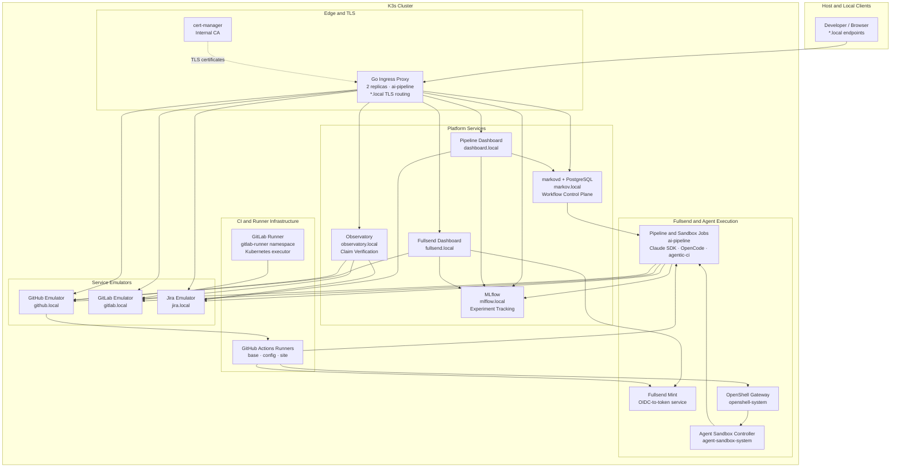

# Breadboard

Integration and deployment repository for the RHOAI (Red Hat OpenShift AI)
AI-first engineering platform. It combines an active Python pipeline for bug,
RFE, and strategy work with a K3s-hosted suite of workflow, CI simulation,
observability, and trace-analysis services.

This repository owns the integration layer: the Python CLI/dashboard, workflow
definitions, container assembly, Kubernetes manifests, and operational scripts.
Several deployed applications are independent repositories checked out under
the gitignored `checkouts/` directory. The manifests and deployment script,
not the contents of every local checkout, define the component stack.

The platform is designed to define, run, observe, evaluate, and govern
AI-native software-engineering workflows against realistic but isolated
services. It can connect business intent to planning, investigation, code, CI,
and evidence while preserving the execution history needed to understand and
compare the result.

Its central goal is continuous improvement: turn execution traces and generated
artifacts into evidence-backed feedback for skills, context, retrieval,
workflows, models, tools, and policies. Findings from one run become targeted
changes and regression cases for the next, creating a measurable engineering
quality loop rather than a collection of one-off agent prompts.

```text
Skills + context + models + policy
                 |
                 v
           Workflow execution
                 |
                 v
       Artifacts + traces + claims
                 |
                 v
      Evidence-based verification
                 |
                 v
         Root-cause attribution
                 |
                 v
     Targeted change + regression replay
```

The reference scenario in [`var/demos/end-to-end/`](var/demos/end-to-end/README.md)
demonstrates the current platform arc:

```text
RFE -> quality gate -> strategy -> review -> epic decomposition
    -> investigation and code generation
```

It resets the local service environment, imports source and skill repositories,
seeds Jira, launches instrumented agent jobs through the dashboard, fans work
out through Markov, and records artifacts and telemetry. The scenario is
destructive by design, which makes complete runs reproducible and suitable for
workflow, skill, model, harness, and policy comparisons.



## Prerequisites

- Python 3.13+
- [uv](https://docs.astral.sh/uv/) (package manager)
- [Podman](https://podman.io/) or Docker for image builds; Podman is required
  for the Python pipeline's patch-validation containers
- Git
- Vertex AI credentials (the Claude Agent SDK connects via Google Cloud)
- K3s (for the full deployment stack; optional for CLI-only usage)

### External data directories

The pipeline uses a `.context/` directory (gitignored) for external reference data:

- **`.context/architecture-context/`** — architecture docs for RHOAI components (read-only reference for agents)
- **`.context/odh-tests-context/`** — test context files (`.json` + `.md`) describing how to lint/test each repo in a container

RFE and strategy skills live in an external repo:

- **`remote_skills/rfe-creator/`** — cloned repo with RFE/strategy skill definitions, scripts, and its own `CLAUDE.md`

These are gitignored and must be cloned or populated separately.

The same is true of the component source checkouts in `checkouts/`. At
minimum, a full local image build expects `github-emulator`, `jira-emulator`,
`gitlab-emulator`, `markovd`, and `observatory`; Markov workflow jobs also use
the separately built `markov` image. Each checkout has its own development
instructions and history.

## Setup

```bash
# Clone and enter the project
git clone git@github.com:jctanner/breadboard.git
cd breadboard

# Create virtualenv and install dependencies
uv sync

# Create .env with Vertex AI credentials
cat > .env <<'EOF'
CLAUDE_CODE_USE_VERTEX=1
CLOUD_ML_REGION=global
ANTHROPIC_VERTEX_PROJECT_ID=<your-project-id>

# For Jira access (fetch phase + rfe-creator skills)
JIRA_SERVER=https://issues.redhat.com
JIRA_USER=<your-email>
JIRA_TOKEN=<your-jira-pat>

# Optional: Atlassian MCP server for enhanced Jira integration
# ATLASSIAN_MCP_URL=http://127.0.0.1:8081/sse
EOF
```

## Usage

### Execution paths

There are three related ways work runs:

1. `main.py` runs the original Python phase orchestrator locally or in a
   `pipeline-agent` Kubernetes Job.
2. The dashboard creates and monitors Kubernetes Jobs, selecting Claude Code
   or OpenCode and an SDK, shell, or `agentic-ci` runner.
3. Markov executes declarative workflows from `var/markov-workflows/`; markovd
   supplies the API/UI, persistence, callbacks, gates, and Kubernetes runner.

These paths share skills, Jira data, workspaces, artifacts, and telemetry, but
they are not aliases for one another.

```bash
python main.py <command> [options]
```

## What the Platform Enables

### Reproducible engineering workflows

Workflow definitions can combine agent skills with Jira, GitHub, dashboard,
Observatory, and Kubernetes operations. Markov supplies sequencing,
conditions, concurrency, fan-out, reusable sub-workflows, registered results,
and gates. Service resets and seeded fixtures make a complete organizational
process replayable rather than leaving it as a series of prompts.

Examples include:

- RFE to strategy, epics, investigations, and implementation
- Bug report to diagnosis, patch, validation, tests, and pull request
- CI failure to root-cause analysis, repair, and rerun
- Security issue to affected-component discovery and remediation
- Upgrade proposal to compatibility analysis and migration work

### Governed automation

The end-to-end demo requires an RFE rubric-pass label before strategy creation.
The same workflow-gate pattern can enforce human approvals, security review,
claim-evidence thresholds, test results, cost limits, and repository or tool
policies. Autonomous work therefore remains subject to explicit, versioned
acceptance criteria.

### Evaluation and experimentation

The same scenario can be run with different skill revisions, models, agent
harnesses, runners, prompts, policies, and repository revisions. MLflow,
OpenTelemetry, strace, Elasticsearch, and Observatory provide the basis for
comparing quality, reliability, unsupported claims, duration, tool behavior,
and cost—not merely whether a job exited successfully.

### Continuous improvement

Observatory closes the loop by extracting atomic claims from generated
artifacts, gathering relevant evidence, and recording whether each claim is
supported, refuted, insufficiently evidenced, or inconclusive. The important
output is not just a verdict; it is an attribution of what should improve:

| Finding | Improvement target |
|---------|--------------------|
| Available evidence was ignored or misused | Skill instructions and examples |
| Necessary evidence was absent | Architecture or domain context |
| Irrelevant evidence was selected | Indexing, queries, and retrieval policy |
| Validation or review was missing | Workflow structure and gates |
| The agent lacked a needed capability | Harness, runner, or tool policy |
| Ground truth was stale or contradictory | Human-owned source documentation |
| Reasoning failed despite sufficient evidence | Prompt, model, or escalation policy |
| Automated verification is not reliable | Human-review gate |

The same seeded scenario can then be replayed to determine whether the change
improved claim support, evidence coverage, verifier agreement, human-review
load, cost, duration, and downstream CI or acceptance outcomes without
introducing regressions elsewhere.

The intended evolution is for these quality signals to participate directly in
Markov gates—for example, preventing progression when high-severity claims are
refuted, security evidence is unresolved, or verifier disagreement requires
human approval.

### Auditable delivery loops

The platform can preserve lineage between the originating Jira request,
workflow and skill versions, model and harness, source revision, agent traces,
generated artifacts, gate decisions, and resulting code. The natural extension
of the demonstrated code-generation stage is a closed loop through branches or
pull requests, CI, failure analysis, repair, review, and merge or escalation.

### Commands

| Command | Description |
|---------|-------------|
| **Bug analysis** | |
| `bug-fetch` | Fetch open RHOAIENG bugs from Jira into `issues/` |
| `bug-completeness` | Score each bug's report quality (0-100) and classify issue type |
| `bug-context-map` | Map each bug to available architecture context and repos |
| `bug-fix-attempt` | Clone midstream repos and attempt AI-generated fixes |
| `bug-test-plan` | Generate test plans based on fix attempts |
| `bug-write-test` | Write QE tests for opendatahub-tests |
| `bug-all` | Run all bug analysis phases per-issue with dependency ordering |
| **RFE management** | |
| `rfe-create` | Write a new RFE from a problem statement or idea |
| `rfe-review` | Review and improve an RFE (rubric scoring, feasibility, auto-revision) |
| `rfe-split` | Split an oversized RFE into smaller, right-sized RFEs |
| `rfe-submit` | Submit or update RFEs in Jira (RHAIRFE project) |
| `rfe-speedrun` / `rfe-all` | End-to-end RFE pipeline: create/fetch, review, auto-fix, submit |
| **Strategy management** | |
| `strat-create` | Create strategies from approved RFEs |
| `strat-refine` | Refine strategies with HOW, dependencies, and NFRs |
| `strat-review` | Adversarial review of refined strategies |
| `strat-submit` | Push refined strategy content to RHAISTRAT Jira tickets |
| `strat-security-review` | Security-focused threat assessment of strategies |
| `strat-all` | Run full strategy pipeline (refine, review, submit, security-review) |
| **Dashboard** | |
| `dashboard` | Launch the Flask web dashboard |

### Common options

```
--model {sonnet,opus,haiku}   Claude model (default: opus); repeatable for bug phases
--max-concurrent N            Parallel agent limit (default: 5)
--issue KEY                   Process a specific issue (e.g., RHOAIENG-37036, RHAIRFE-1234); repeatable
--limit N                     Process only the first N issues
--force                       Regenerate existing outputs
--component NAME              Filter by Jira component (substring match, bug phases)
```

### Examples

```bash
# Score completeness for a single bug
python main.py bug-completeness --issue RHOAIENG-13921

# Run fix attempts for all ai-fixable bugs, max 3 at a time
python main.py bug-fix-attempt --triage ai-fixable --max-concurrent 3

# Re-run issues that previously couldn't be fixed
python main.py bug-fix-attempt --recommendation ai-could-not-fix

# Run fix attempt with no post-fix validation
python main.py bug-fix-attempt --issue RHOAIENG-13921 --skip-validation

# Full bug pipeline for 10 issues using haiku
python main.py bug-all --limit 10 --model haiku

# End-to-end RFE pipeline
python main.py rfe-speedrun --issue RHAIRFE-1234

# Review a strategy
python main.py strat-review --issue RHAISTRAT-400

# Security review of a strategy
python main.py strat-security-review --issue RHAISTRAT-400

# Launch the dashboard
python main.py dashboard --port 8080
```

## Pipeline Architecture

### Bug Analysis Pipeline

```
Jira (RHOAIENG)
     |
     v
+-----------+
| 1. Fetch  |  Download issue JSON to issues/
+-----+-----+
      |
      v
+--------------+   +--------------+
|2. Complete-  |   | 3. Context   |   (run in parallel per issue)
|   ness       |   |    Map       |
+------+-------+   +------+-------+
       |                  |
       +--------+---------+
                v
       +----------------+
       | 4. Fix Attempt |  Clone midstream repos, generate patch
       +-------+--------+
               |
               v
       +----------------+
       |  Validation    |  Spin up podman container, run lint + tests
       |  Loop (0-N)    |  On failure: feed errors back to fix agent
       +-------+--------+
               |
               v
       +----------------+     +----------------+
       | 5. Test Plan   |     | 6. Write Test  |
       +----------------+     +----------------+
```

Each issue flows through phases independently, sharing a concurrency pool. Phases 2 and 3 run in parallel since they're independent. Phase 4 waits for both, and phases 5-6 wait for phase 4.

### RFE Pipeline

```
Problem statement / Jira (RHAIRFE)
     |
     v
+-----------+     +-----------+     +-----------+     +-----------+
|  Create   | --> |  Review   | --> |  Split    | --> |  Submit   |
|  (draft)  |     | (rubric)  |     | (if needed)|    | (to Jira) |
+-----------+     +-----------+     +-----------+     +-----------+

rfe-speedrun / rfe-all runs the full sequence automatically.
```

### Strategy Pipeline

```
Approved RFEs (RHAIRFE) --> Jira (RHAISTRAT)
     |
     v
+-----------+     +-----------+     +-----------+     +-----------------+
|  Create   | --> |  Refine   | --> |  Review   | --> | Security Review |
|  (draft)  |     | (HOW/NFR) |     | (adversarial)|  | (threat model)  |
+-----------+     +-----------+     +-----------+     +-----------------+
                                         |
                                         v
                                    +-----------+
                                    |  Submit   |
                                    | (to Jira) |
                                    +-----------+

strat-all runs refine, review, submit, and security-review in sequence.
```

## How It Works

### Skill system

Each phase is driven by a Claude agent loaded with a **skill** — instructions defined in a `SKILL.md` file. Skills are invoked in two ways:

- **Templated** — SKILL.md content is extracted and injected into the agent prompt. Used for bug analysis phases. Deterministic and batch-friendly.
- **Native** — Agent discovers skills via SDK `Skill` tool. Used for RFE/strategy phases where the agent needs full repo context (CLAUDE.md, scripts, sub-skills).

Skill-to-phase mapping is configured in `var/pipeline-skills.yaml`.

| Skill | Source | Invoke | Agent tools | Purpose |
|-------|--------|--------|-------------|---------|
| `bug-completeness` | local | templated | Read, Write, Glob, Grep | Score bug quality, classify type, recommend triage |
| `bug-context-map` | local | templated | Read, Write, Glob, Grep | Map bug to architecture docs and repos |
| `bug-fix-attempt` | local | templated | Read, Write, Glob, Grep | Analyze root cause, edit source, produce patch |
| `bug-test-plan` | local | templated | Read, Write, Glob, Grep | Design verification strategy |
| `bug-write-test` | local | templated | Read, Write, Glob, Grep | Write QE tests for opendatahub-tests |
| `patch-validation` | local | native | Read, Write, Glob, Grep, Bash | Run lint/tests in podman, report results |
| `strat-security-review` | local | native | Read, Write, Glob, Grep, Bash | Security threat assessment |
| `strat-submit` | local | native | Read, Glob, Grep, Bash | Push strategies to RHAISTRAT Jira |
| `rfe.*` skills | rfe-creator | native | Read, Write, Edit, Glob, Grep, Bash | RFE lifecycle (create, review, split, submit) |
| `strat.*` skills | rfe-creator | native | Read, Write, Edit, Glob, Grep, Bash | Strategy lifecycle (create, refine, review) |

### Fix attempt workflow

1. The orchestrator clones midstream repos into `workspace/{KEY}/{model_id}/src/`
2. The fix agent reads architecture docs, analyzes the bug, and edits source files
3. The orchestrator captures `git diff` from the workspace
4. If validation is enabled, a podman container is started using the recipe from `odh-tests-context`
5. The validation agent runs lint and tests via `podman exec`
6. On failure, errors are fed back to a fresh fix agent for retry (up to `--validation-retries` iterations)
7. Self-corrections from retries are captured for aggregate analysis

### Repo mapping

RHOAI uses a three-tier contribution flow: **upstream** (e.g., `kserve/kserve`) -> **midstream** (e.g., `opendatahub-io/kserve`) -> **downstream** (e.g., `red-hat-data-services/kserve`). Fixes target midstream. The `src/cli/repo_mapping.py` module handles name resolution between tiers and shallow-clones repos into workspaces.

## Output Files

### Bug outputs

Bug phase outputs are stored per-issue in `workspace/{KEY}/{model_id}/`:

| File | Content |
|------|---------|
| `completeness.json` | Completeness score, dimensions, triage recommendation |
| `completeness.md` | Human-readable completeness report |
| `context-map.json` | Component mapping, context rating, relevant files |
| `context-map.md` | Human-readable context map |
| `fix-attempt.json` | Root cause, patch, recommendation, validation results, self-corrections |
| `fix-attempt.md` | Human-readable fix attempt report |
| `test-plan.json` | Unit/integration/regression test specifications |
| `test-plan.md` | Human-readable test plan |

Raw Jira issue JSON is stored in `issues/{KEY}.json`.

Invalid outputs are renamed to `*.invalid` and won't block re-runs.

### RFE/Strategy outputs

RFE and strategy artifacts use YAML frontmatter and are managed by the `rfe-creator` skill repo. Security reviews are written to `security-reviews/`.

### Fix attempt recommendations

| Value | Meaning |
|-------|---------|
| `ai-fixable` | Working code fix produced |
| `already-fixed` | Bug is already resolved in current code |
| `not-a-bug` | Feature request, enhancement, or by-design behavior |
| `docs-only` | Documentation change, not a code fix |
| `upstream-required` | Fix must go to an upstream repo first |
| `insufficient-info` | Bug report lacks detail to attempt a fix |
| `ai-could-not-fix` | AI attempted but failed to produce a fix |

## Dashboard

```bash
python main.py dashboard
```

Opens a Flask web app at `http://localhost:5000` with:

- **Multi-tab view** — All Issues, Bugs, RFEs, Strategies, Epics
- **Issue detail pages** — full Jira data alongside completeness scores, context maps, fix attempts with patches, validation results, self-corrections, and test plans
- **RFE detail pages** — task content, reviews, and tabbed sections
- **Strategy detail pages** — metadata, review summaries, and tabbed content
- **K8s Jobs page** — submit, monitor, and inspect pipeline jobs running in the cluster
- **Activity feed** — live pipeline progress via SSE
- **Stats page** — aggregate statistics across all issues
- **Admin panel** — service configuration and management
- **File browser** — browse generated artifacts on disk

When deployed in the K3s stack, the dashboard is available at `https://dashboard.local` with navbar links to all cluster services (MLflow, Markov, GitHub, GitLab, Jira, Observatory).

## K8s Deployment Stack

The project includes a full K3s-based deployment stack for running the pipeline and its supporting services in a single-node Kubernetes cluster.

### Deployed Services

| Service | Namespace | URL | Purpose |
|---------|-----------|-----|---------|
| Pipeline Dashboard | ai-pipeline | `https://dashboard.local` | Web UI for bugs, RFEs, strategies, jobs |
| GitHub Emulator | ai-pipeline | `https://github.local` | Git hosting and GitHub API emulation |
| GitLab Emulator | ai-pipeline | `https://gitlab.local` | GitLab API emulation with CI/CD pipelines |
| Jira Emulator | ai-pipeline | `https://jira.local` | Jira REST API emulation for ticket management |
| GitLab Runner | gitlab-runner | — | In-cluster CI runner (Kubernetes executor) |
| MLflow | ai-pipeline | `https://mlflow.local` | Experiment tracking and agent trace logging |
| markovd | ai-pipeline | `https://markov.local` | Workflow API/UI, run persistence, callbacks, gates, and Kubernetes orchestration |
| Markov jobs | ai-pipeline | — | Ephemeral pods that execute declarative workflows |
| Elasticsearch | ai-pipeline | — | Search index populated from MLflow trace sync |
| Observatory | ai-pipeline | `https://observatory.local` | CI collection, artifact/trace analysis, claim extraction and verification |
| Go Reverse Proxy | ai-pipeline | — | Routes `*.local` hostnames to internal services via TLS |

### Infrastructure

- **K3s** — lightweight Kubernetes (single-node)
- **cert-manager** — automatic TLS certificate provisioning with an internal CA
- **Traefik** — ingress controller for internal routing
- **Go reverse proxy** — routes `*.local` DNS names from the host to cluster services with TLS passthrough

### Deployment

```bash
# Full stack deployment (20 steps)
make host-deploy-all

# Or step by step
make host-install-k3s
make host-images          # Build all container images
make host-deploy-all      # Apply k8s manifests, wait for readiness
make host-clone-repos     # Clone core and pinned third-party checkouts
make host-deploy-openshell # Deploy Agent Sandbox and OpenShell only
```

### Makefile Targets

The Makefile provides targets for both Vagrant VM (`vagrant-*`) and bare-metal host (`host-*`) deployment:

| Target Group | Examples | Purpose |
|-------------|----------|---------|
| `host-deploy-*` | `host-deploy-all`, `host-deploy-markovd`, `host-deploy-gitlab-runner` | Deploy the stack or selected services |
| `host-rebuild-*` | `host-rebuild-dashboard`, `host-rebuild-gitlab` | Build image + restart deployment |
| `host-logs-*` | `host-logs-dashboard`, `host-logs-gitlab` | Tail service logs |
| `host-images` | | Build all container images |
| `host-status` | | Cluster pod/service status |
| `host-sync-traces` / `host-sync-traces-full` | | Incrementally sync or fully resync MLflow traces to Elasticsearch |
| `host-backup` / `host-restore` | | Backup and restore all service data |
| `host-deploy-gitlab-runner` | | Deploy GitLab Runner with k8s executor |

### Backup and Restore

```bash
make host-backup                    # Backup all service data
make host-backup-full               # Include workspace and context PVCs
make host-restore BACKUP=<path>     # Restore from a backup
make host-list-backups              # List available backups
```

## Project Structure

```
breadboard/
├── main.py                  # Entry point (CLI dispatcher)
├── pyproject.toml           # Dependencies and project metadata
├── Makefile                 # Build, deploy, and operational targets
├── var/
│   ├── pipeline-skills.yaml # Phase-to-skill mapping and invocation config
│   ├── skills-registry.yaml # Staging registry for external skill plugins
│   └── markov-workflows/    # Markov workflow definitions (batch RFE, strategy, etc.)
├── .env                     # Vertex AI and Jira credentials (gitignored)
├── CLAUDE.md                # Claude Code project context
├── src/
│   ├── cli/
│   │   ├── agent_runner.py  # Claude Agent SDK launcher
│   │   ├── cli.py           # Argument parsing
│   │   ├── paths.py         # Workspace path utilities
│   │   ├── phases.py        # Phase orchestrators, batch runner, validation loop
│   │   ├── prompts.py       # Skill prompt extraction and injection
│   │   ├── repo_mapping.py  # Upstream/midstream/downstream name mapping
│   │   ├── schemas.py       # JSON Schema validation for phase outputs
│   │   ├── skill_config.py  # pipeline-skills.yaml parser
│   │   └── validation.py    # Container lifecycle and validation agent runner
│   └── dashboard/
│       ├── webapp.py        # Flask dashboard (PicoCSS, SSE activity feed)
│       ├── report_data.py   # Dashboard data loading (bugs)
│       ├── rfe_data.py      # Dashboard data loading (RFEs)
│       ├── stats.py         # Aggregate statistics
│       ├── k8s_orchestrator.py # K8s job submission and monitoring
│       ├── mlflow_client.py # MLflow API client
│       ├── templates/       # Jinja2 HTML templates
│       └── static/js/       # Frontend JavaScript
├── deploy/
│   ├── k8s/                 # Kubernetes manifests (namespace, certs, services, deployments)
│   ├── dependencies.json    # Pinned third-party source/deployment dependencies
│   ├── scripts/             # Build and deployment automation (20-step deploy-all.sh)
│   ├── golang-reverse-proxy/  # Go reverse proxy for *.local TLS routing
│   └── golang-reverse-proxy/  # Go reverse proxy for *.local TLS routing
├── .claude/skills/          # Local agent skill definitions
│   ├── bug-completeness/    # Score bug quality, classify type
│   ├── bug-context-map/     # Map bug to architecture docs and repos
│   ├── bug-fix-attempt/     # Analyze root cause, edit source, produce patch
│   ├── bug-test-plan/       # Design verification strategy
│   ├── bug-write-test/      # Write QE tests for opendatahub-tests
│   ├── patch-validation/    # Run lint/tests in containers
│   ├── strat-security-review/ # Security threat assessment
│   ├── strat-submit/        # Push strategies to Jira
│   ├── extract-claims/      # Observatory: extract verifiable claims
│   ├── verify-claims/       # Observatory: verify claims against evidence
│   ├── explain-claims/      # Observatory: explain claim verification results
│   └── doc-*/               # Documentation generation skills
├── remote_skills/           # External skill repos (gitignored)
│   └── rfe-creator/         # RFE/strategy skills, scripts, CLAUDE.md
├── .context/                # External context data (gitignored)
│   ├── architecture-context/  # RHOAI component architecture docs
│   └── odh-tests-context/     # Test recipes for container validation
├── scripts/
│   ├── fetch_bugs.py        # Standalone Jira fetch script
│   ├── attach_to_jira.py    # Attach artifacts to Jira tickets
│   └── clean.sh             # Reset workspaces and logs
├── docs/                    # Architecture docs, plans, notes, reference, bugs
├── bugs/                    # Bug analysis notes and summaries
├── artifacts/               # Security reviews and requirements (gitignored)
├── issues/                  # Fetched Jira JSON (gitignored)
├── workspace/               # Cloned repos and phase outputs per issue (gitignored)
└── logs/                    # Activity logs and phase logs (gitignored)
    └── activity.jsonl       # Structured event feed for dashboard SSE
```

## Service Emulators

The deployment stack includes local emulators for GitHub, GitLab, and Jira so the pipeline can run end-to-end without depending on external services. Each emulator lives in `checkouts/` and is built into a container image deployed to the cluster.

| Emulator | URL | API | Purpose |
|----------|-----|-----|---------|
| **GitHub Emulator** | `https://github.local` | GitHub REST/GraphQL subset | Git hosting, pull requests, issues, `gh` CLI workflows |
| **GitLab Emulator** | `https://gitlab.local` | GitLab REST API v4 surface | Git/merge-request/CI integration testing; supported endpoints depend on the checked-out component revision |
| **Jira Emulator** | `https://jira.local` | Jira REST API v2/v3 | Issue tracking, project management, and an optional companion MCP server |

The Jira emulator component also implements an MCP server. The K3s manifest in
this repository deploys the Jira API/UI service; clients should use the
configured `ATLASSIAN_MCP_URL` when an MCP endpoint is separately available.

The stack deploys an in-cluster **GitLab Runner** with a Kubernetes executor for
the GitLab emulator's supported runner/coordinator workflows. Jobs run as pods
in the `gitlab-runner` namespace.

Each emulator runs on SQLite — no external database required. Data persists on PVCs within the cluster.

## Markov and markovd

Markov is the workflow CLI/runner; markovd is the persistent API and React UI
available at `https://markov.local`. In the deployed configuration, markovd
creates Kubernetes jobs using the `markov:latest` image and receives lifecycle
callbacks from them. PostgreSQL stores users and run state, while an nginx
sidecar serves the UI. Workflow definitions live in `var/markov-workflows/`:

| Workflow | Purpose |
|----------|---------|
| `batch-rfe-pipeline.yaml` | Batch RFE processing (create, review, submit) |
| `batch-rfe-to-strategy.yaml` | Convert batch of RFEs to strategies |
| `rfe-to-strategy.yaml` | Single RFE to strategy conversion |
| `rfe-pipeline-with-gates.yaml` | RFE pipeline with approval gates |
| `arch-context-benchmark.yaml` | Architecture context quality benchmarking |

## Observatory

Observatory is broader than claim checking: it collects GitHub/GitLab pipeline
metadata and artifacts, ingests CI definitions and telemetry, parses execution
traces, and exposes health and quality views. Its hallucination-analysis path
extracts verifiable claims from artifacts and checks them against evidence.
This repository supplies three skills used by that path:

- **extract-claims** — parse artifacts into discrete, testable claims
- **verify-claims** — check each claim against source material and codebase evidence
- **explain-claims** — produce human-readable verification summaries

## Jira Projects

| Project | Purpose |
|---------|---------|
| `RHOAIENG` | Engineering bugs |
| `RHAIRFE` | Requests for Enhancement |
| `RHAISTRAT` | Implementation strategies |

## Documentation

See [docs/README.md](docs/README.md) for the full documentation index covering architecture, deployment, plans, reference material, notes, and the agentic work ledger methodology.
