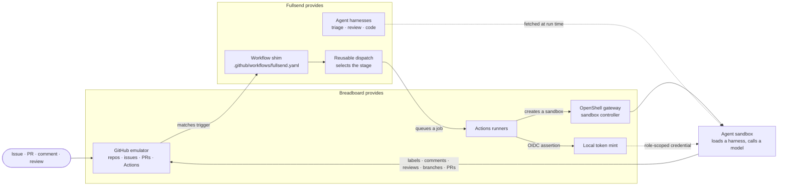

# Fullsend Integration

Fullsend is Breadboard's agentic software-engineering execution path. Breadboard
provides the isolated GitHub emulator, Actions scheduler and runners, local
token mint, OpenShell gateway, sandbox controller, telemetry services, and
operations dashboard. Fullsend provides the workflow shim, role-specific agent
workflows, configuration, and CLI.

The current integrated path is GitHub-first. The
`fullsend-dev/triage-target` repository carries the `.fullsend/` configuration
and Fullsend workflow shim. Jira and GitLab are available to the broader
Breadboard platform, but they do not directly trigger Fullsend agent runs in
the current deployment.

At a glance — who provides what, and the path an event takes:

The dashed edges are what the agent is *given*; the solid path is control
flow. The loop closes at the forge: everything an agent produces arrives back
as ordinary GitHub activity, which is why the dashboard can be a pure observer.

## Services

The integration uses these deployed components:

| Component | Responsibility |
|-----------|----------------|
| GitHub emulator | Stores repositories, issues, pull requests, workflow definitions, workflow runs, and job state; evaluates Actions event triggers. |
| GitHub Actions runners | Poll for queued jobs, execute workflow steps, and report logs and conclusions back to the emulator. The deployment includes repository, config-repository, and site-wide runners. |
| Fullsend Mint | Exchanges a development OIDC assertion for a role- and repository-scoped GitHub installation token. |
| OpenShell gateway | Creates and manages constrained agent sandboxes. |
| Sandbox controller | Runs the sandbox workload and exposes pod state and events to the operations dashboard. |
| Fullsend runner image | Contains the Fullsend binary, OpenShell client, Git tooling, and local runner integration. |
| Fullsend Dashboard | Reads GitHub Actions and Kubernetes state for operational visibility. It does not receive source events or dispatch agent work. |
| MLflow and Observatory | Receive optional agent traces, CI artifacts, and verification data when telemetry is configured. |

See [fullsend-services.mmd](architecture/diagrams/fullsend-services.mmd) for
the service relationship map.

## Event and token flow

Issue, pull request, issue-comment, and pull-request-review activity enters the
GitHub emulator. Its Actions event matcher starts the checked-in `fullsend`
workflow, which forwards the event payload to the reusable dispatch workflow.
The dispatch workflow selects the agent stage and queues a job. The local
runner polls and claims that job; the Fullsend dashboard is only an observer.

Inside the job, the Fullsend composite action requests an OIDC assertion and
posts it to the local mint with the requested role and repository scope. The
mint returns a short-lived token used to check out the target repository and
perform the permitted GitHub operations. The runner then starts the agent
through OpenShell.

The development deployment uses a local OIDC broker backed by
`FULLSEND_DEV_OIDC_TOKEN` and role credentials from the
`fullsend-mint-dev-credentials` Secret. This preserves the workflow contract
without requiring an external GitHub or cloud control plane.

The GitHub emulator also exposes an ephemeral RS256 OIDC issuer and JWKS at
`https://github.local`, and a GitHub App fixture whose private key is kept
only in the emulator's local database. Real Actions OIDC claim validation
against that issuer, rather than the opaque development token above, is the
conformance target described in
[`.ledger/plans/fullsend-integration-conformance-plan.md`](../.ledger/plans/fullsend-integration-conformance-plan.md).

See [fullsend-event-flow.mmd](architecture/diagrams/fullsend-event-flow.mmd)
for the sequence diagram.

## Agent sandbox

The runner supplies the event payload, checked-out workspace, scoped GitHub
token, and model credentials. OpenShell creates the sandbox through the cluster
sandbox controller, mounts the workspace, injects its proxy CA, and applies the
role's filesystem and network policy before the agent starts.

The development smoke policy keeps the system and image paths read-only. Only
`/sandbox`, `/tmp`, and `/dev/null` are writable. The agent can reach the
GitHub emulator through a read-only egress rule and can call the permitted
Vertex AI and Google OAuth endpoints. Other destinations are denied. The
runner retains status and result files in the shared job volume for the smoke
harness and dashboard.

See [fullsend-agent-sandbox.mmd](architecture/diagrams/fullsend-agent-sandbox.mmd)
for the sandbox boundary and data paths.

The source deployment definitions are in `deploy/k8s/23*.yaml`,
`deploy/k8s/24-fullsend-mint-dev.yaml`,
`deploy/k8s/25-fullsend-direct-token-smoke.yaml`, and
`deploy/k8s/26-fullsend-dashboard.yaml`. The build and bootstrap scripts are
under `deploy/scripts/05h-*`, `deploy/scripts/05i-*`, `deploy/scripts/05j-*`,
`deploy/scripts/17-*`, `deploy/scripts/18-*`, and `deploy/scripts/22-seed-fullsend.sh`.
Fullsend's own patches, policies, and seed scripts live under
`deploy/fullsend/`; named legacy compatibility smokes (`19-run-fullsend-direct-token-smoke.sh`,
`20-run-fullsend-vertex-smoke.sh`, `21-run-fullsend-result-smoke.sh`) are
separate from this deployed path and are not run by `deploy-all.sh`.
